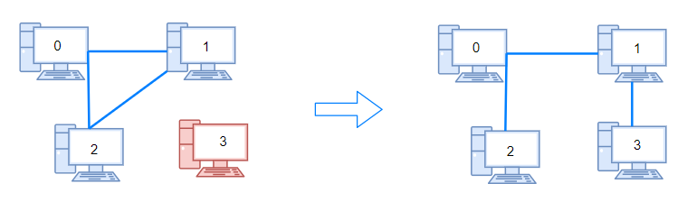
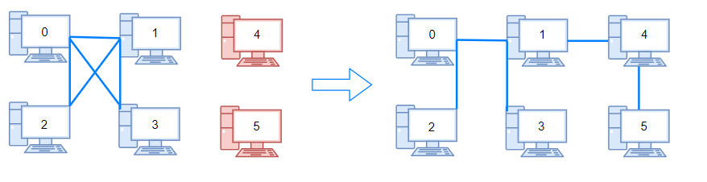
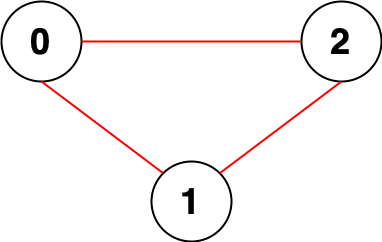
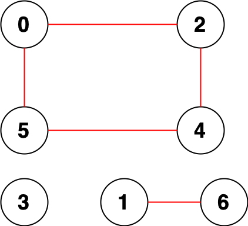
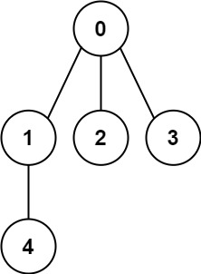
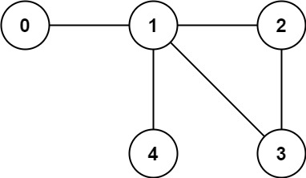

# Graph Representation

<details id="Adjcency Matrix">
<summary> 
<span style="color:pink;font-size:16px;font-weight:bold">Adjcency List 
</span>
</summary>

```java
// We can use Map or ArrayList<> to make Adjcency List
class Solution {
    public int[] findOrder(int numCourses, int[][] prerequisites) {
        Map<Integer, List<Integer>> adjList = new HashMap<Integer, List<Integer>>();

        // creating the adjcency list(this node is the prerequisite for what alll nodes)
        for (int i = 0; i < prerequisites.length; i++) {
            int post = prerequisites[i][0];
            int pre = prerequisites[i][1];
            List<Integer> lst = adjList.getOrDefault(pre, new ArrayList<Integer>());
            lst.add(post);
            adjList.put(pre, lst);
        }   
    }
}
```
</details>

<details id="Matrix">
<summary> 
<span style="color:pink;font-size:16px;font-weight:bold">Matrix 
</span>
</summary>

```java
// We can use Map or ArrayList<> to make Adjcency List
class Solution {
    public int[] findOrder(int numCourses, int[][] prerequisites) {
        Map<Integer, List<Integer>> adjList = new HashMap<Integer, List<Integer>>();
        int[] indegree = new int[numCourses];

        // creating the adjcency list(this node is the prerequisite for what alll nodes)
        for (int i = 0; i < prerequisites.length; i++) {
            int post = prerequisites[i][0];
            int pre = prerequisites[i][1];
            List<Integer> lst = adjList.getOrDefault(pre, new ArrayList<Integer>());
            lst.add(post);
            adjList.put(pre, lst);
            // How many cources has to be completed before taking this course
            indegree[post] += 1;
        }   
    }
}
```

</details>


# DFS & BFS


<details id="Depth First Search">
<summary> 
<span style="color:blue;font-size:16px;font-weight:bold">Depth First Search 
</span>
</summary>

https://www.geeksforgeeks.org/problems/depth-first-traversal-for-a-graph/1

```java
// call for DFS
dfs(adj, 0, visited );

// DFS logic
void dfs(List<List<Integer>> adj, int node, boolean visited){

    if(vivited[node])return;
    visited[node]=true;
    // Do something
    for(int i: adj.get(node)){
        if(!visited[i])dfs(adj, i, visited);
    }
}

```

```java

// Implementation
class Solution {
    // Function to return a list containing the DFS traversal of the graph.
    public ArrayList<Integer> dfsOfGraph(int V, ArrayList<ArrayList<Integer>> adj) {
        boolean[] visited=new boolean[V];
        ArrayList<Integer> ans=new ArrayList<>();
        dfs(adj, 0, visited, ans);
        return ans;
    }
    
    public void dfs(ArrayList<ArrayList<Integer>> adj, int node, boolean[]  visited, ArrayList<Integer> ans){
        if(visited[node])return;
        visited[node]=true;
        ans.add(node);
        for(int i:adj.get(node)){
            if(!visited[i])dfs(adj, i, visited, ans);
        }
    }
}
```
</details>


<details id="Breadh First Search">
<summary> 
<span style="color:blue;font-size:16px;font-weight:bold">Breadh First Search 
</span>
</summary>

Most of the time BFS is used to find the shortest path insted of DFS.

    Node enters the Queue --> node is marked "visited" 

```java
// call for BFS
bfs(adj, 0, visited);

// DFS logic
void bfs(List<List<Integer>> adj, int node, boolean visited){
Queue<Integer> queue=new LinkedList<>();
        queue.offer(node);
        visited[node]=true;
        ans.add(node);
        while(!queue.isEmpty()){
            int n=queue.poll();
            for(int i:adj.get(n)){
                if(!visited[i]){
                    queue.add(i);
                    visited[i]=true;
                    ans.add(i);
                }
            }
        }
}
```

```java
// Implementation
class Solution {
    public ArrayList<Integer> bfsOfGraph(int V, ArrayList<ArrayList<Integer>> adj) {
        boolean[] visited=new boolean[V];
        ArrayList<Integer> ans=new ArrayList<>();
        bfs(adj, 0, visited, ans);
        return ans;        
    }
    public void bfs(ArrayList<ArrayList<Integer>> adj, int node, boolean[]  visited, ArrayList<Integer> ans){
        Queue<Integer> queue=new LinkedList<>();
        queue.offer(node);
        visited[node]=true;
        ans.add(node);
        while(!queue.isEmpty()){
            int n=queue.poll();
            for(int i:adj.get(n)){
                if(!visited[i]){
                    queue.add(i);
                    visited[i]=true;
                    ans.add(i);
                }
            }
        }
    }
}
```
</details>


### Detect Cycle :


<details id="Detect cycle in a graph | Undirected Graph | DFS">
<summary> 
<span style="color:yellow;font-size:16px;font-weight:bold">Detect cycle in a graph | Undirected Graph | DFS 
</span>
</summary>

https://www.geeksforgeeks.org/problems/detect-cycle-in-an-undirected-graph/1

### 1. Using DFS
```java
class Solution {
    public boolean isCycle(int V, ArrayList<ArrayList<Integer>> adj) {
        boolean[] visited=new boolean[V];
        // For Connected Components
        for(int i=0;i<V;i++){
            if(!visited[i] && isCycleUtility(adj,-1,visited,i)){
                return true;
            }
        }
        return false;
    }
    public boolean isCycleUtility(ArrayList<ArrayList<Integer>> adj,  int parent, boolean[] visited, int node){
        visited[node]=true;
        
        for(int i:adj.get(node)){
            if(i == parent)continue;
            if(visited[i])return true;
            if(isCycleUtility(adj,node,visited,i))return true;
        }
        return false;
    }
}
```
</details>


<details id="Detect cycle in a graph | Undirected Graph | BFS">
<summary> 
<span style="color:yellow;font-size:16px;font-weight:bold">Detect cycle in a graph | Undirected Graph | BFS 
</span>
</summary>

### 2. Using BFS

```java
class Co{
    int node;
    int parent;
    Co(int n, int p){
        this.node=n;
        this.parent=p;
    }
}
class Solution {
    public boolean isCycle(int V, ArrayList<ArrayList<Integer>> adj) {
        boolean[] visited=new boolean[V];
        
        for(int i=0;i<V;i++){
            if(!visited[i] && isCycleUtility(adj,visited,i)){
                return true;
            }
        }
        return false;
    }
    public boolean isCycleUtility(ArrayList<ArrayList<Integer>> adj, boolean[] visited, int node){
        visited[node]=true;
        Queue<Co> queue=new LinkedList<>();
        queue.add(new Co(node, -1));
        
        while(!queue.isEmpty()){
            Co pair=queue.poll();
            
            for(int i:adj.get(pair.node)){
                if(i==pair.parent)continue;
                if(visited[i])return true;
                if(!visited[i]){
                    visited[i]=true;
                    queue.add(new Co(i,pair.node));
                }
            }
        }
        return false;
    }
}
```
</details>


<details id="Detect cycle in a graph | Undirected | DSU(Disjoint Set Union)">
<summary> 
<span style="color:yellow;font-size:16px;font-weight:bold">Detect cycle in a graph | Undirected | DSU(Disjoint Set Union) 
</span>
</summary>

### 3. Using DSU(Disjoint Set Union)
```java
//Function to detect cycle using DSU in an undirected graph.
public int detectCycle(int V, ArrayList<ArrayList<Integer>> adj)
{
    int[] parent=new int[V];
    int[] rank=new int[V];
    for(int i=0;i<V;i++)parent[i]=i;
    
    // Iterate through each edge of the graph.
    for (int u = 0; u < V; u++) {
        for (int v : adj.get(u)) {
            if (u < v) { // To avoid considering the same edge twice.
                if (find(u,parent) == find(v,parent))
                    return 1;
                else
                    union(u, v, parent, rank);
            }
        }
    }
    return 0;
    
}
// Function to find the parent of a node x with path compression.
private int find(int x, int[] parent) {
    if (parent[x] == x)
        return x;
    return parent[x] = find(parent[x], parent);
}

// Function to perform the union of two sets x and y.
private void union(int x, int y, int[] parent, int[] rank) {
    int xRoot = find(x, parent);
    int yRoot = find(y, parent);

    if (xRoot != yRoot) {
        if (rank[xRoot] > rank[yRoot]) {
            parent[yRoot] = xRoot;
        } else if (rank[xRoot] < rank[yRoot]) {
            parent[xRoot] = yRoot;
        } else {
            parent[xRoot] = yRoot;
            rank[yRoot]++;
        }
    }
}
```


</details>

<details id="Detect cycle in a graph | Directed | DFS">
<summary> 
<span style="color:blue;font-size:16px;font-weight:bold">Detect cycle in a graph | Directed | DFS
</span>
</summary>

### 1. Using DFS

```java
class Solution {
    boolean isCycleDFS(List<List<Integer>> adj, int u, List<Integer> visited, List<Integer> inRecursion) {
        visited[u] = true;
        inRecursion[u] = true;
        
        
        for(int v : adj.get(u)) {
            //if not visited, then we check for cycle in DFS
            if(visited[v] == false && isCycleDFS(adj, v, visited, inRecursion))
                return true;
            else if(inRecursion[v] == true)
                return true;
        }
        
        inRecursion[u] = false;
        return false;
        
    }
    
    // Function to detect cycle in a directed graph.
    bool isCyclic(int V, List<Integer> adj) {
        vector<bool> visited(V, false);
        boolean[] inRecursion=new boolean[V];
        
        for(int i = 0; i<V; i++) {
            if(!visited[i] && isCycleDFS(adj, i, visited, inRecursion))
                return true;
        }
        return false;
    }
}

```


</details>


<details id="Detect cycle in a graph | Directed | BFS (Khan's Algorithm)">
<summary> 
<span style="color:blue;font-size:16px;font-weight:bold">Detect cycle in a graph | Directed | BFS (Khan's Algorithm) 
</span>
</summary>

### Using BFS (Khan's Algorithm)


```java

public class DirectedGraph {
    private int V; // Number of vertices
    private LinkedList<Integer>[] adj; // Adjacency list

    public DirectedGraph(int v) {
        V = v;
        adj = new LinkedList[v];
        for (int i = 0; i < v; ++i) {
            adj[i] = new LinkedList<>();
        }
    }

    // Function to add an edge into the graph
    public void addEdge(int v, int w) {
        adj[v].add(w);
    }

    // Function to check if the graph contains a cycle
    public boolean isCyclic() {
        int[] inDegree = new int[V];

        // Calculate in-degrees of all vertices
        for (int i = 0; i < V; i++) {
            for (int neighbor : adj[i]) {
                inDegree[neighbor]++;
            }
        }

        // Create a queue and enqueue all vertices with in-degree 0
        Queue<Integer> queue = new LinkedList<>();
        for (int i = 0; i < V; i++) {
            if (inDegree[i] == 0) {
                queue.add(i);
            }
        }

        int visitedVertices = 0;

        // Perform BFS
        while (!queue.isEmpty()) {
            int vertex = queue.poll();
            visitedVertices++;

            // Decrease in-degree by 1 for all its neighboring nodes
            for (int neighbor : adj[vertex]) {
                inDegree[neighbor]--;
                // If in-degree becomes 0, add it to the queue
                if (inDegree[neighbor] == 0) {
                    queue.add(neighbor);
                }
            }
        }

        // If visitedVertices count is not equal to the number of vertices,
        // the graph contains a cycle
        return visitedVertices != V;
    }

    public static void main(String[] args) {
        DirectedGraph graph = new DirectedGraph(4);
        graph.addEdge(0, 1);
        graph.addEdge(1, 2);
        graph.addEdge(2, 3);
        graph.addEdge(3, 1); // This edge creates a cycle

        if (graph.isCyclic()) {
            System.out.println("Graph contains a cycle");
        } else {
            System.out.println("Graph does not contain a cycle");
        }
    }
}

```

</details>

<details id="Find all possible length cycle | undirected graph | DFS">
<summary> 
<span style="color:red;font-size:16px;font-weight:bold">Find all possible length cycle | undirected graph | DFS
</span>
</summary>

### Find all possible length cycle in undirected graph

    
    Note: Simpliy running a normal DFS with a global visited array will not traverse all possible cycles, This prevents revisiting nodes from different starting points, but in cycle detection with shortest cycle, you must allow revisiting because the shortest cycle could involve nodes discovered later.
    
    EXAMPLE: 
    0 -- 1 -- 2 -- 3 -- 4
     \        |         /
      ------- 5 -------
    Cycle A: 0 → 1 → 2 → 3 → 4 → 5 → 0 (length 6)

    Cycle B: 2 → 3 → 4 → 5 → 2 (length 4)

    If you start DFS at 0:

    You’ll discover the big cycle (6).

    But since all nodes are now visited = true, you’ll never re-explore from 2 to discover the shorter cycle (4).

    👉 That’s exactly why global visited[] is wrong for shortest cycle.

```java
// This code dosent work. It will not iterate over all the possible cycles

class Solution {
    int minLengthCycle = Integer.MAX_VALUE;

    public int findShortestCycle(int n, int[][] edges) {
        boolean[] visited=new boolean[n];
        
        List<List<Integer>> adj=new ArrayList<>();
        // make adj list
        for(int i=0;i<n;i++){
            adj.add(new ArrayList<>());
        }

        for(int[] edge:edges){
            adj.get(edge[0]).add(edge[1]);
            adj.get(edge[1]).add(edge[0]);
        }
        // traverse the graph and find the cycle, also make sure to traverse conected components
        for(int i=0;i<n;i++){
            if(!visited[i]){
                traverseGraph(adj, i, -1, 1, visited);
            }
        }
        return minLengthCycle == Integer.MAX_VALUE? -1: minLengthCycle;
    }

    private void traverseGraph(List<List<Integer>> adj, int node, int parent, int cycleLen, boolean[] visited) {
        visited[node] = true;

        for (int neighbor : adj.get(node)) {
            if (neighbor == parent)
                continue;
            if (visited[neighbor]) {
                minLengthCycle = Math.min(minLengthCycle, cycleLen);
                return;
            }
            if (!visited[neighbor]) {
                traverseGraph(adj, neighbor, node, cycleLen + 1, visited);
            }
        }
    }
}
```

```java
// This is correct code that will iterate over all possible cycles

import java.util.*;

class Solution {
    private List<List<Integer>> adj;
    private Set<String> seenCycles; // to avoid duplicates
    private List<Integer> cycleLengths;

    public List<Integer> findAllCycleLengths(int n, int[][] edges) {
        adj = new ArrayList<>();
        for (int i = 0; i < n; i++) adj.add(new ArrayList<>());
        for (int[] edge : edges) {
            adj.get(edge[0]).add(edge[1]);
            adj.get(edge[1]).add(edge[0]); // undirected
        }

        seenCycles = new HashSet<>();
        cycleLengths = new ArrayList<>();

        boolean[] visited = new boolean[n];

        for (int i = 0; i < n; i++) {
            dfs(i, -1, visited, new ArrayList<>());
        }

        return cycleLengths;
    }

    private void dfs(int node, int parent, boolean[] visited, List<Integer> path) {
        visited[node] = true;
        path.add(node);

        for (int neighbor : adj.get(node)) {
            if (neighbor == parent) continue;

            if (!visited[neighbor]) {
                dfs(neighbor, node, visited, path);
            } else {
                // cycle detected → extract cycle length
                int idx = path.indexOf(neighbor);
                if (idx != -1) {
                    List<Integer> cycle = path.subList(idx, path.size());
                    String key = normalize(cycle);
                    if (!seenCycles.contains(key)) {
                        seenCycles.add(key);
                        cycleLengths.add(cycle.size());
                    }
                }
            }
        }

        path.remove(path.size() - 1);
        visited[node] = false; // important for backtracking
    }

    // Normalize cycle to avoid duplicates (store as sorted string)
    private String normalize(List<Integer> cycle) {
        List<Integer> sorted = new ArrayList<>(cycle);
        Collections.sort(sorted);
        return sorted.toString();
    }

    public static void main(String[] args) {
        Solution sol = new Solution();

        int n = 5;
        int[][] edges = {
            {0, 1}, {1, 2}, {2, 0}, // cycle of length 3
            {1, 3}, {3, 4}, {4, 1}  // cycle of length 3
        };

        List<Integer> cycles = sol.findAllCycleLengths(n, edges);
        System.out.println("Cycle lengths: " + cycles);
    }
}

```
🔹 Time Complexity

DFS traversal

We run DFS starting from each node.

Standard DFS is O(V + E) for a graph with V vertices and E edges.

Since we allow backtracking (visited[node] = false after recursion), each node can appear in multiple DFS calls, so worst-case is higher.

Cycle detection (subList + indexOf)

path.indexOf(neighbor) → O(L) where L is the current path length (≤ V).

path.subList(idx, path.size()) → O(1) (it’s a view, not a copy).

But later we may normalize the cycle:

List<Integer> sorted = new ArrayList<>(cycle);  // O(L)
Collections.sort(sorted);                       // O(L log L)


So processing each cycle costs up to O(L log L).

Number of cycles

In the worst case (dense graphs), the number of simple cycles can be exponential in V.

Example: a complete graph K_n has an enormous number of cycles (~2^n).

So in the absolute worst case, the algorithm is exponential.

👉 Practical bound:

For sparse graphs with relatively few cycles, the algorithm runs in roughly O(V * (V + E) + C * L log L)
where C = number of distinct cycles found, and L = average cycle length.

🔹 Space Complexity

Adjacency list: O(V + E)

DFS recursion stack: O(V) in the worst case (deep path).

Path list: O(V)

Cycle storage: If you store all cycles explicitly, space can blow up to O(C * L) (again exponential in worst-case).

👉 Total space: O(V + E + C * L).

🔑 Summary

Time complexity:

Worst case: Exponential (because the number of cycles in a graph can be exponential).

Practical graphs: ~O(V * (V + E)) + cycle-processing overhead.

Space complexity:

O(V + E + C * L) (depends on how many cycles are stored).
</details>

<details id="Find all possible length cycle | undirected graph | BFS">
<summary> 
<span style="color:red;font-size:16px;font-weight:bold">Find all possible length cycle | undirected graph | BFS
</span>
</summary>

### "Find all possible length cycle

🔹 1. DFS vs BFS for cycle detection

    *DFS

        -Naturally explores deep paths.

        -Good for existence of a cycle (directed or undirected).

        -But harder to track the shortest cycle, because you only know about cycles after you backtrack, and computing exact cycle length means looking at path indices, etc.

        -If you want to list all cycles, DFS works, but it can get messy and duplicates are common.


    
    *BFS

        -Naturally explores layer by layer.

        -Every time BFS discovers an already visited node (that is not the parent), you immediately know the shortest cycle that includes that edge.

        -BFS gives you distances directly (dist[] array).

        -Much more convenient for shortest cycle problems.

    
    
    
    
🔹 2. BFS Approach to Find Cycle Lengths

    For undirected graphs:

    1. For each node u:

        -Run BFS starting at u.

        -Track dist[v] = distance from u to v.

        -Track parent[v] to avoid trivial 2-length cycles (edge back to parent).

    2. During BFS:

        -If you encounter an edge (v, w) where w is already visited and w != parent[v], you’ve found a cycle.

        -Its length = dist[v] + dist[w] + 1.

    3. Collect all such cycle lengths.

```java
import java.util.*;

class Solution {
    public List<Integer> findAllCycleLengths(int n, int[][] edges) {
        List<List<Integer>> adj = new ArrayList<>();
        for (int i = 0; i < n; i++) adj.add(new ArrayList<>());
        for (int[] e : edges) {
            adj.get(e[0]).add(e[1]);
            adj.get(e[1]).add(e[0]); // undirected
        }

        List<Integer> cycleLengths = new ArrayList<>();

        for (int start = 0; start < n; start++) {
            int[] dist = new int[n];
            Arrays.fill(dist, -1);
            int[] parent = new int[n];
            Arrays.fill(parent, -1);

            Queue<Integer> q = new LinkedList<>();
            q.offer(start);
            dist[start] = 0;

            while (!q.isEmpty()) {
                int node = q.poll();
                for (int neighbor : adj.get(node)) {
                    if (dist[neighbor] == -1) {
                        dist[neighbor] = dist[node] + 1;
                        parent[neighbor] = node;
                        q.offer(neighbor);
                    } else if (parent[node] != neighbor) {
                        // Found a cycle
                        int cycleLen = dist[node] + dist[neighbor] + 1;
                        cycleLengths.add(cycleLen);
                    }
                }
            }
        }

        return cycleLengths.isEmpty() ? List.of() : cycleLengths;
    }

    public static void main(String[] args) {
        Solution sol = new Solution();

        int n = 5;
        int[][] edges = {
            {0, 1}, {1, 2}, {2, 0},   // cycle length 3
            {1, 3}, {3, 4}, {4, 1}    // cycle length 3
        };

        List<Integer> cycles = sol.findAllCycleLengths(n, edges);
        System.out.println("Cycle lengths: " + cycles);
    }
}


```

🔹 4. Why BFS is More Convenient

    Cycle length comes “for free” from dist[].

    In DFS, you’d have to manually track depth and search the path list for repeats (indexOf → O(n) each time).

    BFS avoids backtracking complexity; once you hit a visited node that isn’t your parent, you instantly know the cycle length.

    For shortest cycle problems, BFS is always the preferred approach.

🔹 Problem: Finding all cycles in a graph

    We’re talking about simple cycles (no repeated vertices within a cycle).

    1. Number of simple cycles

    In a graph with n vertices:

    The maximum number of simple cycles is exponential.

    Specifically, in a complete graph K_n, the number of distinct simple cycles is:

    Θ(2^n/ n​)

    So, even before considering the algorithm, the output size itself is exponential.

    
    2. BFS to enumerate all cycles

    BFS per root is O(n + m) (linear).

    To enumerate all cycles, BFS has to:

    Store all possible paths.

    Detect cycles when a node is revisited.

    Copy/store those cycles.

    Each path extension is like branching in a tree, and the branching factor can be up to O(n) in dense graphs.

    
    3. Exact complexity

    Time Complexity:

    Each cycle takes at least O(length of cycle) to output.

    With up to Θ(2^n / n) cycles possible, the time complexity is:

    O(2^n)

    Space Complexity:

    To store paths and cycles, worst case also requires:

    O(2n)

</details>


<details id="Find smallest length cycle | undirected graph | BFS">
<summary> 
<span style="color:red;font-size:16px;font-weight:bold">Find smallest length cycle | undirected graph | BFS
</span>
</summary>

### Find smallest cycle in undirected graph

```java
import java.util.*;

class Solution {
    public int findShortestCycle(int n, int[][] edges) {
        List<List<Integer>> adj = new ArrayList<>();
        for (int i = 0; i < n; i++) adj.add(new ArrayList<>());
        for (int[] e : edges) {
            adj.get(e[0]).add(e[1]);
            adj.get(e[1]).add(e[0]); // undirected
        }

        int ans = Integer.MAX_VALUE;

        // Run BFS from each node
        for (int start = 0; start < n; start++) {
            int[] dist = new int[n];
            Arrays.fill(dist, -1);
            int[] parent = new int[n];
            Arrays.fill(parent, -1);

            Queue<Integer> q = new LinkedList<>();
            q.offer(start);
            dist[start] = 0;

            while (!q.isEmpty()) {
                int node = q.poll();
                for (int neighbor : adj.get(node)) {
                    if (dist[neighbor] == -1) {
                        dist[neighbor] = dist[node] + 1;
                        parent[neighbor] = node;
                        q.offer(neighbor);
                    } else if (parent[node] != neighbor) {
                        // Found a cycle
                        int cycleLen = dist[node] + dist[neighbor] + 1;
                        ans = Math.min(ans, cycleLen);
                    }
                }
            }
        }

        return ans == Integer.MAX_VALUE ? -1 : ans;
    }

    public static void main(String[] args) {
        Solution sol = new Solution();

        int n = 5;
        int[][] edges = {
            {0, 1}, {1, 2}, {2, 0},   // cycle of length 3
            {1, 3}, {3, 4}, {4, 1}    // another cycle of length 3
        };

        int shortest = sol.findShortestCycle(n, edges);
        System.out.println("Shortest cycle length: " + shortest);
    }
}

```

</details>

### Find largest cycle in undirected graph


### Topological Sort (DAG)

<details id="Topological Sort Definition">
<summary> 
<span style="color:green;font-size:16px;font-weight:bold">Topological Sort in DAG 
</span>
</summary>

    Topological sort is only possible for a Directed, Acyclic graph. Just use general code for cycle detection using BFS/DFS add a small logic for stack to store the order. Code is extended version of the cycle detection. Because if there is a cycle in the graph then it is not acyclic hence no topological order is present. 

### Topological Sort (DFS)
</details>

<details id="207. Course Schedule">
<summary> 
<span style="color:yellow;font-size:16px;font-weight:bold">207. Course Schedule 
</span>
</summary>

https://leetcode.com/problems/course-schedule/

There are a total of numCourses courses you have to take, labeled from 0 to numCourses - 1. You are given an array prerequisites where prerequisites[i] = [ai, bi] indicates that you must take course bi first if you want to take course ai.

For example, the pair [0, 1], indicates that to take course 0 you have to first take course 1.
Return true if you can finish all courses. Otherwise, return false.

 

Example 1:

Input: numCourses = 2, prerequisites = [[1,0]]
Output: true
Explanation: There are a total of 2 courses to take. 
To take course 1 you should have finished course 0. So it is possible.
Example 2:

Input: numCourses = 2, prerequisites = [[1,0],[0,1]]
Output: false
Explanation: There are a total of 2 courses to take. 
To take course 1 you should have finished course 0, and to take course 0 you should also have finished course 1. So it is impossible.
 

Constraints:

1 <= numCourses <= 2000
0 <= prerequisites.length <= 5000
prerequisites[i].length == 2
0 <= ai, bi < numCourses
All the pairs prerequisites[i] are unique.

```java
// Used DFS to check if the cycle is present--> topological order cant be obtained or YES 
    class Solution {
        public boolean canFinish(int numCourses, int[][] prerequisites) {
            List<List<Integer>> adj=new ArrayList<>();
            boolean[] visited=new boolean[numCourses];
            boolean[] inRec=new boolean[numCourses];
            
            // Initializing adjcency list
            for(int i=0;i<numCourses;i++){
                adj.add(new ArrayList<>());
            }
            
            // Making adjcency list
            for(int[] pre:prerequisites){
                adj.get(pre[1]).add(pre[0]);
            } 

            // For Connected Components
            for(int i=0;i<numCourses;i++){
                if(!visited[i]  && checkCycleDFS(adj, visited, inRec, i)){
                    return false;
                }
            }
            return true;
        }

        public boolean checkCycleDFS(List<List<Integer>> adj, boolean[] visited, boolean[] inRec, int node){
            visited[node]=true;
            inRec[node]=true;

            for(int neighbour: adj.get(node)){
                if(inRec[neighbour])return true;
                if(visited[neighbour])continue;
                if(checkCycleDFS(adj, visited, inRec, neighbour)){
                    return true;
                }
            }
            inRec[node]=false;
            return false;
        }
    }

```


</details>

<details id="210. Course Schedule II">
<summary> 
<span style="color:yellow;font-size:16px;font-weight:bold">210. Course Schedule II 
</span>
</summary>

https://leetcode.com/problems/course-schedule-ii/description/

There are a total of numCourses courses you have to take, labeled from 0 to numCourses - 1. You are given an array prerequisites where prerequisites[i] = [ai, bi] indicates that you must take course bi first if you want to take course ai.

For example, the pair [0, 1], indicates that to take course 0 you have to first take course 1.
Return the ordering of courses you should take to finish all courses. If there are many valid answers, return any of them. If it is impossible to finish all courses, return an empty array.

 

Example 1:

Input: numCourses = 2, prerequisites = [[1,0]]
Output: [0,1]
Explanation: There are a total of 2 courses to take. To take course 1 you should have finished course 0. So the correct course order is [0,1].
Example 2:

Input: numCourses = 4, prerequisites = [[1,0],[2,0],[3,1],[3,2]]
Output: [0,2,1,3]
Explanation: There are a total of 4 courses to take. To take course 3 you should have finished both courses 1 and 2. Both courses 1 and 2 should be taken after you finished course 0.
So one correct course order is [0,1,2,3]. Another correct ordering is [0,2,1,3].
Example 3:

Input: numCourses = 1, prerequisites = []
Output: [0]
 

Constraints:

1 <= numCourses <= 2000
0 <= prerequisites.length <= numCourses * (numCourses - 1)
prerequisites[i].length == 2
0 <= ai, bi < numCourses
ai != bi
All the pairs [ai, bi] are distinct.


```java
// Very similar to CourceScheduel, here additionally we need to print the sequence

class Solution {
    public int[] findOrder(int numCourses, int[][] prerequisites) {
        List<List<Integer>> adj=new ArrayList<>();
        boolean[] visited=new boolean[numCourses];
        boolean[] inRec=new boolean[numCourses];
        Stack<Integer> topoOrder=new Stack<>();

        // Initializing adjcency list
        for(int i=0;i<numCourses;i++){
            adj.add(new ArrayList<>());
        }
        
        // Making adjcency list
        for(int[] pre:prerequisites){
            adj.get(pre[1]).add(pre[0]);
        } 

        // For Connected Components
        for(int i=0;i<numCourses;i++){
            if(!visited[i]  && checkCycleDFS(adj, visited, inRec, topoOrder, i)){
                return new int[0];
            }
        }

        // Convert the stack to an array
        int[] result = new int[numCourses];
        for (int i = 0; i < numCourses; i++) {
            result[i] = topoOrder.pop();
        }

        return result;
    }

    private boolean checkCycleDFS(List<List<Integer>> graph, boolean[] visited, boolean[] onPath, Stack<Integer> stack, int course) {
        visited[course] = true;
        onPath[course] = true;

        for (int neighbor : graph.get(course)) {
            if(onPath[neighbor])return true;
            if(visited[neighbor])continue;
            if (checkCycleDFS(graph, visited, onPath, stack, neighbor)) {
                return true;
            }
        }
        onPath[course] = false;
        stack.push(course);
        return false;
    }
}

```


    BFS Khan's Algorithm

```java


class Solution {
    public int[] findOrder(int numCourses, int[][] prerequisites) {
        // Create adjacency list and indegree array
        List<List<Integer>> adj = new ArrayList<>();
        int[] indegree = new int[numCourses];

        // Initialize the adjacency list
        for (int i = 0; i < numCourses; i++) {
            adj.add(new ArrayList<>());
        }

        // Build the graph and populate the indegree array
        for (int[] pre : prerequisites) {
            adj.get(pre[1]).add(pre[0]);
            indegree[pre[0]]++;  // Increment the indegree of the dependent course
        }

        // Initialize the queue with courses that have 0 indegree (no prerequisites)
        Queue<Integer> queue = new LinkedList<>();
        for (int i = 0; i < numCourses; i++) {
            if (indegree[i] == 0) {
                queue.offer(i);
            }
        }

        // Initialize an array to store the course order
        int[] courseOrder = new int[numCourses];
        int index = 0;

        // Process the courses using BFS
        while (!queue.isEmpty()) {
            int course = queue.poll();
            courseOrder[index++] = course;

            // Decrease the indegree of neighboring courses
            for (int neighbor : adj.get(course)) {
                indegree[neighbor]--;
                if (indegree[neighbor] == 0) {
                    queue.offer(neighbor);  // Add to queue if indegree becomes 0
                }
            }
        }

        // If we processed all courses, return the course order
        if (index == numCourses) {
            return courseOrder;
        }

        // If not all courses could be processed, return an empty array (cycle detected)
        return new int[0];
    }
}

```
</details>


### Bipartite
<details id="Bipartite Graph | Definition">
<summary> 
<span style="color:purple;font-size:16px;font-weight:bold">Bipartite Graph | Definition 
</span>
</summary>

    Can you color a graph in 2 colors, such that no 2 adjcent nodes have same color.
    IF ANY ODD LENGTH CYCLE IS PRESENT IN A GRAPH ---> GRAPH CAN'T BE BIPARTITE
</details>

<details id="Bipartite Graph | DFS">
<summary> 
<span style="color:purple;font-size:16px;font-weight:bold">Bipartite Graph | DFS
</span>
</summary>
Given an adjacency list of a graph adj of V no. of vertices having 0 based index. Check whether the graph is bipartite or not.


```java


class Solution
{
    public boolean isBipartite(int V, ArrayList<ArrayList<Integer>>adj)
    {
        int[] colors=new int[V];
        Arrays.fill(colors,-1);
        
        for(int i=0;i<V;i++){
            if(colors[i]==-1 && !dfs(adj,0,colors,i)){
                return false;
            }
        }
        return true;
    }
    public boolean dfs(ArrayList<ArrayList<Integer>>adj, int color, int[] colors, int node){
        colors[node]=color;
        
        for(int i:adj.get(node)){
            if(colors[i]==color)return false;
            
            if(colors[i]==-1 && !dfs(adj,1-color,colors,i)){
                return false;
            }
        }
        return true;
    }
}
```
</details>


<details id="Bipartite Graph | BFS">
<summary> 
<span style="color:purple;font-size:16px;font-weight:bold">Bipartite Graph | BFS 
</span>
</summary>

```java
class Solution
{
    public boolean isBipartite(int V, ArrayList<ArrayList<Integer>>adj)
    {
        int[] colors=new int[V];
        Arrays.fill(colors,-1);
        
        for(int i=0;i<V;i++){
            if(colors[i]==-1 && !dfs(adj,0,colors,i)){
                return false;
            }
        }
        return true;
    }
    public boolean dfs(ArrayList<ArrayList<Integer>>adj, int color, int[] colors, int node){
        Queue<Integer> queue=new LinkedList<>();
        queue.add(node);
        colors[node]=color;
        
        while(!queue.isEmpty()){
            int n=queue.poll();
            
            for(int i:adj.get(n)){
                if(colors[i]==colors[n])return false;
                
                if(colors[i]==-1){
                    colors[i]=1-colors[n];
                    queue.offer(i);
                }
            }
            
        }
        return true;
    }
}
```
</details>

### Disjoint Set Union | Union-Find

<details id="Disjoint Set Union | Definition">
<summary> 
<span style="color:orange;font-size:16px;font-weight:bold">Disjoint Set Union | Definition 
</span>
</summary>

    Sets whose intersection is NULL are called Disjoint SETs
    S1^S2^S3 = NULL


```java
// Find (Tell if 2 members (a,b) belongs to the same set or not)
int find(int i, List<Integer> parent){

    if(i == parent[i])return i;

    return parent[i]=find(parent[i], parent);
}
```
```java
// Union (Combine 2 given sets)
void union(int x, int y, List<Integer> parent, List<Integer> rank){
    int x_parent = find(x, parent);
    int y_parent = find(y, parent);

    if(x_parent == y_parent){
        return;
    }else if(rank[x_parent]> rank[y_parent]){
        parent[y_parent]=x_parent;
    }else if(rank[x_parent]< rank[y_parent]){
        parent[x_parent]=y_parent;
    }else{
        parent[x_parent]=y_parent;
        rank[y_parent]++;
    }
}
```
</details>

<details id="1319. Number of Operations to Make Network Connected">
<summary> 
<span style="color:yellow;font-size:16px;font-weight:bold">1319. Number of Operations to Make Network Connected 
</span>
</summary>

There are n computers numbered from 0 to n - 1 connected by ethernet cables connections forming a network where connections[i] = [ai, bi] represents a connection between computers ai and bi. Any computer can reach any other computer directly or indirectly through the network.

You are given an initial computer network connections. You can extract certain cables between two directly connected computers, and place them between any pair of disconnected computers to make them directly connected.

Return the minimum number of times you need to do this in order to make all the computers connected. If it is not possible, return -1.

 

Example 1:



Input: n = 4, connections = [[0,1],[0,2],[1,2]]
Output: 1
Explanation: Remove cable between computer 1 and 2 and place between computers 1 and 3.

Example 2:



Input: n = 6, connections = [[0,1],[0,2],[0,3],[1,2],[1,3]]
Output: 2
Example 3:

Input: n = 6, connections = [[0,1],[0,2],[0,3],[1,2]]
Output: -1
Explanation: There are not enough cables.
 

Constraints:

1 <= n <= 105
1 <= connections.length <= min(n * (n - 1) / 2, 105)
connections[i].length == 2
0 <= ai, bi < n
ai != bi
There are no repeated connections.
No two computers are connected by more than one cable.

```java
// Using simple DFS to count the connected components and return ans-1
class Solution {
    public int makeConnected(int n, int[][] connections) {
        if(connections.length<n-1)return -1;
        boolean[] visited=new boolean[n];
        List<List<Integer>> adj=new ArrayList<>();
        int ans=0;
        for(int i=0;i<n;i++){
            adj.add(new ArrayList<Integer>());
        }
        // Undirected graph
        for(int[] i:connections){
            adj.get(i[0]).add(i[1]);
            adj.get(i[1]).add(i[0]);
        }

        for(int i=0;i<n;i++){
            if(!visited[i]){
                ans++;
                dfs(adj, visited, i);
            }
        }
        return ans-1;
    }
    public void dfs(List<List<Integer>> adj, boolean[] visited, int node){
        visited[node]=true;

        for(int i:adj.get(node)){
            if(!visited[i]){
                dfs(adj, visited, i);
            }
        }
    }
}
```


```java
// Using DSU
class Solution {
    public int makeConnected(int n, int[][] connections) {
        if(connections.length<n-1)return -1;
        int[] parent=new int[n];
        int[] rank=new int[n];
        for(int i=0;i<n;i++){
            parent[i]=i;
        }
        int components=n;
        for(int[] i:connections){
            if(find(i[0], parent) != find(i[1],parent)){
                union(i[0],i[1],parent, rank);
                components--;
            }
        }
        return components - 1;
    }

    public int find(int node, int[] parent ){
        if(parent[node]==node){
            return node;
        }
        return parent[node]= find(parent[node],parent);
    }

    void union(int x, int y, int[] parent, int[] rank){
        int x_parent = find(x, parent);
        int y_parent = find(y, parent);

        if(x_parent == y_parent){
            return;
        }else if(rank[x_parent]> rank[y_parent]){
            parent[y_parent]=x_parent;
        }else if(rank[x_parent]< rank[y_parent]){
            parent[x_parent]=y_parent;
        }else{
            parent[x_parent]=y_parent;
            rank[y_parent]++;
        }
    }
}

```
</details>

<details id="2316. Count Unreachable Pairs of Nodes in an Undirected Graph">
<summary> 
<span style="color:yellow;font-size:16px;font-weight:bold">2316. Count Unreachable Pairs of Nodes in an Undirected Graph 
</span>
</summary>

https://leetcode.com/problems/count-unreachable-pairs-of-nodes-in-an-undirected-graph/description/

You are given an integer n. There is an undirected graph with n nodes, numbered from 0 to n - 1. You are given a 2D integer array edges where edges[i] = [ai, bi] denotes that there exists an undirected edge connecting nodes ai and bi.

Return the number of pairs of different nodes that are unreachable from each other.

 

Example 1:



Input: n = 3, edges = [[0,1],[0,2],[1,2]]
Output: 0
Explanation: There are no pairs of nodes that are unreachable from each other. Therefore, we return 0.

Example 2:



Input: n = 7, edges = [[0,2],[0,5],[2,4],[1,6],[5,4]]
Output: 14
Explanation: There are 14 pairs of nodes that are unreachable from each other:
[[0,1],[0,3],[0,6],[1,2],[1,3],[1,4],[1,5],[2,3],[2,6],[3,4],[3,5],[3,6],[4,6],[5,6]].
Therefore, we return 14.
 

Constraints:

1 <= n <= 105
0 <= edges.length <= 2 * 105
edges[i].length == 2
0 <= ai, bi < n
ai != bi
There are no repeated edges.
```java
// Using DSU (Can also be done using DFS/BFS)
class Solution {
    public long countPairs(int n, int[][] edges) {
        int[] parent = new int[n];
        int[] rank = new int[n];
        
        // Initialize the parent array where each node is its own parent
        for (int i = 0; i < n; i++) {
            parent[i] = i;
        }
        
        // Apply union for each edge
        for (int[] edge : edges) {
            union(edge[0], edge[1], parent, rank);
        }
        
        // Count the size of each component
        Map<Integer, Integer> componentSizeMap = new HashMap<>();
        for (int i = 0; i < n; i++) {
            int root = find(i, parent);
            componentSizeMap.put(root, componentSizeMap.getOrDefault(root, 0) + 1);
        }
        
        // Calculate the number of valid pairs
        long result = 0;
        long remainingNodes = n;
        
        for (int size : componentSizeMap.values()) {
            result += size * (remainingNodes - size);
            remainingNodes -= size;
        }
        
        return result;
    }
    
    // Union-Find with union by rank
    private void union(int x, int y, int[] parent, int[] rank) {
        int rootX = find(x, parent);
        int rootY = find(y, parent);
        
        if (rootX != rootY) {
            if (rank[rootX] > rank[rootY]) {
                parent[rootY] = rootX;
            } else if (rank[rootX] < rank[rootY]) {
                parent[rootX] = rootY;
            } else {
                parent[rootX] = rootY;
                rank[rootY]++;
            }
        }
    }
    
    // Find with path compression
    private int find(int node, int[] parent) {
        if (node != parent[node]) {
            parent[node] = find(parent[node], parent);
        }
        return parent[node];
    }
}

```
</details>

### Single Source Shortest path

<details id="Dijkstra Algorithm">
<summary> 
<span style="color:blue;font-size:16px;font-weight:bold">Dijkstra Algorithm 
</span>
</summary>

https://www.geeksforgeeks.org/problems/implementing-dijkstra-set-1-adjacency-matrix/1?utm_source=youtube&utm_medium=collab_striver_ytdescription&utm_campaign=implementing-dijkstra-set-1-adjacency-matrix

Single source shortest Path algorithm

Time Complexity: O(E * logV), Where E is the number of edges and V is the number of vertices.
The while loop runs at most V times because each vertex is processed only once.
For each vertex, we perform relaxation on its neighbors. In the worst case, each edge is considered once.
Therefore, the overall time complexity is O(E*logV), where V is the number of vertices, and the logV factor comes from the priority queue operations.
Auxiliary Space: O(V),
The dist array of size V is used to store the minimum distances from the source vertex to all other vertices. So, the space complexity for dist is O(V)
The pq priority queue is used to keep track of vertices to visit next. In the worst case, it can contain all V vertices. So, the space complexity for the priority queue is O(V).
Overall, the space complexity of the algorithm is O(V).


    Dijkstra ka output hot ahai ek array jiske har index pr shortest path hoga us node k.
    Make a min heap 
    Visited array is not mandatory to use
    Cant use if negative cycle in a graph
    can be applied on undirected graph


```java
class DriverClass { 
    class NodeDistPair {
        int dist;
        int node;
        
        NodeDistPair(int dist, int node) {
            this.dist = dist;
            this.node = node;
        }
    }
    
    class Solution {
        // Function to find the shortest distance of all the vertices from the source vertex S.
        static int[] dijkstra(int V, ArrayList<ArrayList<ArrayList<Integer>>> adj, int S) {
            // Min Heap <Dist_of_this_node_to_source_node, this_node>
            PriorityQueue<NodeDistPair> pq = new PriorityQueue<>((a, b) -> a.dist - b.dist);
            
            int[] dist = new int[V];
            Arrays.fill(dist, Integer.MAX_VALUE);
            dist[S] = 0;
            pq.offer(new NodeDistPair(0, S));
            
            while (!pq.isEmpty()) {
                NodeDistPair current = pq.poll(); // Fetch and remove the min element
                int dis = current.dist;
                int node = current.node;
                
                for (int i = 0; i < adj.get(node).size(); i++) {
                    int adjNode = adj.get(node).get(i).get(0);
                    int edgeWeight = adj.get(node).get(i).get(1);
                    
                    if (dis + edgeWeight < dist[adjNode]) {
                        dist[adjNode] = dis + edgeWeight;
                        pq.offer(new NodeDistPair(dist[adjNode], adjNode));
                    }
                }
            }
            
            return dist;
        }
    }
}

```


Your observation about vertices being added to the priority queue multiple times is correct in practical implementations of **Dijkstra's algorithm**, especially when we are not using an explicit check to prevent redundant entries. Let’s clarify this step-by-step:

---

### **Key Points About Priority Queue Behavior**

1. **Inserting Duplicate Entries**
   - When a vertex \(A\) has been updated with a new, shorter distance (e.g., \((5, A)\) updated to \((2, A)\)), the new entry \((2, A)\) is pushed into the priority queue, resulting in multiple entries for \(A\) (e.g., \((5, A)\) and \((2, A)\)).
   - This happens because the priority queue in its default form does not replace or merge entries but simply adds the new distance.

2. **Extracting Redundant Entries**
   - When \((5, A)\) is extracted from the priority queue, the algorithm recognizes that \(5\) is not the current shortest distance to \(A\) (since \(2 < 5\)) and skips processing \(A\) for this entry.
   - The valid distance is processed later when the correct entry \((2, A)\) is extracted.

3. **Correctness**
   - The algorithm ensures correctness because it processes only the shortest distance for each vertex due to the check:
     ```python
     if current_distance > distance[node]:
         continue
     ```
   - This ensures that older, redundant distances (e.g., \((5, A)\)) are ignored.

---

### **Why Do We Say "Each Vertex Is Inserted/Extracted Once"?**

The statement:
- **"Each vertex is extracted from the priority queue once"** assumes the algorithm processes a vertex only when it extracts the **shortest distance** for that vertex.
- This is not strictly true for **raw priority queue operations** but rather reflects the **number of times meaningful work is done** for each vertex.

In practice:
- Each vertex can be **inserted into the priority queue multiple times** (when updates to its shortest distance occur).
- However, **each vertex is processed (its neighbors are relaxed) at most once**, which is the key operation for analyzing complexity.

---

### **Impact on Complexity**

Let’s revisit the complexity under the assumption that vertices may be added multiple times:

1. **Insertions into the Priority Queue:**
   - There can be up to \(E\) insertions because each edge might update the distance of a vertex (and push a new entry).

2. **Priority Queue Extract-Min:**
   - Each edge may lead to a redundant entry being added. However, the meaningful extracts are at most \(V\), as each vertex is fully processed once when its shortest distance is finalized.

3. **Key Complexity Observations:**
   - Total inserts: \(O(E)\)
   - Total Extract-Min operations: \(O(V \log V + E \log V)\) due to redundant entries.

Final **time complexity** remains:
\[
O((V + E) \log V)
\]
because \(E\) dominates \(V\) in sparse graphs.

---

### **Can We Avoid Multiple Insertions?**

If desired, the algorithm can be modified to avoid multiple insertions:
1. **Decrease Key Optimization:**
   - Instead of inserting a new distance, decrease the priority of the existing entry.
   - This requires using a **decrease key operation** (supported in Fibonacci heaps), but it's not practical for many heap implementations like binary heaps.

2. **Lazy Approach (Commonly Used):**
   - Allow multiple entries and simply skip redundant ones during processing, which is simpler and efficient for most applications.

---

### **Conclusion**
- The statement "each vertex is inserted once" is an **idealized view** referring to meaningful processing, not raw priority queue operations.
- In practice, multiple insertions happen, but the algorithm's logic ensures that only the shortest distance is processed for each vertex.
- Complexity analysis accounts for these redundant operations, which is why the overall time complexity remains \(O((V + E) \log V)\).


</details>


<details id="743. Network Delay Time">
<summary> 
<span style="color:blue;font-size:16px;font-weight:bold">743. Network Delay Time 
</span>
</summary>

https://leetcode.com/problems/network-delay-time/description/

## Learn this implementation

### Maintain a minimum distance array and update it on the go. Use min heap to put (weight, destination node). 
https://www.youtube.com/watch?v=hptQEIpvaxM&list=PLpIkg8OmuX-LZB9jYzbbZchk277H5CbdY&index=28


You are given a network of n nodes, labeled from 1 to n. You are also given times, a list of travel times as directed edges times[i] = (ui, vi, wi), where ui is the source node, vi is the target node, and wi is the time it takes for a signal to travel from source to target.

We will send a signal from a given node k. Return the minimum time it takes for all the n nodes to receive the signal. If it is impossible for all the n nodes to receive the signal, return -1.

 

Example 1:


Input: times = [[2,1,1],[2,3,1],[3,4,1]], n = 4, k = 2
Output: 2
Example 2:

Input: times = [[1,2,1]], n = 2, k = 1
Output: 1
Example 3:

Input: times = [[1,2,1]], n = 2, k = 2
Output: -1
 

Constraints:

1 <= k <= n <= 100
1 <= times.length <= 6000
times[i].length == 3
1 <= ui, vi <= n
ui != vi
0 <= wi <= 100
All the pairs (ui, vi) are unique. (i.e., no multiple edges.)

### Time Complexity


```java
// MIK solution

class Solution {
    public int networkDelayTime(int[][] times, int n, int k) {
        Map<Integer, List<int[]>> adj = new HashMap<>();

        for (int i = 1; i <= n; i++) {
            adj.put(i, new ArrayList<>());
        }

        // min dist array
        int[] minDist = new int[n + 1];// [ 1, 0, 1, 2]

        for (int i = 1; i <= n; i++) {
            minDist[i] = Integer.MAX_VALUE;
        }

        minDist[k] = 0;

        // initialize adj list
        for (int[] t : times) {
            int from = t[0];
            int to = t[1];
            int time = t[2];

            adj.get(from).add(new int[] { to, time });
            // adj.get(to).add(new int[] { from, time });
        }

        // min-heap
        PriorityQueue<int[]> queue = new PriorityQueue<>((a, b) -> Integer.compare(a[1], b[1]));
        queue.add(new int[]{k, 0});

        while (!queue.isEmpty()) {
            int to = queue.peek()[0];
            int time = queue.peek()[1];
            queue.poll(); // log n

            for (int[] neighbor : adj.get(to)) { 

                int toNeighbor = neighbor[0];
                int additionalTime = neighbor[1] + time;

                if (additionalTime < minDist[toNeighbor]) {
                    minDist[toNeighbor] = additionalTime;
                    queue.offer(new int[] { toNeighbor, additionalTime });
                }
            }
        }

        int mintime = -1;
        for (int i : minDist) {
            System.out.println(i);
            if (i == Integer.MAX_VALUE)
                return -1;
            mintime = Math.max(mintime, i);
        }
        return mintime;
    }
}


import java.util.*;

class Solution {
    public int networkDelayTime(int[][] times, int n, int k) {
        // Time Complexity: O(n) to initialize the mintimes array
        int[] mintimes = new int[n + 1];
        Arrays.fill(mintimes, Integer.MAX_VALUE);
        
        // Time Complexity: O(n) to initialize the adjacency list
        List<List<int[]>> adj = new ArrayList<>();
        for (int i = 0; i < n + 1; i++) {
            adj.add(new ArrayList<>());
        }
        
        // Time Complexity: O(E) to add each edge to the adjacency list
        for (int i = 0; i < times.length; i++) {
            int source = times[i][0];
            int target = times[i][1];
            int weight = times[i][2];
            adj.get(source).add(new int[]{weight, target});
        }
        
        // Priority queue to process the node with the smallest distance first
        // Time Complexity: O(V) for initial insertion into the queue in the worst case
        PriorityQueue<int[]> queue = new PriorityQueue<>((a, b) -> a[0] - b[0]);
        queue.add(new int[]{0, k}); // {weight, node}
        mintimes[k] = 0;
        
        // Main loop to process the queue
        // Time Complexity: O((E + V) * log V) for all priority queue operations combined
        while (!queue.isEmpty()) {
            int[] current = queue.poll();  // O(log V) for each poll operation
            int weight = current[0];
            int node = current[1];
            
            if (weight > mintimes[node]) {
                continue;
            }
            
            // Loop through all neighbors
            // Time Complexity: O(E) since we process each edge at most once
            for (int[] neighbor : adj.get(node)) {
                int newWeight = weight + neighbor[0];
                int neighborNode = neighbor[1];
                
                // Relaxation step
                if (newWeight < mintimes[neighborNode]) {
                    mintimes[neighborNode] = newWeight;
                    queue.add(new int[]{newWeight, neighborNode});  // O(log V) for each insert operation
                }
            }
        }
        
        int maxTime = Integer.MIN_VALUE;
        // Time Complexity: O(n) to find the maximum time across all nodes
        for (int i = 1; i <= n; i++) {
            if (mintimes[i] == Integer.MAX_VALUE) {
                return -1; // If any node is unreachable, return -1.
            }
            maxTime = Math.max(maxTime, mintimes[i]);
        }
        
        return maxTime;
    }
}


```


</details>


### Shortest path to all nodes


<details id="Floyed Wasrshall">
<summary> 
<span style="color:blue;font-size:16px;font-weight:bold">Floyed Wasrshall 
</span>
</summary>

    possible for directed/undirected graph
    Time Complexity is O(V^3)

```java
import java.util.*;

class Solution {
    
    public void shortest_distance(int[][] grid) {
        int n = grid.length;
        
        // Step 1: Replace -1 with a large number (representing infinity)
        for (int i = 0; i < n; i++) {
            for (int j = 0; j < n; j++) {
                if (grid[i][j] == -1) {
                    grid[i][j] = 100000; // Large value to represent infinity
                }
            }
        }
        
        // Step 2: Apply Floyd-Warshall Algorithm
        for (int via = 0; via < n; via++) {
            for (int i = 0; i < n; i++) {
                for (int j = 0; j < n; j++) {
                    // Update the distance if a shorter path is found through 'via'
                    grid[i][j] = Math.min(grid[i][j], grid[i][via] + grid[via][j]);
                }
            }
        }
        
        // Step 3: Replace large numbers (infinity) back to -1 to denote no path
        for (int i = 0; i < n; i++) {
            for (int j = 0; j < n; j++) {
                if (grid[i][j] == 100000) {
                    grid[i][j] = -1;
                }
            }
        }
    }
}


```


```java
import java.util.*;

class Solution {
    
    public void shortest_distance(List<List<Pair<Integer, Integer>>> adj, int V) {
        // Step 1: Initialize the distance matrix
        int[][] dist = new int[V][V];
        
        // Initialize the matrix with a large value (infinity)
        for (int i = 0; i < V; i++) {
            Arrays.fill(dist[i], 100000);
            dist[i][i] = 0; // Distance from a node to itself is 0
        }
        
        // Populate the initial distances based on the adjacency list
        for (int i = 0; i < V; i++) {
            for (Pair<Integer, Integer> edge : adj.get(i)) {
                int neighbor = edge.getKey();
                int weight = edge.getValue();
                dist[i][neighbor] = weight;
            }
        }
        
        // Step 2: Apply Floyd-Warshall Algorithm
        for (int via = 0; via < V; via++) {
            for (int i = 0; i < V; i++) {
                for (int j = 0; j < V; j++) {
                    // Update the distance if a shorter path is found through 'via'
                    dist[i][j] = Math.min(dist[i][j], dist[i][via] + dist[via][j]);
                }
            }
        }
        
        // Step 3: Convert large distances back to -1 to denote no path
        for (int i = 0; i < V; i++) {
            for (int j = 0; j < V; j++) {
                if (dist[i][j] == 100000) {
                    dist[i][j] = -1;
                }
            }
        }

        // Output the final distances matrix (for example)
        System.out.println("The shortest distance matrix is:");
        for (int i = 0; i < V; i++) {
            System.out.println(Arrays.toString(dist[i]));
        }
    }
}
```
</details>

### Strongly Connected Component

<details id="KosaRaju Algorithm">
<summary> 
<span style="color:blue;font-size:16px;font-weight:bold">KosaRaju Algorithm 
</span>
</summary>

```java
import java.util.*;

class Solution {
    
    // Function to perform DFS and push nodes onto the stack after visiting them
    private void dfsFill(int u, List<List<Integer>> adj, boolean[] visited, Stack<Integer> st) {
        visited[u] = true;
        
        for (int v : adj.get(u)) {
            if (!visited[v]) {
                dfsFill(v, adj, visited, st);
            }
        }
        
        st.push(u);
    }

    // Function to perform DFS traversal on the reversed graph
    private void dfsTraverse(int u, List<List<Integer>> adjReversed, boolean[] visited) {
        visited[u] = true;
        
        for (int v : adjReversed.get(u)) {
            if (!visited[v]) {
                dfsTraverse(v, adjReversed, visited);
            }
        }
    }

    // Function to find the number of strongly connected components in the graph.
    public int kosaraju(int V, List<List<Integer>> adj) {
        Stack<Integer> st = new Stack<>();
        boolean[] visited = new boolean[V];
        
        // Step 1: Perform DFS and push nodes into the stack in the order of their finishing times
        for (int i = 0; i < V; i++) {
            if (!visited[i]) {
                dfsFill(i, adj, visited, st);
            }
        }
        
        // Step 2: Reverse the graph
        List<List<Integer>> adjReversed = new ArrayList<>();
        for (int i = 0; i < V; i++) {
            adjReversed.add(new ArrayList<>());
        }
        
        for (int u = 0; u < V; u++) {
            for (int v : adj.get(u)) {
                adjReversed.get(v).add(u); // Reverse the edge u -> v to v -> u
            }
        }
        
        // Step 3: Process the nodes in the order defined by the stack and count SCCs
        Arrays.fill(visited, false);
        int count = 0;
        
        while (!st.isEmpty()) {
            int node = st.pop();
            if (!visited[node]) {
                // Perform DFS on the reversed graph to find all reachable nodes
                dfsTraverse(node, adjReversed, visited);
                count++;
            }
        }
        
        return count;
    }

    public static void main(String[] args) {
        int V = 5;
        List<List<Integer>> adj = new ArrayList<>();
        
        // Initialize adjacency list for graph
        for (int i = 0; i < V; i++) {
            adj.add(new ArrayList<>());
        }
        
        // Example graph edges (u -> v)
        adj.get(0).add(2);
        adj.get(2).add(1);
        adj.get(1).add(0);
        adj.get(0).add(3);
        adj.get(3).add(4);
        
        Solution solution = new Solution();
        System.out.println("Number of strongly connected components: " + solution.kosaraju(V, adj));
    }
}

```
</details>


### Questions

<details id="947. Most Stones Removed with Same Row or Column">
<summary> 
<span style="color:yellow;font-size:16px;font-weight:bold">947. Most Stones Removed with Same Row or Column 
</span>
</summary>

```java
class Solution {
    public int removeStones(int[][] stones) {
        boolean[] visited=new boolean[stones.length];
        int group=0;
        for(int i=0;i<stones.length;i++){
            if(!visited[i]){
                group++;
                dfs(stones, visited, i);
            }
        }
        return stones.length - group;
    }

    private void dfs(int[][] stones,  boolean[]  visited, int index){
        visited[index]=true;
        int r=stones[index][0];
        int c=stones[index][1];
        for(int i=0;i<stones.length;i++){
            if(!visited[i] && (stones[i][0]==r || stones[i][1]==c)){
                visited[i]=true;
                dfs(stones, visited, i);
            }
        }
    }
}
```
</details>

<details id="1926. Nearest Exit from Entrance in Maze">
<summary> 
<span style="color:yellow;font-size:16px;font-weight:bold">1926. Nearest Exit from Entrance in Maze 
</span>
</summary>

```java
class Solution {
    public int nearestExit(char[][] maze, int[] entrance) {
        Queue<Pair<Integer, Integer>> queue=new LinkedList<>();
        queue.offer(new Pair(entrance[0], entrance[1]));
        
        int path=0;
        while(!queue.isEmpty()){
            int size=queue.size();
            path++;
            for(int i=0;i<size;i++){
                Pair<Integer, Integer> currentCell=queue.poll();
                int r=currentCell.getKey();
                int c=currentCell.getValue();
                int[][] dir=new int[][]{{1,0},{0,1},{-1,0},{0,-1}};
                for(int[] d:dir){
                    int row=r+d[0];
                    int col=c+d[1];
                    if(row<0 || row>=maze.length || col<0 || col >= maze[0].length)continue;
                    if(maze[row][col] == '+' || (row==entrance[0] && col== entrance[1]))continue;
                    if(row==0 ||  row==maze.length-1 || col==maze[0].length-1 || col==0){
                        return path;
                    }
                    queue.add(new Pair(row,col));
                    maze[row][col] = '+';
                }
            }
        }
        return -1;
    }
}

```
</details>


<details id="1971. Find if Path Exists in Graph">
<summary> 
<span style="color:yellow;font-size:16px;font-weight:bold">1971. Find if Path Exists in Graph 
</span>
</summary>

```java
class Solution {
    public boolean validPath(int n, int[][] edges, int source, int destination) {
        if(source==destination)return true;
        List<List<Integer>> adj=new ArrayList<>();
        for(int i=0;i<n;i++){
            adj.add(new ArrayList<>());
        }
        for(int[] u:edges){
            adj.get(u[0]).add(u[1]);
            adj.get(u[1]).add(u[0]);
        }
        boolean[] visited=new boolean[n];
        Queue<Integer> queue=new LinkedList<>();
        queue.offer(source);
        visited[source]=true;
        while(!queue.isEmpty()){
            int size= queue.size();

            for(int i=0;i<size;i++){
                int node= queue.poll();
                for(int neighbour: adj.get(node)){
                    if(neighbour == destination)return true;
                    if(!visited[neighbour]){
                        queue.offer(neighbour);
                        visited[neighbour]=true;
                    }
                }
            } 
        }
        return false;
    }
}
```
</details>

<details id="841. Keys and Rooms">
<summary> 
<span style="color:yellow;font-size:16px;font-weight:bold">841. Keys and Rooms 
</span>
</summary>

```java
class Solution {
    public boolean canVisitAllRooms(List<List<Integer>> rooms) {
        int n=rooms.size();
        boolean[] visited=new boolean[n];
        int roomsVisited=0;
        Queue<Integer> queue=new LinkedList<>();
        queue.offer(0);
        visited[0]=true;
        roomsVisited++;

        while(!queue.isEmpty()){
            int size=queue.size();

            for(int i=0;i<size;i++){
                int room=queue.poll();
                for(int key: rooms.get(room)){
                    if(!visited[key]){
                        if(++roomsVisited==n)return true;
                        visited[key]=true;
                        queue.add(key);
                    }
                }
            }
        }
        return false;
    } 
}
```
  
</details>


<details id="886. Possible Bipartition">
<summary> 
<span style="color:yellow;font-size:16px;font-weight:bold">886. Possible Bipartition
 
</span>
</summary>

```java
class Solution {
    public boolean possibleBipartition(int n, int[][] dislikes) {
        List<List<Integer>> adj = new ArrayList<>();

        for (int i = 0; i <= n; i++) {
            adj.add(new ArrayList<>());
        }
        for (int[] i : dislikes) {
            adj.get(i[0]).add(i[1]);
            adj.get(i[1]).add(i[0]);
        }
        Queue<Integer> queue = new LinkedList<>();
        int[] group = new int[n + 1];

        for (int i = 1; i <= n; i++) {
            if (group[i] == 0) {
                queue.add(i);
                group[i] = 1;
                while (!queue.isEmpty()) {
                    int node = queue.poll();
                    for (int ne : adj.get(node)) {
                        if (group[ne] == 0) {
                            queue.add(ne);
                            group[ne] = -group[node];
                        } else if (group[ne] == group[node])
                            return false;
                    }
                }
            }
        }
        return true;
    }
}
```
</details>

<details id="797. All Paths From Source to Target">
<summary> 
<span style="color:yellow;font-size:16px;font-weight:bold">797. All Paths From Source to Target 
</span>
</summary>

```java
class Solution {
    public List<List<Integer>> allPathsSourceTarget(int[][] graph) {
        List<List<Integer>> paths=new ArrayList<>();
        List<Integer> subPath=new ArrayList<>();
        dfs(paths, subPath, graph, 0, graph.length-1);
        return paths;
    }
    private void dfs(List<List<Integer>> paths, List<Integer> subPath, int[][] graph, int currNode, int target){
        subPath.add(currNode);
        if(currNode == target){
            paths.add(new ArrayList<>(subPath));
            subPath.remove(subPath.size()-1);
            return;
        }

        for(int i: graph[currNode]){
            dfs(paths, subPath, graph, i, graph.length-1);
        }
        subPath.remove(subPath.size()-1);
    }
}
```
</details>


<details id="1061. Lexicographically Smallest Equivalent String">
<summary> 
<span style="color:yellow;font-size:16px;font-weight:bold">1061. Lexicographically Smallest Equivalent String 
</span>
</summary>

```java
// DFS Approach
class Solution {
    public String smallestEquivalentString(String s1, String s2, String baseStr) {
        List<Integer>[] adj = new ArrayList[26]; // 26 lowercase English letters
        for (int i = 0; i < 26; i++) {
            adj[i] = new ArrayList<>();
        }
        // Build edges based on s1 and s2
        for (int i = 0; i < s1.length(); i++) {
            int u = s1.charAt(i) - 'a';
            int v = s2.charAt(i) - 'a';
            adj[u].add(v);
            adj[v].add(u);
        }

        // Step 2: Initialize visited array and mapping array
        boolean[] visited = new boolean[26];
        char[] mapping = new char[26]; // Maps each character to its smallest equivalent

        // Initialize mapping to itself for all characters
        for (int i = 0; i < 26; i++) {
            mapping[i] = (char) (i + 'a');
        }

        // Step 3: Find connected components and determine mappings using DFS
        for (int i = 0; i < 26; i++) {
            if (!visited[i]) {
                Set<Integer> componentNodes = new HashSet<>();
                int minChar = dfs(i, adj, visited, componentNodes);
                // Update mapping for all nodes in the component
                char minCharC = (char) (minChar + 'a');
                for (int node : componentNodes) {
                    mapping[node] = minCharC;
                }
            }
        }

        // Step 4: Construct the result string using the mapping
        StringBuilder sb = new StringBuilder();
        for (char c : baseStr.toCharArray()) {
            sb.append(mapping[c - 'a']);
        }

        return sb.toString();
    }

    // DFS function to traverse the graph and return the smallest character
    private int dfs(int u, List<Integer>[] adj, boolean[] visited, Set<Integer> componentNodes) {
        visited[u] = true;
        componentNodes.add(u);
        int minChar = u; // Initialize minChar with the current node

        for (int v : adj[u]) {
            if (!visited[v]) {
                int childMinChar = dfs(v, adj, visited, componentNodes);
                // Update minChar if a smaller character is found
                if (childMinChar < minChar) {
                    minChar = childMinChar;
                }
            }
        }
        return minChar;
    }
}

```

```java
class Solution {
    public String smallestEquivalentString(String s1, String s2, String baseStr) {
        int[] parent = new int[26];

        for (int i = 0; i < 26; i++) {
            parent[i] = i;
        }

        for (int i = 0; i < s1.length(); i++) {
            union(parent, s1.charAt(i) - 'a', s2.charAt(i) - 'a');
        }

        StringBuilder sb = new StringBuilder();
        for (char c : baseStr.toCharArray()) {
            char smallestChar = (char) (find(parent, c - 'a') + 'a');
            sb.append(smallestChar);
        }

        return sb.toString();
    }

    private void union(int[] parent, int x, int y) {
        int rootX = find(parent, x);
        int rootY = find(parent, y);

        if (rootX != rootY) {
            // Union by setting the parent of the larger character to the smaller one
            if (rootX < rootY) {
                parent[rootY] = rootX;
            } else {
                parent[rootX] = rootY;
            }
        }
    }

    // Find function with path compression
    private int find(int[] parent, int x) {
        if (parent[x] == x) {
            return x;
        }
        return parent[x] = find(parent, parent[x]);
    }
}

```
</details>

<details id="133. Clone Graph">
<summary> 
<span style="color:yellow;font-size:16px;font-weight:bold">133. Clone Graph 
</span>
</summary>

```java

/*
// Definition for a Node.
class Node {
    public int val;
    public List<Node> neighbors;
    public Node() {
        val = 0;
        neighbors = new ArrayList<Node>();
    }
    public Node(int _val) {
        val = _val;
        neighbors = new ArrayList<Node>();
    }
    public Node(int _val, ArrayList<Node> _neighbors) {
        val = _val;
        neighbors = _neighbors;
    }
}
*/


// DFS
class Solution {
    public Node cloneGraph(Node node) {
        if(node ==null)return null;
        Map<Node, Node> nodeMap=new HashMap<>();
        Node firstNode =new Node(node.val, new ArrayList<>());
        nodeMap.put(node, firstNode);
        cloneGraphRecursively( firstNode,  nodeMap,  node);
        return firstNode;
    }
    private void cloneGraphRecursively(Node clone, Map<Node, Node> nodeMap, Node orignal){
        for(Node neighbour: orignal.neighbors){
            if(nodeMap.containsKey(neighbour)){
                nodeMap.get(neighbour).neighbors.add(clone);
            }else{
                ArrayList<Node> n=new ArrayList<>();
                n.add(clone);
                Node temp=new Node(neighbour.val, n);
                nodeMap.put(neighbour, temp);
                cloneGraphRecursively( temp,  nodeMap,  neighbour);
            }
        }
    }
}
```

```java
// BFS
class Solution {
    public Node cloneGraph(Node node) {
        if(node ==null)return null;
        return cloneGraphRecursively( node);
    }
    private Node cloneGraphRecursively( Node orignal){
        Queue<Node> queue=new LinkedList<>();
        queue.offer(orignal);
        Map<Node, Node> nodeMap=new HashMap<>();
        Node firstNode =new Node(orignal.val, new ArrayList<>());
        nodeMap.put(orignal, firstNode);

        while(!queue.isEmpty()){
            Node originalNode=queue.poll();
            Node cloneNode=nodeMap.get(originalNode);
            for(Node neighbour: originalNode.neighbors){
                if(nodeMap.containsKey(neighbour)){
                    nodeMap.get(neighbour).neighbors.add(cloneNode);
                }else{
                    ArrayList<Node> neighbourList=new ArrayList<>();
                    neighbourList.add(cloneNode);
                    Node newCloneNode=new Node(neighbour.val, neighbourList);
                    nodeMap.put(neighbour, newCloneNode);
                    queue.add(neighbour);
                }
            }
        }
        return firstNode;
    }
}
```
</details>

<details id="839. Similar String Groups">
<summary> 
<span style="color:yellow;font-size:16px;font-weight:bold">839. Similar String Groups 
</span>
</summary>

```java
class Solution {
    public int numSimilarGroups(String[] strs) {
        Map<String, List<String>> adj =new HashMap<>();

        for (String str : strs) {
            adj.putIfAbsent(str, new ArrayList<>());
        }

        for (int i = 0; i < strs.length; i++) {
            for (int j = i + 1; j < strs.length; j++) {
                if (isSimilar(strs[i], strs[j])) {
                    adj.get(strs[i]).add(strs[j]);
                    adj.get(strs[j]).add(strs[i]);
                }
            }
        }
        int count=0;
        Set<String> visited =new HashSet<>();
        for(int i=0;i<strs.length;i++){
            if(!visited.contains(strs[i])){
                dfs(adj, strs[i], visited);
                count++;
            }
        }
        return count;
    }
    private boolean isSimilar(String s1, String s2) {
        int dissimilar = 0;
        for (int i = 0; i < s1.length(); i++) {
            if (s1.charAt(i) != s2.charAt(i)) {
                dissimilar++;
                if (dissimilar > 2) return false;
            }
        }
        return dissimilar == 0 || dissimilar == 2;
    }
    private void dfs(Map<String, List<String>> adj, String str, Set<String> visited){
        visited.add(str);
        for (String neighbour : adj.get(str)) {
            if (!visited.contains(neighbour)) {
                dfs(adj, neighbour, visited);
            }
        }
    }
}

```

```java
// DSU

class Solution {
    public int numSimilarGroups(String[] strs) {
        int[] parent=new int[strs.length];
        int[] rank =new int[strs.length];

        for(int i=0;i<strs.length;i++){
            parent[i]=i;
        }
        int groups=strs.length;
        for(int i=0;i<strs.length;i++){
            for(int j=i+1; j<strs.length;j++){
                if(isSimilar(strs[i], strs[j]) && (find(i, parent, rank)!=find(j, parent, rank))){
                    union(i, j, parent, rank);
                    groups--;
                }
            }
        }
        return groups;
    }
    private boolean isSimilar(String s1, String s2) {
        int dissimilar = 0;
        for (int i = 0; i < s1.length(); i++) {
            if (s1.charAt(i) != s2.charAt(i)) {
                dissimilar++;
                if (dissimilar > 2) return false;
            }
        }
        return dissimilar == 0 || dissimilar == 2;
    }

    private int find(int str,  int[] parent,  int[] rank  ){
        if(parent[str]==str)return str;
        return  parent[str]=find(parent[str],parent, rank);
    }

    private void union(int str1, int str2, int[] parent,  int[] rank ){
        int parentStr1=find(str1, parent, rank);
        int parentStr2=find(str2, parent, rank);

        // This line of code wil never execute
        if(parentStr1 == parentStr2)return;

        if(rank[parentStr1]>rank[parentStr2]){
            parent[parentStr2]=parentStr1;
        }else if(rank[parentStr1]<rank[parentStr2]){
            parent[parentStr1]=parentStr2;
        }else{
            parent[parentStr1]=parentStr2;
            rank[parentStr2]++;
        }
    }
}
```
</details>


<details id="1697. Checking Existence of Edge Length Limited Paths">
<summary> 
<span style="color:yellow;font-size:16px;font-weight:bold">1697. Checking Existence of Edge Length Limited Paths 
</span>
</summary>

```java
class Solution {
    class Query {
        int p;
        int q;
        int dist;
        int index;
        Query(int p,int q,int dist,int index){
            this.p=p;
            this.q=q;
            this.dist=dist;
            this.index=index;
        }
    }

        public boolean[] distanceLimitedPathsExist(int n, int[][] edgeList, int[][] queries) {
            int[] parent = new int[n];
            int[] rank = new int[n];
            boolean[] answer=new boolean[queries.length];
            int qIndex=0;
            int eIndex=0;
            Arrays.sort(edgeList, (a, b) -> Integer.compare(a[2], b[2]));
            Query[] queryList=new Query[queries.length];
            for (int i = 0; i < n; i++) {
                parent[i] = i;
            }
            for(int i=0;i<queries.length;i++){
                queryList[i]=new Query(queries[i][0],queries[i][1],queries[i][2],i);
            }
            Arrays.sort(queryList, (a,b)->Integer.compare(a.dist, b.dist));

            for(int i=0;i<queryList.length;i++){
                while(eIndex<edgeList.length && edgeList[eIndex][2]<queryList[qIndex].dist){
                    union(edgeList[eIndex][0], edgeList[eIndex][1], parent, rank);
                    eIndex++;
                }
                answer[queryList[qIndex].index]=find(queryList[qIndex].p, parent, rank)==find(queryList[qIndex].q, parent, rank);
                qIndex++;
            }
            return answer;
        }

    private int find(int node, int[] parent, int[] rank){
        if(parent[node]==node)return node;
        return parent[node]=find(parent[node], parent, rank);
    }

    private void union(int node1, int node2, int[] parent, int[] rank){
        int parent1=find(node1, parent, rank);
        int parent2=find(node2, parent, rank);

        if(parent1 == parent2)return;

        if(rank[parent1]>rank[parent2]){
            parent[parent2]=parent1;
        }else if(rank[parent1]<rank[parent2]){
            parent[parent1]=parent2;
        }else{
            parent[parent2]=parent1;
            rank[parent1]++;
        }
    }

}
```
</details>

<details id="1579. Remove Max Number of Edges to Keep Graph Fully Traversable">
<summary> 
<span style="color:yellow;font-size:16px;font-weight:bold">1579. Remove Max Number of Edges to Keep Graph Fully Traversable 
</span>
</summary>

```java

// DSU
class Solution {
    public int maxNumEdgesToRemove(int n, int[][] edges) {
        Arrays.sort(edges, (a, b)->Integer.compare(b[0], a[0]));
        int[] parentA = new int[n+1];
        int[] rankA = new int[n+1];
        int[] parentB = new int[n+1];
        int[] rankB = new int[n+1];
        for (int i = 1; i < n; i++) {
            parentA[i] = i;
            parentB[i] = i;
        }
        int groupsA=n;
        int groupsB=n;
        int edgesUsed=0;
        for(int[] e:edges){
            if(groupsA==1 && groupsB==1)return edges.length-edgesUsed;
            boolean used=false;
            if((e[0]==3 || e[0]==1) && find(e[1], parentA, rankA)!=find(e[2], parentA, rankA)){
                union(e[1],e[2], parentA, rankA);groupsA--;used=true;
            }
            if((e[0]==3 || e[0]==2) && find(e[1], parentB, rankB)!=find(e[2], parentB, rankB)){
                union(e[1],e[2], parentB, rankB);groupsB--;used=true;
            }
            if(used)edgesUsed++;
        }
        return groupsA==1 && groupsB==1?edges.length-edgesUsed:-1;
    }
    private int find(int node, int[] parent, int[] rank){
        if(parent[node]==node)return node;
        return parent[node]=find(parent[node], parent, rank);
    }

    private void union(int node1, int node2, int[] parent, int[] rank){
        int parent1=find(node1, parent, rank);
        int parent2=find(node2, parent, rank);

        if(parent1 == parent2)return;

        if(rank[parent1]>rank[parent2]){
            parent[parent2]=parent1;
        }else if(rank[parent1]<rank[parent2]){
            parent[parent1]=parent2;
        }else{
            parent[parent2]=parent1;
            rank[parent1]++;
        }
    }
}
```
</details>

<details id="1557. Minimum Number of Vertices to Reach All Nodes">
<summary> 
<span style="color:yellow;font-size:16px;font-weight:bold">1557. Minimum Number of Vertices to Reach All Nodes 
</span>
</summary>

```java
class Solution {
    public List<Integer> findSmallestSetOfVertices(int n, List<List<Integer>> edges) {
        List<Integer> verticies=new ArrayList<>();
        int[] indegree= new int[n];

        for(List<Integer> e:edges){
            indegree[e.get(1)]++;
        }
        for(int i=0;i<n;i++){
            if(indegree[i]==0)verticies.add(i);
        }
        return verticies;
    }
}
```
</details>


<details id="1091. Shortest Path in Binary Matrix">
<summary> 
<span style="color:yellow;font-size:16px;font-weight:bold">1091. Shortest Path in Binary Matrix 
</span>
</summary>

```java
// BFS
class Solution {
    public int shortestPathBinaryMatrix(int[][] grid) {
        if(grid[0][0]==1)return -1;
        Queue<Pair<Integer, Integer>> queue=new LinkedList<>();
        queue.offer(new Pair(0,0));
        int level=0;
        boolean[][] visited=new boolean[grid.length][grid[0].length];
        while(!queue.isEmpty()){
            int size=queue.size();
            level++;
            for(int i=0;i<size;i++){
                Pair<Integer, Integer> node=queue.poll();
                int x=node.getKey();
                int y=node.getValue();

                if(x == grid.length-1 && y == grid.length-1)return level;
                int[][] dir=new int[][]{{-1,0},{-1,1}, {0,1},{1,1},{1,0},{1,-1},{0,-1},{-1,-1}};

                for(int j=0;j<dir.length;j++){
                    int dirx=x+dir[j][0];
                    int diry=y+dir[j][1];
                    if(dirx<0 || dirx>=grid.length || diry<0 || diry>=grid[0].length || grid[dirx][diry]==1 || visited[dirx][diry])continue;
                    visited[dirx][diry]=true;
                    queue.offer(new Pair(dirx, diry));
                }
            }
        }
        return -1;
    }
}

```

```java
class Solution {
    public int shortestPathBinaryMatrix(int[][] grid) {
        int r=grid.length;
        int c=grid[0].length;
        if (grid[0][0] == 1 || grid[r - 1][c - 1] == 1) return -1;

        // Min heap with <distance_from_source, cell>
        PriorityQueue<Pair<Integer, Pair<Integer,Integer>>> queue=new PriorityQueue<>((a, b)-> Integer.compare(a.getKey(), b.getKey()));
        
        // Shortest Path of node from source
        int[][] shortestPath=new int[grid.length][grid[0].length];

        // Initializing the shortest path by infnity
        for(int[] path:shortestPath){
            Arrays.fill(path, Integer.MAX_VALUE);
        }

        shortestPath[0][0]=0;
        queue.offer(new Pair(0, new Pair(0,0)));

        while(!queue.isEmpty()){
            int distance=queue.peek().getKey();
            int x=queue.peek().getValue().getKey();
            int y=queue.peek().getValue().getValue();
           
            queue.poll();
            int[][] dist=new int[][]{{-1,0},{-1,1}, {0,1}, {1,1}, {1,0}, {1,-1}, {0,-1}, {-1, -1}};
            for(int[] d:dist){
                int neighborX=x+d[0];
                int neighborY=y+d[1];
                int newDistance= distance + 1;
                if(neighborX<0 || neighborX>=r || neighborY<0 || neighborY>=c || grid[neighborX][neighborY]==1 )continue;
                if(newDistance<shortestPath[neighborX][neighborY]){
                    shortestPath[neighborX][neighborY]=newDistance;
                    queue.offer(new Pair(newDistance, new Pair(neighborX, neighborY)));
                }
            }
        }   
        return shortestPath[r-1][c-1]==Integer.MAX_VALUE? -1 : shortestPath[r-1][c-1]+1;
    }
}
```
</details>

<details id="1514. Path with Maximum Probability">
<summary> 
<span style="color:yellow;font-size:16px;font-weight:bold">1514. Path with Maximum Probability 
</span>
</summary>

```java
class Solution {
    public double maxProbability(int n, int[][] edges, double[] succProb, int start_node, int end_node) {
        // Adjcency List
        Map<Integer, List<Pair<Integer, Double>>> adj=new HashMap<>();

        // Building the adjacency list
        for (int i = 0; i < edges.length; i++) {
            int u = edges[i][0];
            int v = edges[i][1];
            double prob = succProb[i];

            adj.putIfAbsent(u, new ArrayList<>());
            adj.putIfAbsent(v, new ArrayList<>());

            adj.get(u).add(new Pair<>(v, prob));
            adj.get(v).add(new Pair<>(u, prob));
        }

        // MaxHeap <probabillty, node>
         PriorityQueue<Pair<Double, Integer>> queue = new PriorityQueue<>((a, b) -> Double.compare(b.getKey(), a.getKey()));

        // Probability array to store the maximum probability to reach each node
        double[] probabilities = new double[n];
        probabilities[start_node] = 1.0;
        queue.offer(new Pair<>(1.0, start_node));

     // Dijkstra's-like approach using a priority queue
        while (!queue.isEmpty()) {
            double prob = queue.peek().getKey();
            int node = queue.peek().getValue();
            queue.poll();

            // If we reach the end node, return the probability
            if (node == end_node) {
                return probabilities[end_node];
            }

            // Iterate through neighbors of the current node
            for (Pair<Integer, Double> pair : adj.getOrDefault(node, new ArrayList<>())) {
                int neighbor = pair.getKey();
                double edgeProb = pair.getValue();
                double newProb = prob * edgeProb;

                // Update the probability if a higher one is found
                if (newProb > probabilities[neighbor]) {
                    probabilities[neighbor] = newProb;
                    queue.offer(new Pair<>(newProb, neighbor));
                }
            }
        }

        return 0.0;
    }
}
```
</details>

<details id="802. Find Eventual Safe States">
<summary> 
<span style="color:yellow;font-size:16px;font-weight:bold">802. Find Eventual Safe States 
</span>
</summary>

```java
// DFS
class Solution {
    public List<Integer> eventualSafeNodes(int[][] graph) {
        int n=graph.length;
        boolean[] visited=new boolean[n];
        boolean[] inRecursion=new boolean[n];
        List<Integer> safeNodes=new ArrayList<>();


        for(int i=0;i<n;i++){
            if(!visited[i]){
                isCycle(graph, visited, inRecursion, i);
            }
        }

        for(int i=0;i<n;i++){
            if(!inRecursion[i])safeNodes.add(i);
        }
        return safeNodes;
    }

    private boolean isCycle(int[][] graph, boolean[] visited, boolean[] inRecursion, int node){
        visited[node]=true;
        inRecursion[node]=true;

        for(int i: graph[node]){
            if(!visited[i] && isCycle(graph, visited, inRecursion, i)){
                return true;
            }else if(visited[i] && inRecursion[i]){
                return true;
            }
        }
        inRecursion[node]=false;
        return false;
    }
}
```

     in a directed graph to find a cycle we need to run Khans Algorithm (topological sort) to find out the cycle. we can directly use DFS to find the cycle.

     Khan algorithms me sabse pelhe reverse krna padt ahai edges and algorith run krna padt ahai. jo jo nodes pop ho jaynge vo nodes safe sahenge and jo nodes queu me bach jaynge vo nodes cycle ka part honge

</details>


<details id="127. Word Ladder">
<summary> 
<span style="color:yellow;font-size:16px;font-weight:bold">127. Word Ladder 
</span>
</summary>

```java
class Solution {
    public int ladderLength(String beginWord, String endWord, List<String> wordList) {
        Set<String> dict=new HashSet<>(wordList);
        Set<String> visited=new HashSet<>();
        Queue<String> queue=new LinkedList<>();
        if (!dict.contains(endWord)) return 0;
        queue.offer(beginWord);
        visited.add(beginWord);
        int count=1;
        while(!queue.isEmpty()){
            int size=queue.size();
            for(int k=0;k<size;k++){
                String s=queue.poll();
                for(int i=0;i<s.length();i++){
                    StringBuilder str=new StringBuilder(s);
                    for (int j = 0; j <= 26; j++) {
                        str.setCharAt(i, (char)('a'+j));
                        String newword=str.toString();
                        if(newword.equals(endWord))return count+1;
                        if(!visited.contains(newword) && dict.contains(newword)){
                            visited.add(newword);
                            queue.add(newword);
                        }
                    }
                }
            }
            count++;
        }
        return 0;
    }
}
```

Let's break down the time complexity analysis step by step:

1. Let's define variables:
   - N = length of wordList
   - L = length of each word (assuming all words have same length)

2. Initial operations:
   - Creating HashSet from wordList: O(N)
   - Checking if endWord exists in dict: O(1)

3. Main BFS loop analysis:
   - For each word, we:
     - Try to change each character (L positions)
     - For each position, try all 26 letters
     - For each new word formed:
       - Creating new word: O(L)
       - Checking in visited and dict: O(1)

4. In worst case:
   - We might need to visit all words in dictionary
   - For each word, we perform:
     * L (positions) × 26 (letters) × O(L) (string operations) = O(L² × 26)

Therefore, the total time complexity is:
O(N × L² × 26) = O(N × L²)

Space Complexity:
- dict set: O(N)
- visited set: O(N)
- queue: O(N)
Total Space: O(N)

Key points:
- The bottleneck is trying all possible character variations for each word
- For each word position, we try all 26 letters
- String operations (creating new strings) also contribute significantly to the complexity
- The actual number of iterations might be less due to early termination when endWord is found

</details>


<details id="126. Word Ladder II">
<summary> 
<span style="color:yellow;font-size:16px;font-weight:bold">126. Word Ladder II 
</span>
</summary>


    O(n!×L)
    𝑂(n!): Represents the worst-case number of recursive calls, where each word could be considered as a next step.
    𝑂(𝐿): Represents the time to check if a transformation is valid using the canTransform function.

```java
// BruteForce (Not accepted)
class Solution {
    private int minAnsLen = Integer.MAX_VALUE;
    
    public List<List<String>> findLadders(String beginWord, String endWord, List<String> wordList) {
        Set<String> visited = new HashSet<>();
        List<List<String>> words = new ArrayList<>();
        List<String> path = new ArrayList<>();
        
        // Convert wordList to a set for O(1) lookups.
        Set<String> wordSet = new HashSet<>(wordList);
        if (!wordSet.contains(endWord)) return words; // Early exit if endWord is not in the list.

        recursivelyFindPath(beginWord, endWord, wordSet, visited, path, words);
        return words;
    }

    private void recursivelyFindPath(String beginWord, String endWord, Set<String> wordSet, Set<String> visited, 
                                     List<String> path, List<List<String>> words) {
        path.add(beginWord);
        visited.add(beginWord);

        // Check if we've reached the endWord.
        if (beginWord.equals(endWord)) {
            if (path.size() < minAnsLen) {
                minAnsLen = path.size();
                words.clear(); // Clear the list to store only the shortest paths.
            }
            if (path.size() == minAnsLen) {
                words.add(new ArrayList<>(path));
            }
        } else {
            // Explore all possible one-letter transformations.
            for (String word : wordSet) {
                if (!visited.contains(word) && canTransform(beginWord, word)) {
                    recursivelyFindPath(word, endWord, wordSet, visited, path, words);
                }
            }
        }

        // Backtrack: remove the current word from path and visited.
        visited.remove(beginWord);
        path.remove(path.size() - 1);
    }

    private boolean canTransform(String begin, String end) {
        int diff = 0;
        for (int i = 0; i < begin.length(); i++) {
            if (begin.charAt(i) != end.charAt(i)) {
                diff++;
                if (diff > 1) return false;
            }
        }
        return diff == 1;
    }
}


```


   
    O(N×L 2 )
    N: All words might need to be visited. 
    L^2 : For each word, generating all possible transformations is O(L), and checking for valid transformations (via canTransform) is also O(L).
    Still not accepting 33/37 passed

```java
class Solution {
    public List<List<String>> findLadders(String beginWord, String endWord, List<String> wordList) {
        Set<String> wordSet = new HashSet<>(wordList);
        List<List<String>> words = new ArrayList<>();
        if (!wordSet.contains(endWord)) return words;

        Set<String> visited = new HashSet<>();
        Queue<List<String>> queue = new LinkedList<>();
        queue.add(Arrays.asList(beginWord));
        boolean foundEndWord = false;

        while (!queue.isEmpty() && !foundEndWord) {
            int size = queue.size();
            Set<String> currentLevelVisited = new HashSet<>();

            for (int i = 0; i < size; i++) {
                List<String> path = queue.poll();
                String lastWord = path.get(path.size() - 1);

                for (String neighbor : wordSet) {
                    if (!visited.contains(neighbor) && canTransform(lastWord, neighbor)) {
                        List<String> newPath = new ArrayList<>(path);
                        newPath.add(neighbor);

                        if (neighbor.equals(endWord)) {
                            foundEndWord = true;
                            words.add(newPath);
                        } else {
                            queue.add(newPath);
                            currentLevelVisited.add(neighbor);
                        }
                    }
                }
            }
            // Add all words visited in this level to the global visited set.
            visited.addAll(currentLevelVisited);
        }

        return words;
    }

    private boolean canTransform(String begin, String end) {
        int diff = 0;
        for (int i = 0; i < begin.length(); i++) {
            if (begin.charAt(i) != end.charAt(i)) {
                diff++;
                if (diff > 1) return false;
            }
        }
        return diff == 1;
    }
}

```
</details>

<details id="675. Cut Off Trees for Golf Event">
<summary> 
<span style="color:yellow;font-size:16px;font-weight:bold">675. Cut Off Trees for Golf Event 
</span>
</summary>


```java
import java.util.*;

class Solution {
    // Directions for north, south, east, and west.
    private static final int[][] directions = {{-1, 0}, {1, 0}, {0, -1}, {0, 1}};
    
    public int cutOffTree(List<List<Integer>> forest) {
        int m = forest.size();
        int n = forest.get(0).size();

        // Step 1: Store all the trees' positions along with their heights.
        List<int[]> trees = new ArrayList<>();
        for (int i = 0; i < m; i++) {
            for (int j = 0; j < n; j++) {
                if (forest.get(i).get(j) > 1) {
                    trees.add(new int[]{i, j, forest.get(i).get(j)}); // {row, col, height}
                }
            }
        }

        // Step 2: Sort the trees based on their height.
        Collections.sort(trees, (a, b) -> Integer.compare(a[2], b[2]));

        // Step 3: Calculate the total minimum steps required.
        int totalSteps = 0;
        int startX = 0, startY = 0;

        for (int[] tree : trees) {
            int targetX = tree[0];
            int targetY = tree[1];
            int steps = bfs(forest, startX, startY, targetX, targetY);

            if (steps == -1) {
                return -1; // If a tree is unreachable, return -1.
            }

            totalSteps += steps;
            startX = targetX;
            startY = targetY; // Move the starting point to the last cut tree.
        }

        return totalSteps;
    }

    // BFS to find the shortest path from (startX, startY) to (targetX, targetY).
    private int bfs(List<List<Integer>> forest, int startX, int startY, int targetX, int targetY) {
        if (startX == targetX && startY == targetY) return 0;

        int m = forest.size();
        int n = forest.get(0).size();
        boolean[][] visited = new boolean[m][n];
        Queue<int[]> queue = new LinkedList<>();
        queue.add(new int[]{startX, startY, 0}); // {x, y, steps}
        visited[startX][startY] = true;

        while (!queue.isEmpty()) {
            int[] current = queue.poll();
            int x = current[0];
            int y = current[1];
            int steps = current[2];

            for (int[] dir : directions) {
                int newX = x + dir[0];
                int newY = y + dir[1];

                // Check if the new position is within bounds and walkable.
                if (newX >= 0 && newX < m && newY >= 0 && newY < n &&
                    !visited[newX][newY] && forest.get(newX).get(newY) > 0) {
                    
                    if (newX == targetX && newY == targetY) {
                        return steps + 1;
                    }

                    queue.add(new int[]{newX, newY, steps + 1});
                    visited[newX][newY] = true;
                }
            }
        }

        return -1; // Return -1 if the target is unreachable.
    }
}

```
</details>

<details id="310. Minimum Height Trees">
<summary> 
<span style="color:yellow;font-size:16px;font-weight:bold">310. Minimum Height Trees 
</span>
</summary>

https://leetcode.com/problems/minimum-height-trees/description/

A tree is an undirected graph in which any two vertices are connected by exactly one path. In other words, any connected graph without simple cycles is a tree.

Given a tree of n nodes labelled from 0 to n - 1, and an array of n - 1 edges where edges[i] = [ai, bi] indicates that there is an undirected edge between the two nodes ai and bi in the tree, you can choose any node of the tree as the root. When you select a node x as the root, the result tree has height h. Among all possible rooted trees, those with minimum height (i.e. min(h))  are called minimum height trees (MHTs).

Return a list of all MHTs' root labels. You can return the answer in any order.

The height of a rooted tree is the number of edges on the longest downward path between the root and a leaf.

 

Example 1:


Input: n = 4, edges = [[1,0],[1,2],[1,3]]
Output: [1]
Explanation: As shown, the height of the tree is 1 when the root is the node with label 1 which is the only MHT.
Example 2:


Input: n = 6, edges = [[3,0],[3,1],[3,2],[3,4],[5,4]]
Output: [3,4]
 

Constraints:

1 <= n <= 2 * 104
edges.length == n - 1
0 <= ai, bi < n
ai != bi
All the pairs (ai, bi) are distinct.
The given input is guaranteed to be a tree and there will be no repeated edges.

```java
class Solution {
    public List<Integer> findMinHeightTrees(int n, int[][] edges) {
        // Khan's Algorithm (Optimal Solution)
        // First we add all the 0 indegree nodes, we will the answer if we end up with
        // either 1 node or 2 nodes
         if (n == 1) return Collections.singletonList(0);
        int[] indegree = new int[n];
        Queue<Integer> queue = new LinkedList<>();
        List<List<Integer>> adj = new ArrayList<>();

        for (int i = 0; i < n; i++) {
            adj.add(new ArrayList<>());
        }
        for (int[] edge : edges) {
            int u = edge[0];
            int v = edge[1];
            adj.get(u).add(v);
            adj.get(v).add(u);
            indegree[u]++;
            indegree[v]++;
        }
        for (int i = 0; i < n; i++) {
            if (indegree[i] == 1)
                queue.add(i);
        }

        while (n > 2) {
            int size = queue.size();
            n -= size;
            for (int i = 0; i < size; i++) {
                int node = queue.poll();
                for (int neighbour : adj.get(node)) {
                    indegree[neighbour]--;
                    if (indegree[neighbour] == 1)
                        queue.add(neighbour);
                }
            }
        }
        return new ArrayList<>(queue);
    }
}

```

</details>


<details id="365. Water and Jug Problem">
<summary> 
<span style="color:yellow;font-size:16px;font-weight:bold">365. Water and Jug Problem 
</span>
</summary>

https://leetcode.com/problems/water-and-jug-problem/description/


You are given two jugs with capacities x liters and y liters. You have an infinite water supply. Return whether the total amount of water in both jugs may reach target using the following operations:

Fill either jug completely with water.
Completely empty either jug.
Pour water from one jug into another until the receiving jug is full, or the transferring jug is empty.
 

Example 1:

Input: x = 3, y = 5, target = 4

Output: true

Explanation:

Follow these steps to reach a total of 4 liters:

Fill the 5-liter jug (0, 5).
Pour from the 5-liter jug into the 3-liter jug, leaving 2 liters (3, 2).
Empty the 3-liter jug (0, 2).
Transfer the 2 liters from the 5-liter jug to the 3-liter jug (2, 0).
Fill the 5-liter jug again (2, 5).
Pour from the 5-liter jug into the 3-liter jug until the 3-liter jug is full. This leaves 4 liters in the 5-liter jug (3, 4).
Empty the 3-liter jug. Now, you have exactly 4 liters in the 5-liter jug (0, 4).
Reference: The Die Hard example.

Example 2:

Input: x = 2, y = 6, target = 5

Output: false

Example 3:

Input: x = 1, y = 2, target = 3

Output: true

Explanation: Fill both jugs. The total amount of water in both jugs is equal to 3 now.

 

Constraints:


1 <= x, y, target <= 103


```java
class State {
    int x, y;

    State(int a, int b) {
        this.x = a;
        this.y = b;
    }

    }

    public boolean canMeasureWater(int x, int y, int z) {
        if(x+y==z) return true;
        if(x+y<z) return false;
        if(x%2==0 && y%2==0 && z%2!=0)//cannot measure odd capacity using even capacity jugs 
            return false;
        
        HashSet<String> visited=new HashSet<>();//state visited hset of jugs
        State start=new State(0,0);
        Queue<State> q=new LinkedList<>();
        q.add(start);
        //run a bfs. don't add already visited states
        while(q.size()>0){
            int n=q.size();
            State curr=q.poll();
            if(curr.x+curr.y==z)
                return true;
            visited.add(curr.x+","+curr.y);
            
            int newY,newX;
            //pour x->y ********************* option 1
            newX=curr.x-Math.min(curr.x,y-curr.y);
            newY=curr.y+Math.min(curr.x,y-curr.y);
            if(!visited.contains(newX+","+newY) )
                q.add(new State(newX,newY));
            
            //pour x<-y ********************* option 2
            newX=curr.x+Math.min(curr.y,x-curr.x);
            newY=curr.y-Math.min(curr.y,x-curr.x);
            if(!visited.contains(newX+","+newY) )
                q.add(new State(newX,newY));
            
            //expty x   ********************* option 3
            newX=0;
            newY=curr.y;//same
            if(!visited.contains(newX+","+newY) )
                q.add(new State(newX,newY));
            
            //empty y   ********************* option 4
            newX=curr.x;//same
            newY=0;
            if(!visited.contains(newX+","+newY) )
                q.add(new State(newX,newY));
            
            //fill x    ********************* option 5
            newX=x;//max capacity
            newY=curr.y;
            if(!visited.contains(newX+","+newY) )
                q.add(new State(newX,newY));
            
            //fill y    ********************* option 6
            newX=curr.x;
            newY=y;//max capacity
            if(!visited.contains(newX+","+newY) )
                q.add(new State(newX,newY));
        }
        return false;
    }
```

</details>

<details id="399. Evaluate Division">
<summary> 
<span style="color:yellow;font-size:16px;font-weight:bold">399. Evaluate Division 
</span>
</summary>

https://leetcode.com/problems/evaluate-division/description/


You are given an array of variable pairs equations and an array of real numbers values, where equations[i] = [Ai, Bi] and values[i] represent the equation Ai / Bi = values[i]. Each Ai or Bi is a string that represents a single variable.

You are also given some queries, where queries[j] = [Cj, Dj] represents the jth query where you must find the answer for Cj / Dj = ?.

Return the answers to all queries. If a single answer cannot be determined, return -1.0.

Note: The input is always valid. You may assume that evaluating the queries will not result in division by zero and that there is no contradiction.

Note: The variables that do not occur in the list of equations are undefined, so the answer cannot be determined for them.

 

Example 1:

Input: equations = [["a","b"],["b","c"]], values = [2.0,3.0], queries = [["a","c"],["b","a"],["a","e"],["a","a"],["x","x"]]
Output: [6.00000,0.50000,-1.00000,1.00000,-1.00000]
Explanation: 
Given: a / b = 2.0, b / c = 3.0
queries are: a / c = ?, b / a = ?, a / e = ?, a / a = ?, x / x = ? 
return: [6.0, 0.5, -1.0, 1.0, -1.0 ]
note: x is undefined => -1.0
Example 2:

Input: equations = [["a","b"],["b","c"],["bc","cd"]], values = [1.5,2.5,5.0], queries = [["a","c"],["c","b"],["bc","cd"],["cd","bc"]]
Output: [3.75000,0.40000,5.00000,0.20000]
Example 3:

Input: equations = [["a","b"]], values = [0.5], queries = [["a","b"],["b","a"],["a","c"],["x","y"]]
Output: [0.50000,2.00000,-1.00000,-1.00000]
 

Constraints:

1 <= equations.length <= 20
equations[i].length == 2
1 <= Ai.length, Bi.length <= 5
values.length == equations.length
0.0 < values[i] <= 20.0
1 <= queries.length <= 20
queries[i].length == 2
1 <= Cj.length, Dj.length <= 5
Ai, Bi, Cj, Dj consist of lower case English letters and digits.


```java
class Solution {
    public double[] calcEquation(List<List<String>> equations, double[] values, List<List<String>> queries) {
       // Build the adjacency list
        Map<String, List<Pair<String, Double>>> adj = new HashMap<>();
        for(int i = 0; i < equations.size(); i++) {
            String from = equations.get(i).get(0);
            String to = equations.get(i).get(1);
            double weight = values[i];
            
            adj.computeIfAbsent(from, k -> new ArrayList<>()).add(new Pair<>(to, weight));
            adj.computeIfAbsent(to, k -> new ArrayList<>()).add(new Pair<>(from, 1.0 / weight));
        }
        
        double[] answers=new double[queries.size()];
        int index=0;
        
        for(List<String> q : queries){
            String from = q.get(0);
            String to = q.get(1);
            
            if(!adj.containsKey(from) || !adj.containsKey(to)){
                answers[index++] = -1.0;
                continue;
            }
            
            if(from.equals(to)){
                answers[index++] = 1.0;
                continue;
            }
            
            // BFS initialization
            Queue<Pair<String, Double>> queue = new LinkedList<>();
            Set<String> visited = new HashSet<>();

            // It is very important to also include distance in thhis queus. If we keep track of current 
            // distance through a variable in the bfs, its value will keep on changing during the iterations.
            queue.add(new Pair<>(from, 1.0));
            visited.add(from);
            boolean found = false;
            
            while(!queue.isEmpty() && !found){
                Pair<String, Double> current = queue.poll();
                String node = current.getKey();
                double currentProduct = current.getValue();
                
                for(Pair<String, Double> neighbor : adj.get(node)){
                    String neighborNode = neighbor.getKey();
                    double value = neighbor.getValue();
                    
                    if(!visited.contains(neighborNode)){
                        double newProduct = currentProduct * value;
                        if(neighborNode.equals(to)){
                            answers[index] = newProduct;
                            found = true;
                            break;
                        }
                        queue.add(new Pair<>(neighborNode, newProduct));
                        visited.add(neighborNode);
                    }
                }
            }
            
            if(!found){
                answers[index] = -1.0;
            }
            index++;
        }
        return answers;
    }
}

```


</details>


<details id="1020. Number of Enclaves">
<summary> 
<span style="color:yellow;font-size:16px;font-weight:bold">1020. Number of Enclaves 
</span>
</summary>

https://leetcode.com/problems/number-of-enclaves/description/

You are given an m x n binary matrix grid, where 0 represents a sea cell and 1 represents a land cell.

A move consists of walking from one land cell to another adjacent (4-directionally) land cell or walking off the boundary of the grid.

Return the number of land cells in grid for which we cannot walk off the boundary of the grid in any number of moves.

 

Example 1:


Input: grid = [[0,0,0,0],[1,0,1,0],[0,1,1,0],[0,0,0,0]]
Output: 3
Explanation: There are three 1s that are enclosed by 0s, and one 1 that is not enclosed because its on the boundary.
Example 2:


Input: grid = [[0,1,1,0],[0,0,1,0],[0,0,1,0],[0,0,0,0]]
Output: 0
Explanation: All 1s are either on the boundary or can reach the boundary.
 

Constraints:

m == grid.length
n == grid[i].length
1 <= m, n <= 500
grid[i][j] is either 0 or 1.


```java
// Multisource BFS
class Solution {
    public int numEnclaves(int[][] grid) {
        int m = grid.length;
        int n = grid[0].length;

        Queue<int[]> queue = new LinkedList<>();

        // Add boundary land cells to the queue
        for (int j = 0; j < n; j++) {
            for (int i = 0; i < m; i++) {
                if ((i==0 || i==m-1 || j==0 || j==n-1) && grid[i][j] == 1) {
                    queue.offer(new int[] { i, j });
                    grid[i][j] = 0;
                }
            }
        }
        // Directions for moving up, down, left, right
        int[][] directions = { { 1, 0 }, { -1, 0 }, { 0, 1 }, { 0, -1 } };

        while (!queue.isEmpty()) {
            int[] cell = queue.poll();
            int x = cell[0];
            int y = cell[1];

            for (int[] dir : directions) {
                int newX = x + dir[0];
                int newY = y + dir[1];

                if (newX >= 0 && newX < m && newY >= 0 && newY < n && grid[newX][newY] == 1) {
                    queue.offer(new int[] { newX, newY });
                    grid[newX][newY] = 0;
                }
            }
        }

        int count = 0;
        for (int i = 0; i < m; i++) {
            for (int j = 0; j < n; j++) {
                if (grid[i][j] == 1) {
                    count++;
                }
            }
        }
        return count;
    }
}

```

```java
// DFS
class Solution {
    public int numEnclaves(int[][] grid) {
        int m = grid.length;
        int n = grid[0].length;
        
        // Eliminate lands connected to the boundary
        for (int j = 0; j < n; j++) {
            for (int i = 0; i < m; i++) {
                if ((i==0 || i==m-1 || j==0 || j==n-1) && grid[i][j] == 1) {
                    dfs(grid, i, j);
                }
            }
        }
        
        // Count remaining land cells (enclaves)
        int count = 0;
        for (int i = 0; i < m; i++) {
            for (int j = 0; j < n; j++) {
                if (grid[i][j] == 1) {
                    count++;
                }
            }
        }
        return count;
    }
    
    private void dfs(int[][] grid, int i, int j) {
        int m = grid.length;
        int n = grid[0].length;
        
        // Base case: check boundaries and if the cell is sea or already visited
        if (i < 0 || i >= m || j < 0 || j >= n || grid[i][j] != 1) {
            return;
        }
        
        // Mark the current cell as visited by setting it to 0 (sea)
        grid[i][j] = 0;
        
        // Explore all four directions
        dfs(grid, i + 1, j); // Down
        dfs(grid, i - 1, j); // Up
        dfs(grid, i, j + 1); // Right
        dfs(grid, i, j - 1); // Left
    }
}


```
</details>

<details id="1765. Map of Highest Peak">
<summary> 
<span style="color:yellow;font-size:16px;font-weight:bold">1765. Map of Highest Peak 
</span>
</summary>

    Here i ihad doubts regarding how maxHeight+1 is correct and i am not travesing the nodes multiple times. 
    Why Conflicts Do Not Occur in This Solution
    The BFS approach used in this problem naturally prevents conflicts due to the way it explores cells and assigns heights. Here's how:

    1. Cells Are Visited Exactly Once
    Visited Check: We use maxHeight[X][Y] == -1 to determine if a cell has been visited.
    Marking as Visited: Once a cell's height is assigned, we immediately update maxHeight[X][Y] and add the cell to the queue.
    No Reassignment: Since we only process unvisited cells (maxHeight[X][Y] == -1), each cell's height is assigned exactly once.
    2. BFS Guarantees Shortest Path First
    Level-Order Traversal: BFS explores cells in order of their distance from the starting points (water cells in this case).
    First Encounter Is the Shortest Path: The first time we reach an unvisited cell, we've found the shortest path to it from any water cell.
    No Need to Update Later: Any subsequent paths to that cell will be equal or longer in distance, so the initially assigned height is the minimum possible.
    3. Height Assignment Based on Neighbor's Height
    Incremental Heights: When visiting an adjacent cell, we assign maxHeight[X][Y] = maxHeight[x][y] + 1.
    Consistent Height Difference: This ensures that the absolute difference between adjacent cells is exactly 1, satisfying the problem's adjacency constraint.
    No Conflicting Assignments: Since each cell's height is determined by the shortest path (smallest possible height), there's no opportunity for a conflicting, lower height to be assigned later.
```java
// Multisource BFS
class Solution {
    public int[][] highestPeak(int[][] isWater) {
        Queue<int[]> queue = new LinkedList<>();
        int[][] DIR=new int[][]{{1,0}, {0,1}, {-1,0}, {0, -1}};
        
        int m = isWater.length;
        int n = isWater[0].length;
        int[][] maxHeight =new int[m][n];
        for (int i = 0; i < m; i++) {
            for (int j = 0; j < n; j++) {
                if (isWater[i][j] == 1) {
                    maxHeight[i][j]=0;
                    queue.offer(new int[] { i, j });
                }else{
                    maxHeight[i][j]=-1;
                }
            }
        }
        while(!queue.isEmpty()){
            int size=queue.size();
            for(int i=0;i<size;i++){
                int x=queue.peek()[0];
                int y=queue.peek()[1];
                queue.poll();

                for(int[] d:DIR){
                    int X=x+d[0];
                    int Y=y+d[1];
                    if(X>=0 && X<m && Y>=0 && Y<n && maxHeight[X][Y]==-1){
                        maxHeight[X][Y] = maxHeight[x][y] + 1;
                        queue.offer(new int[]{X, Y});
                    }
                }
            }
        }
        return maxHeight;
    }
}
```
</details>


<details id="130. Surrounded Regions">
<summary> 
<span style="color:yellow;font-size:16px;font-weight:bold">130. Surrounded Regions 
</span>
</summary>

https://leetcode.com/problems/surrounded-regions/description/

```java
// Multi source BFS
class Solution {
    public void solve(char[][] board) {
        Queue<int[]> queue=new LinkedList<>();
        int m=board.length;
        int n=board[0].length;

        int[][] DIR=new int[][]{{1,0}, {0,1}, {-1,0}, {0,-1}};
        // char[][] unmarked=new char[m][n];
        for(int i=0;i<m;i++){
            for(int j=0;j<n;j++){
                if(i==0 || j==0 || i==m-1 || j== n-1){
                    if(board[i][j]=='O')
                    {
                        queue.offer(new int[]{i,j});
                        board[i][j]='M';
                    }
                }
            }
        }

        while(!queue.isEmpty()){
            int x=queue.peek()[0];
            int y=queue.peek()[1];
            queue.poll();

            for(int[] d:DIR){
                int X=x+d[0];
                int Y=y+d[1];
                if(X>=0 && X<m && Y>=0 && Y<n && board[X][Y]=='O'){
                    board[X][Y]='M';
                    queue.offer(new int[]{X,Y});
                }
            }
        }

        for(int i=0;i<m;i++){
            for(int j=0;j<n;j++){
                if(board[i][j] == 'O'){
                    board[i][j]='X';
                }else if(board[i][j] == 'M'){
                    board[i][j]='O';
                }
            }
        }
    }
}
```

</details>

<details id="934. Shortest Bridge">
<summary> 
<span style="color:yellow;font-size:16px;font-weight:bold">934. Shortest Bridge 
</span>
</summary>

https://leetcode.com/problems/shortest-bridge/

    This is a DFS+multisource BFS solution. Here we are visiting all the 1s of first island and putting itr in th equeue, after that we are doing a multisource BFS with that queue
```java
class Solution {
    int[][] DIR = new int[][] { { 1, 0 }, { 0, 1 }, { -1, 0 }, { 0, -1 } };

    public int shortestBridge(int[][] grid) {
        int m = grid.length;
        int n = grid[0].length;
        Queue<int[]> queue = new LinkedList<>();
        int[][] visited = new int[m][n];
         boolean found = false;

        // Step 1: Find the first island and mark all its cells in the queue and visited array.
        for (int i = 0; i < m; i++) {
            if (found) break;
            for (int j = 0; j < n; j++) {
                if (grid[i][j] == 1) {
                    dfs(grid, queue, visited, i, j);
                    found = true;
                    break;
                }
            }
        }
        int level = 0;

        while (!queue.isEmpty()) {
            int size = queue.size();
            for (int i = 0; i < size; i++) {
                int X = queue.peek()[0];
                int Y = queue.peek()[1];
                queue.poll();
                for (int[] d : DIR) {
                    int x = d[0] + X;
                    int y = d[1] + Y;
                    if (x >= 0 && x < grid.length && y >= 0 && y < grid[0].length && visited[x][y]==0) {
                        if(grid[x][y] == 1)return level;
                        queue.offer(new int[]{x,y});
                        visited[x][y]=1;
                    }
                }
            }
            level++;
        }
        return -1;
    }

    private void dfs(int[][] grid, Queue<int[]> queue, int[][] visited, int i, int j) {
        visited[i][j] = 1;
        queue.add(new int[]{i, j});
        for (int[] d : DIR) {
            int x = i + d[0];
            int y = j + d[1];
            if (x >= 0 && x < grid.length && y >= 0 && y < grid[0].length && grid[x][y] == 1 && visited[x][y] == 0) {
                dfs(grid, queue, visited, x, y);
            }
        }
    }
}

```
</details>


<details id="261. Graph Valid Tree">
<summary> 
<span style="color:yellow;font-size:16px;font-weight:bold">261. Graph Valid Tree 
</span>
</summary>


You have a graph of n nodes labeled from 0 to n - 1. You are given an integer n and a list of edges where edges[i] = [ai, bi] indicates that there is an undirected edge between nodes ai and bi in the graph.

Return true if the edges of the given graph make up a valid tree, and false otherwise.


xample 1:



Input: n = 5, edges = [[0,1],[0,2],[0,3],[1,4]]
Output: true


Example 2:



Input: n = 5, edges = [[0,1],[1,2],[2,3],[1,3],[1,4]]
Output: false
 

Constraints:

1 <= n <= 2000
0 <= edges.length <= 5000
edges[i].length == 2
0 <= ai, bi < n
ai != bi
There are no self-loops or repeated edges.


```java
class Solution {
    public boolean validTree(int n, int[][] edges) {
        // check if i have n-1 edges
        // checking if the graph has cycles
        // checking if all the vertex are visited (To check te connected components)
        // n + E +  (n + E) +  O(n) => O(n + E)
        List<List<Integer>> adj = new ArrayList<>();
        // Make a adjcency List
        // Initialize the ADJ List
        for (int i = 0; i < n; i++) { // O(n)
            adj.add(new ArrayList<>());
        }

        // Add edges to adj list
        for (int[] edge : edges) { // O(E)
            int vertex1 = edge[0];
            int vertex2 = edge[1];
            // Undirected graph
            adj.get(vertex1).add(vertex2);
            adj.get(vertex2).add(vertex1);
        }

        // count of edges and vertex (n)
        // edge count should be 1 less than the vertex in order to make a tree
        if (edges.length != n - 1) {
            return false;
        }

        // Checking cycle in the undirected graph
        boolean[] visited = new boolean[n];

        boolean cycle = hasCycle(adj, visited, 0, -1); // (n + E)
        if (cycle) {
            // Have a cycle hence this cant be a valid tree
            return false;
        }

        // If the graph does not have cycle, check the visied nodes

        for (boolean i : visited) { // O(n)
            if (i == false) {
                return false;
            }
        }

        return true;
    }

    boolean hasCycle(List<List<Integer>> adj, boolean[] visited, int node, int parent) {
        visited[node] = true;

        for (int neighbor : adj.get(node)) {
            if (neighbor == parent) {
                continue;
            }
            if (visited[neighbor]) {
                return true;
            }
            if (hasCycle(adj, visited, neighbor, node)) {
                return true;
            }
        }
        return false;
    }
}

```
</details>

<details id="Amazon Graph Question">
<summary> 
<span style="color:yellow;font-size:16px;font-weight:bold">Amazon Graph Question 
</span>
</summary>

```java
import java.util.*;

class Main {
   
    static class Rate {
        String to; // Target currency
        double rate; // Conversion rate to the target currency

        public Rate(String to, double rate) {
            this.to = to;
            this.rate = rate;
        }
    }
    public static double convertCurrency(Map<String, List<Rate>> ratesMap, String from, String to) {
        if (!ratesMap.containsKey(from) || !ratesMap.containsKey(to)) {
            throw new IllegalArgumentException("Invalid currencies");
        }

        // BFS initialization
        Queue<String> queue = new LinkedList<>(); // Queue for BFS traversal
        Map<String, Double> conversionMap = new HashMap<>(); // Map to store conversion rates from the source

        queue.offer(from); // Start BFS from the source currency
        conversionMap.put(from, 1.0); // Source to itself has a rate of 1

        // BFS to find the conversion rate
        while (!queue.isEmpty()) {
            String current = queue.poll(); // Current currency being processed
            double currentRate = conversionMap.get(current); // Conversion rate to the current currency

            for (Rate rate : ratesMap.get(current)) {
                if (!conversionMap.containsKey(rate.to)) {
                    // Compute the conversion rate for the neighbor
                    conversionMap.put(rate.to, currentRate * rate.rate);

                    // If the target currency is found, return the conversion rate
                    if (rate.to.equals(to)) {
                        System.out.print(conversionMap);
                        return conversionMap.get(to);
                    }

                    queue.offer(rate.to); // Add the neighbor to the queue for further exploration
                }
            }
        }

        // If no path exists between the source and target currency
        throw new IllegalArgumentException("No conversion path exists between " + from + " and " + to);
    }

    public static void main(String[] args) {
        // Sample log file entries as JSON-like strings
        List<String> logEntries = Arrays.asList(
            "{\"from\":\"USD\", \"to\":\"EUR\", \"rate\":1.1}",
            "{\"from\":\"EUR\", \"to\":\"GBP\", \"rate\":1.2}",
            "{\"from\":\"GBP\", \"to\":\"INR\", \"rate\":100.0}",
            "{\"from\":\"USD\", \"to\":\"JPY\", \"rate\":110.0}",
            "{\"from\":\"JPY\", \"to\":\"INR\", \"rate\":0.65}"
        );

        // Step 1: Build the graph (ratesMap) from log file entries
        Map<String, List<Rate>> ratesMap = new HashMap<>();
        for (String log : logEntries) {
            // Parse each log entry
            String[] parts = log.replaceAll("[{}\"]", "").split(",");
            String from = parts[0].split(":")[1].trim(); // Extract source currency
            String to = parts[1].split(":")[1].trim();   // Extract target currency
            double rate = Double.parseDouble(parts[2].split(":")[1].trim()); // Extract conversion rate

            // Add the conversion rate to the graph
            ratesMap.computeIfAbsent(from, k -> new ArrayList<>()).add(new Rate(to, rate));
            ratesMap.computeIfAbsent(to, k -> new ArrayList<>()).add(new Rate(from, 1/rate));
        }
        // System.out.print(ratesMap);
        // Step 2: Perform currency conversion
        String fromCurrency = "USD"; // Source currency
        String toCurrency = "INR";  // Target currency

        try {
            // Call the conversion function
            double exchangeRate = convertCurrency(ratesMap, fromCurrency, toCurrency);
            System.out.println("Exchange rate from " + fromCurrency + " to " + toCurrency + ": " + exchangeRate);
        } catch (IllegalArgumentException e) {
            // Handle invalid conversions or missing paths
            System.out.println(e.getMessage());
        }
    }
}
```
</details>


<details id="787. Cheapest Flights Within K Stops">
<summary> 
<span style="color:yellow;font-size:16px;font-weight:bold">787. Cheapest Flights Within K Stops 
</span>
</summary>

https://leetcode.com/problems/cheapest-flights-within-k-stops/description/

There are n cities connected by some number of flights. You are given an array flights where flights[i] = [fromi, toi, pricei] indicates that there is a flight from city fromi to city toi with cost pricei.

You are also given three integers src, dst, and k, return the cheapest price from src to dst with at most k stops. If there is no such route, return -1.

 

Example 1:


Input: n = 4, flights = [[0,1,100],[1,2,100],[2,0,100],[1,3,600],[2,3,200]], src = 0, dst = 3, k = 1
Output: 700
Explanation:
The graph is shown above.
The optimal path with at most 1 stop from city 0 to 3 is marked in red and has cost 100 + 600 = 700.
Note that the path through cities [0,1,2,3] is cheaper but is invalid because it uses 2 stops.
Example 2:


Input: n = 3, flights = [[0,1,100],[1,2,100],[0,2,500]], src = 0, dst = 2, k = 1
Output: 200
Explanation:
The graph is shown above.
The optimal path with at most 1 stop from city 0 to 2 is marked in red and has cost 100 + 100 = 200.
Example 3:


Input: n = 3, flights = [[0,1,100],[1,2,100],[0,2,500]], src = 0, dst = 2, k = 0
Output: 500
Explanation:
The graph is shown above.
The optimal path with no stops from city 0 to 2 is marked in red and has cost 500.
 

Constraints:

1 <= n <= 100
0 <= flights.length <= (n * (n - 1) / 2)
flights[i].length == 3
0 <= fromi, toi < n
fromi != toi
1 <= pricei <= 104
There will not be any multiple flights between two cities.
0 <= src, dst, k < n
src != dst


The time complexity of the provided BFS solution is determined by the following factors:

1. **Number of Nodes Processed**:
   - In the worst case, we can process each city multiple times for up to \(k+1\) stops.

2. **Number of Edges Processed**:
   - For each node processed, we traverse all its neighbors (edges).

3. **Operations on `minPrices`**:
   - Updating and checking values in the `minPrices` map for each stop.

### Key Variables:
- \(n\): Number of cities (nodes).
- \(m\): Number of flights (edges).
- \(k\): Maximum allowed stops.


To put it in perspective, while a regular BFS would be O(V + E), this modified BFS for finding cheapest paths with a constraint on the number of stops has a higher complexity of O(kE) because:

We can't eliminate vertices from consideration just because we've visited them once
Each edge might need to be processed multiple times (up to k+1 times) as we might find cheaper paths


```java
class Solution {
    public int findCheapestPrice(int n, int[][] flights, int src, int dst, int k) {
        // prepare adj list [to_city, price_from_src]
        List<List<int[]>> adj = new ArrayList<>();

        // Initialize adj list
        for (int i = 0; i < n; i++) {
            adj.add(new ArrayList<>());
        }

        // prepare adj list using flights info
        for (int[] flight : flights) {
            int from = flight[0];
            int to = flight[1];
            int price = flight[2];

            adj.get(from).add(new int[] { to, price });
        }

        // Traversing cities usiing BFS
        // [to, price]
        Queue<int[]> queue = new LinkedList<>();

        // Keep track of visited cities
        Map<Integer, Integer> minPrice = new HashMap<>();
        minPrice.put(src, 0);

        queue.add(new int[] { src, 0 });
        int result = Integer.MAX_VALUE;

        while (!queue.isEmpty() && k >= 0) {
            int size = queue.size();
            for (int i = 0; i < size; i++) {
                int city = queue.peek()[0];
                int price = queue.peek()[1];
                queue.poll();

                for (int[] neighbor : adj.get(city)) {
                    int nextCity = neighbor[0];
                    int newPrice = price + neighbor[1];

                    // Only visit the city if current route has lesser price than than prev visited route
                    if (newPrice < minPrice.getOrDefault(nextCity, Integer.MAX_VALUE)) {
                        // dont return right away, maybe some flight with more stops<k will be cheaper 
                        if (nextCity == dst) {
                            result = Math.min(result, newPrice);
                        }
                        queue.add(new int[] { nextCity, newPrice });
                        minPrice.put(nextCity, newPrice);
                    }
                }
            }
            k--;
        }
        return result == Integer.MAX_VALUE ? -1 : result;
    }
}
```


</details>

<details id="815. Bus Routes">
<summary> 
<span style="color:yellow;font-size:16px;font-weight:bold">815. Bus Routes 
</span>
</summary>

https://leetcode.com/problems/bus-routes/description/

You are given an array routes representing bus routes where routes[i] is a bus route that the ith bus repeats forever.

For example, if routes[0] = [1, 5, 7], this means that the 0th bus travels in the sequence 1 -> 5 -> 7 -> 1 -> 5 -> 7 -> 1 -> ... forever.
You will start at the bus stop source (You are not on any bus initially), and you want to go to the bus stop target. You can travel between bus stops by buses only.

Return the least number of buses you must take to travel from source to target. Return -1 if it is not possible.

 

Example 1:

Input: routes = [[1,2,7],[3,6,7]], source = 1, target = 6
Output: 2
Explanation: The best strategy is take the first bus to the bus stop 7, then take the second bus to the bus stop 6.
Example 2:

Input: routes = [[7,12],[4,5,15],[6],[15,19],[9,12,13]], source = 15, target = 12
Output: -1
 

 

Constraints:

1 <= routes.length <= 500.
1 <= routes[i].length <= 105
All the values of routes[i] are unique.
sum(routes[i].length) <= 105
0 <= routes[i][j] < 106
0 <= source, target < 106


    Key improvements in the corrected solution:

    Better Graph Representation: Instead of creating an adjacency list of stops, we create a map of stops to the routes that contain that stop. This makes it easier to find all possible routes from a given stop.
    Simplified BFS: The search is now simpler and more efficient:

    We track both visited stops and visited routes
    We only need to store the stop and number of buses taken in the queue
    We don't need a separate Journey class


    Early Returns:

    Returns 0 if source equals target
    Returns -1 if either source or target isn't in any route


    Correct Bus Count: The solution now correctly counts the number of buses needed:

    Increments bus count when switching to a new route
    Returns buses + 1 when target is found (as we need one more bus to reach the target)


    Edge Cases: Properly handles all edge cases:

    Source equals target
    Unreachable target
    Multiple routes containing the same stop


    This solution will correctly handle the example cases:

    For routes = [[1,2,7],[3,6,7]], source = 1, target = 6: Returns 2
    For routes = [[7,12],[4,5,15],[6],[15,19],[9,12,13]], source = 15, target = 12: Returns -1

    The time complexity is O(N * R) where N is the total number of stops across all routes and R is the number of routes. The space complexity is O(N) for storing the stop-to-routes map and visited sets.

```java

class Solution {
    public int numBusesToDestination(int[][] routes, int source, int target) {
        if (source == target)
            return 0;

        // Create a map of stop to list of bus routes that contain that stop
        Map<Integer, List<Integer>> stopToRoutes = new HashMap<>();

        // Build the map
        for (int i = 0; i < routes.length; i++) {
            for (int stop : routes[i]) {
                stopToRoutes.computeIfAbsent(stop, k -> new ArrayList<>()).add(i);
            }
        }

        // If target is not reachable, return -1
        if (!stopToRoutes.containsKey(source) || !stopToRoutes.containsKey(target)) {
            return -1;
        }

        // Queue will store the current stop and number of buses taken
        Queue<int[]> queue = new LinkedList<>();
        queue.offer(new int[] { source, 0 }); // [stop, buses taken]

        // Keep track of visited stops and routes
        Set<Integer> visitedStops = new HashSet<>();
        Set<Integer> visitedRoutes = new HashSet<>();
        visitedStops.add(source);

        while (!queue.isEmpty()) {
            int[] current = queue.poll();
            int currentStop = current[0];
            int buses = current[1];

            // Get all routes that contain current stop
            for (int routeId : stopToRoutes.get(currentStop)) {
                if (visitedRoutes.contains(routeId))
                    continue;

                visitedRoutes.add(routeId);
                // Check all stops in this route
                for (int nextStop : routes[routeId]) {
                    if (nextStop == target)
                        return buses + 1;

                    if (!visitedStops.contains(nextStop)) {
                        visitedStops.add(nextStop);
                        queue.offer(new int[] { nextStop, buses + 1 });
                    }
                }
            }
        }

        return -1;
    }
}
```


```java

// Time Limit Exceeded
class Solution {
    class Journey {
        int stop;
        int bus;
        int busTaken;

        Journey(int stop, int bus, int busTaken) {
            this.stop = stop;
            this.bus = bus;
            this.busTaken = busTaken;
        }
    }

    public int numBusesToDestination(int[][] routes, int source, int target) {
        // Early return if source and target are the same
        if (source == target) return 0;
        
        int n = routes.length;
        int minStops = Integer.MAX_VALUE; // Change from 0 to Integer.MAX_VALUE
        
        // Declare adjacency List
        Map<Integer, List<Journey>> adj = new HashMap<>();

        // Create adjacency list for ALL stops in each route
        for (int route = 0; route < n; route++) {
            int length = routes[route].length;
            for (int i = 0; i < length; i++) {
                for (int j = 0; j < length; j++) {
                    if (i != j) {
                        int from = routes[route][i];
                        int to = routes[route][j];

                        if (!adj.containsKey(from)) {
                            adj.put(from, new ArrayList<>());
                        }
                        adj.get(from).add(new Journey(to, route, 0));
                    }
                }
            }
        }

        // Handle case where source or target are not in any route
        if (!adj.containsKey(source) || !adj.containsKey(target)) return -1;

        Queue<Journey> queue = new LinkedList<>();
        queue.add(new Journey(source, -1, 0));

        Map<Integer, Journey> visited = new HashMap<>();
        visited.put(source, new Journey(source, 0, 0));

        while (!queue.isEmpty()) {
            Journey current = queue.poll();
            int currentStop = current.stop;
            int currentBus = current.bus;
            int busTaken = current.busTaken;

            // Skip if no routes for this stop
            if (!adj.containsKey(currentStop)) continue;

            for (Journey nextRoute : adj.get(currentStop)) {
                int newBusCount = busTaken;

                // Target Reached
                if (nextRoute.stop == target) {
                    minStops = Math.min(minStops, newBusCount + (currentBus == nextRoute.bus ? 0 : 1));
                    continue;
                }

                // Unvisited Stop
                if (!visited.containsKey(nextRoute.stop)) {
                    newBusCount += (currentBus != nextRoute.bus) ? 1 : 0;
                    queue.offer(new Journey(nextRoute.stop, nextRoute.bus, newBusCount));
                    visited.put(nextRoute.stop, new Journey(nextRoute.stop, nextRoute.bus, newBusCount));
                } else {
                    // Potentially update if we found a better route
                    int currentBusTaken = visited.get(nextRoute.stop).busTaken;
                    int potentialNewBusTaken = newBusCount + (currentBus != nextRoute.bus ? 1 : 0);
                    
                    if (potentialNewBusTaken < currentBusTaken) {
                        queue.offer(new Journey(nextRoute.stop, nextRoute.bus, potentialNewBusTaken));
                        visited.put(nextRoute.stop, new Journey(nextRoute.stop, nextRoute.bus, potentialNewBusTaken));
                    }
                }
            }
        }

        return minStops == Integer.MAX_VALUE ? -1 : minStops;
    }
}
```
</details>


<details id="Bellman-Ford">
<summary> 
<span style="color:yellow;font-size:16px;font-weight:bold">Bellman-Ford 
</span>
</summary>

https://www.geeksforgeeks.org/problems/distance-from-the-source-bellman-ford-algorithm/1


iven a weighted and directed graph of v vertices and edges, Find the shortest distance of all the vertex's from the source vertex, src and return a list of integers where the ith integer denotes the distance of the ith node from the source node. If a vertices can't be reach from the s then mark the distance as 10^8.
Note: If the graph contains a negative cycle then return an array consisting of only -1.

Examples:

Input: edges = [[0,1,9]], src = 0

Output: [0, 9]
Explanation: Shortest distance of all nodes from source is printed.
Input: edges = [[0,1,5], [1,0,3], [1,2,-1], [2,0,1]], src = 2

Output: [1, 6, 0]
Explanation: For nodes 2 to 0, we can follow the path: 2-0. This has a distance of 1. For nodes 2 to 1, we cam follow the path: 2-0-1, which has a distance of 1+5 = 6,
Constraints:
1 ≤ V ≤ 500
1 ≤ E ≤ V*(V-1)
-1000 ≤ data of nodes, weight ≤ 1000
0 ≤ S < V

Company Tags
AmazonMicrosoft
Topic Tags
Related Articles


```java

// Relaxing edges v-1 times + 1 more time just to check for negative cycle. Relax the in the same order in all v-1 passes.
class Solution {
  public:
    vector<int> bellman_ford(int V, vector<vector<int>>& edges, int S) {
        vector<int> result(V, 1e8);
        result[S] = 0;
        
        for(int c = 1; c<=V-1; c++) {
            
            for(auto &edge : edges) {
                
                int u = edge[0];
                int v = edge[1];
                int w = edge[2];
                
                if(result[u] != 1e8 && result[u] + w < result[v]) {
                    result[v] = result[u] + w;
                }
                
            }
            
        }
        
        //Now detect negative cycle
        for(auto &edge : edges) {
            
            int u = edge[0];
                int v = edge[1];
                int w = edge[2];
                
                if(result[u] != 1e8 && result[u] + w < result[v]) {
                    return {-1};
                }
        }
        
        return result;
    }
};

```
</details>

<details id="CHEET SHEET">
<summary> 
<span style="color:cyan;font-size:16px;font-weight:bold">CHEET SHEET 
</span>
</summary>

# Graph Classes, Properties, and Problem-Solving Guide

---

## 1. General Graphs
- **Definition**: Graphs with no structural restrictions. They may be:
  - **Directed (digraphs)** or **Undirected**
  - **Weighted** or **Unweighted**
  - **Cyclic** or **Acyclic**
  - **Dense** or **Sparse**
- **Properties**:
  - Can contain any number of edges between vertices (except self-loops depending on definition).
  - Algorithms must assume worst-case (many NP-hard problems).
- **Examples**: Road networks, social networks.

---

## 2. Functional Graphs
- **Definition**: A **directed graph** where each node has at most one outgoing edge.
- **Special Properties**:
  - Every connected component looks like:
    - A **cycle** with trees pointing into it, or
    - Just a **chain** (if no cycle).
  - Each node belongs to exactly one such structure.
- **Why useful**:
  - Cycle detection is trivial (DFS or BFS with timestamps).
  - Longest cycle problem can be solved in **O(n)**.
- **Examples**:
  - Each user follows exactly one other user (toy social network).
  - Each city teleports to exactly one other city.

---

## 3. Other Important Classes of Graphs

### (a) Trees
- **Acyclic, connected, undirected graphs** with `n-1` edges.
- **Properties**:
  - Unique path between any two nodes.
  - Many problems simplify (DFS or BFS works).
  - Concepts: LCA, Diameter, DP on trees.

### (b) DAGs (Directed Acyclic Graphs)
- Directed graphs with **no cycles**.
- **Properties**:
  - **Topological order** exists.
  - DP works well (e.g., longest path in DAG).
- **Use cases**: Scheduling, dependency resolution.

### (c) Bipartite Graphs
- Vertices split into 2 disjoint sets, edges only between sets.
- **Properties**:
  - No odd-length cycles.
  - Useful for **matching problems** (e.g., job assignment).
  - Detectable with BFS/DFS 2-coloring.

### (d) Planar Graphs
- Can be drawn on a plane without edge crossings.
- **Properties**:
  - Obeys Euler’s formula: `V - E + F = 2`.
- Less common in coding interviews (mostly geometry-heavy).

### (e) Complete Graphs (Kn)
- Every node connected to every other.
- **Properties**:
  - Dense, `O(n^2)` edges.
  - Exponential number of cycles.
  - Good for worst-case analysis.

### (f) Weighted Graphs
- Edges have weights (distances, costs).
- **Algorithms**:
  - Dijkstra, Bellman-Ford, Floyd-Warshall
  - Kruskal/Prim (for MST).

### (g) Unweighted Graphs
- All edges weight = 1 (or no weights).
- **Algorithms**:
  - BFS = shortest path.

---

## 4. What Properties to Keep in Mind (Cheat Sheet)

When solving **graph-based questions**, check:

1. **Directed vs Undirected**
   - Cycle detection, topological sort only for directed.
   - Bipartite easier on undirected.

2. **Weighted vs Unweighted**
   - Unweighted → BFS for shortest path.  
   - Weighted → Dijkstra (non-negative), Bellman-Ford (negative allowed), Floyd-Warshall (all-pairs).

3. **Sparse vs Dense**
   - Sparse: `E ~ O(V)` → adjacency list + Dijkstra with heap.  
   - Dense: `E ~ O(V^2)` → adjacency matrix + Floyd-Warshall.

4. **Acyclic vs Cyclic**
   - DAG → DP/topological sort.  
   - General → may require cycle detection.

5. **Special Class (Tree, DAG, Bipartite, Functional, etc.)**
   - Recognize special cases → unlock faster algorithms.

6. **Output Requirements**
   - Are we finding **existence** (e.g., does a cycle exist?) → `O(V+E)`.  
   - Or **enumerating all cycles/paths** → often exponential.

---

## 5. TL;DR

👉 To **solve graph problems efficiently**, always ask:
- Is it **directed or undirected**?  
- Is it **weighted or unweighted**?  
- Is it **acyclic (tree/DAG)** or **cyclic**?  
- Is it a **special class** (functional, bipartite, planar)?  
- Do I need to **detect, count, find shortest/longest, or enumerate**?

---

## 6. Algorithm Mapping (Cheat Sheet)

- **DFS / BFS** → traversal, connected components, bipartite, cycle detection.  
- **Topological sort + DP** → DAG problems.  
- **Dijkstra / Bellman-Ford / Floyd-Warshall** → shortest paths.  
- **Kruskal / Prim** → Minimum Spanning Tree.  
- **Backtracking / DP on bitmask** → Hamiltonian / longest cycle problems.  

---

</details>


<!-- <details id="1584. Min Cost to Connect All Points">
<summary> 
<span style="color:yellow;font-size:16px;font-weight:bold">1584. Min Cost to Connect All Points 
</span>
</summary>
</details> -->

<!-- <details id="1584. Min Cost to Connect All Points">
<summary> 
<span style="color:yellow;font-size:16px;font-weight:bold">1584. Min Cost to Connect All Points 
</span>
</summary>
</details> -->


<!-- <details id="1584. Min Cost to Connect All Points">
<summary> 
<span style="color:yellow;font-size:16px;font-weight:bold">1584. Min Cost to Connect All Points 
</span>
</summary>
</details> -->

<!-- <details id="1584. Min Cost to Connect All Points">
<summary> 
<span style="color:yellow;font-size:16px;font-weight:bold">1584. Min Cost to Connect All Points 
</span>
</summary>
</details> -->


<!-- <details id="1584. Min Cost to Connect All Points">
<summary> 
<span style="color:yellow;font-size:16px;font-weight:bold">1584. Min Cost to Connect All Points 
</span>
</summary>
</details> -->

<!-- <details id="1584. Min Cost to Connect All Points">
<summary> 
<span style="color:yellow;font-size:16px;font-weight:bold">1584. Min Cost to Connect All Points 
</span>
</summary>
</details> -->


<!-- <details id="1584. Min Cost to Connect All Points">
<summary> 
<span style="color:yellow;font-size:16px;font-weight:bold">1584. Min Cost to Connect All Points 
</span>
</summary>
</details> -->

<!-- <details id="1584. Min Cost to Connect All Points">
<summary> 
<span style="color:yellow;font-size:16px;font-weight:bold">1584. Min Cost to Connect All Points 
</span>
</summary>
</details> -->


<!-- <details id="1584. Min Cost to Connect All Points">
<summary> 
<span style="color:yellow;font-size:16px;font-weight:bold">1584. Min Cost to Connect All Points 
</span>
</summary>
</details> -->

<!-- <details id="1584. Min Cost to Connect All Points">
<summary> 
<span style="color:yellow;font-size:16px;font-weight:bold">1584. Min Cost to Connect All Points 
</span>
</summary>
</details> -->


<!-- <details id="1584. Min Cost to Connect All Points">
<summary> 
<span style="color:yellow;font-size:16px;font-weight:bold">1584. Min Cost to Connect All Points 
</span>
</summary>
</details> -->

<!-- <details id="1584. Min Cost to Connect All Points">
<summary> 
<span style="color:yellow;font-size:16px;font-weight:bold">1584. Min Cost to Connect All Points 
</span>
</summary>
</details> -->


<!-- <details id="1584. Min Cost to Connect All Points">
<summary> 
<span style="color:yellow;font-size:16px;font-weight:bold">1584. Min Cost to Connect All Points 
</span>
</summary>
</details> -->

<!-- <details id="1584. Min Cost to Connect All Points">
<summary> 
<span style="color:yellow;font-size:16px;font-weight:bold">1584. Min Cost to Connect All Points 
</span>
</summary>
</details> -->


<!-- <details id="1584. Min Cost to Connect All Points">
<summary> 
<span style="color:yellow;font-size:16px;font-weight:bold">1584. Min Cost to Connect All Points 
</span>
</summary>
</details> -->

<!-- <details id="1584. Min Cost to Connect All Points">
<summary> 
<span style="color:yellow;font-size:16px;font-weight:bold">1584. Min Cost to Connect All Points 
</span>
</summary>
</details> -->


<!-- <details id="1584. Min Cost to Connect All Points">
<summary> 
<span style="color:yellow;font-size:16px;font-weight:bold">1584. Min Cost to Connect All Points 
</span>
</summary>
</details> -->

<!-- <details id="1584. Min Cost to Connect All Points">
<summary> 
<span style="color:yellow;font-size:16px;font-weight:bold">1584. Min Cost to Connect All Points 
</span>
</summary>
</details> -->


<!-- <details id="1584. Min Cost to Connect All Points">
<summary> 
<span style="color:yellow;font-size:16px;font-weight:bold">1584. Min Cost to Connect All Points 
</span>
</summary>
</details> -->

<!-- <details id="1584. Min Cost to Connect All Points">
<summary> 
<span style="color:yellow;font-size:16px;font-weight:bold">1584. Min Cost to Connect All Points 
</span>
</summary>
</details> -->

