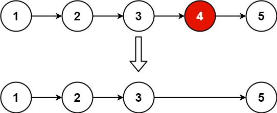
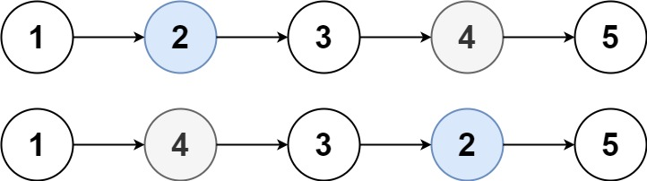
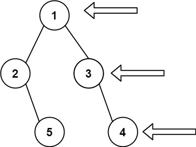

# Leetcode Grind

## 78. Subsets : 
https://leetcode.com/problems/subsets/
    For example we wantto print all the permutations of [1,2,3]. the permutations would look like.
    Input: nums = [1,2,3]
    Output: [[],[1],[2],[1,2],[3],[1,3],[2,3],[1,2,3]]

```java
public List<List<Integer>> subsets(int[] nums) {
List<List<Integer>> list = new ArrayList<>();
Arrays.sort(nums);
backtrack(list, new ArrayList<>(), nums, 0);
return list;
}

private void backtrack(List<List<Integer>> list , List<Integer> tempList, int [] nums, int start){
    list.add(new ArrayList<>(tempList));
    for(int i = start; i < nums.length; i++){
        tempList.add(nums[i]);
        backtrack(list, tempList, nums, i + 1);
        tempList.remove(tempList.size() - 1);
    }
}
```
    The output will be like [] [1] [1,2] [1,2,3] now after the calls to backtrack() completes, we start removing elements like 3 and then 2. and now we add 3 so the output well be [1,3] [2] [2,3] and finally [3]

    ## Output: [] [1] [1,2] [1,2,3] [1,3] [2] [2,3] [3]


## 90. Subsets II (contains duplicates) : 
https://leetcode.com/problems/subsets-ii/
### 1st Approach
    Here we have some duplicates, so we need to take care and not print duplicate permutations. For example 
    
    Input: nums = [1,2,2]
    Output: [[],[1],[1,2],[1,2,2],[2],[2,2]]

    if we try to apply same logic as "Subsets" problem we will get output 

    [[],[1],[1,2],[1,2,2],[1,2],[2],[2,2],[2]]. here [1,2] and [2] are printed twice.

```java
public List<List<Integer>> subsetsWithDup(int[] nums) {
    List<List<Integer>> list = new ArrayList<>();
    Arrays.sort(nums);
    backtrack(list, new ArrayList<>(), nums, 0);
    return list;
}

private void backtrack(List<List<Integer>> list, List<Integer> tempList, int [] nums, int start){
    list.add(new ArrayList<>(tempList));
    for(int i = start; i < nums.length; i++){
        if(i > start && nums[i] == nums[i-1]) continue; // skip duplicates
        tempList.add(nums[i]);
        backtrack(list, tempList, nums, i + 1);
        tempList.remove(tempList.size() - 1);
    }
} 
```
    Hence to deal with duplicates we have added  

    if(i > start && nums[i] == nums[i-1]) continue;

    we will add all the elements if they are in their 1st iteration no matter if they are duplicate, i=start, but when i!=start we will check in the input array nums if the current element is a duplicate. If yes, we will skip this element.
    [] [1] [1,2] 
    [1,2,2] we added last 2, because its in the 1st iteration of the loop.
    [1,2] since this 2 is in a result of i=1 (!=start) we checked for duplicate and reject this permutation.  

    NOTE: don't forget to sort the array, else this will produce duplicate subsets.

### 2nd Approach

    Here insted of rejecting the duplicates, we will generate all the subsets and put it inside hashset to eleminate duplicate sets. This approach is not as intutive as first.

```java
 public List<List<Integer>> subsetsWithDup(int[] nums) {
        Arrays.sort(nums);
        HashSet<List<Integer>> ans=new HashSet<>();
        backtrack(nums,ans,new ArrayList<>(),0);
        return new ArrayList<>(ans);
    }
    public void backtrack(int[] nums, HashSet<List<Integer>> ans, List<Integer> sub, int start) {
        ans.add(new ArrayList<>(sub));
        for(int i=start;i<nums.length;i++){
            // if(i>start && nums[i]==nums[i-1])continue;
            sub.add(nums[i]);
            backtrack(nums,ans,sub,i+1);
            sub.remove(sub.size()-1);
        }
    }
```

## 46. Permutations 
https://leetcode.com/problems/permutations/

    Here we are dealing with permutations rather than subsets as we saw in the previous problem. 

    Input: nums = [1,2,3]
    Output: [[1,2,3],[1,3,2],[2,1,3],[2,3,1],[3,1,2],[3,2,1]]

```java
public List<List<Integer>> permute(int[] nums) {
   List<List<Integer>> list = new ArrayList<>();
   // Arrays.sort(nums); // not necessary
   backtrack(list, new ArrayList<>(), nums);
   return list;
}

private void backtrack(List<List<Integer>> list, List<Integer> tempList, int [] nums){
   if(tempList.size() == nums.length){
      list.add(new ArrayList<>(tempList));
   } else{
      for(int i = 0; i < nums.length; i++){ 
         if(tempList.contains(nums[i])) continue; // element already exists, skip
         tempList.add(nums[i]);
         backtrack(list, tempList, nums);
         tempList.remove(tempList.size() - 1);
      }
   }
} 
```

## 47.Permutations II (contains duplicates) : 
https://leetcode.com/problems/permutations-ii/

    This problem is exactly the same as previous one just with duplicates.

    Input: nums = [1,1,2]
    Output:[    [1,1,2],    [1,2,1],    [2,1,1]]

```java
public List<List<Integer>> permuteUnique(int[] nums) {
    List<List<Integer>> list = new ArrayList<>();
    Arrays.sort(nums);
    backtrack(list, new ArrayList<>(), nums, new boolean[nums.length]);
    return list;
}

private void backtrack(List<List<Integer>> list, List<Integer> tempList, int [] nums, boolean [] used){
    if(tempList.size() == nums.length){
        list.add(new ArrayList<>(tempList));
    } else{
        for(int i = 0; i < nums.length; i++){
            if(used[i] || (i > 0 && nums[i] == nums[i-1] && !used[i - 1]) continue;
            used[i] = true; 
            tempList.add(nums[i]);
            backtrack(list, tempList, nums, used);
            used[i] = false; 
            tempList.remove(tempList.size() - 1);
        }
    }
}
```

    Here we are using the if statement to eliminate the duplicates. Lets do a quick walk through using [1,1,2] asan example.

    1.) call to backtrack(<>, <>, [1,1,2], [false,false,false]);
        1) (i=0)-> backtrack(<>, <1>, [1,1,2], [true,false,false]);
           1) (i=0)-> continue skip i=0 since used[i]=true;
           2) (i=1)-> backtrack(<>, <1,1>, [1,1,2], [true,true,false]);
              1) (i=0)-> continue skip i=0 since used[0]=true;
              2) (i=1)-> contunue skip i=1 since used[1]=true;
              3) (i=2)-> backtrack(<>, <1,1,2>, [1,1,2], [true,true,true]);
                 1) <1,1,2> added to ans
              4) (i=2) <1,1> <true,true,false>
           3) (i=1)-> <1> <true,false,false>
           4) (i=2)-> backtrack(<>, <1,2>, [1,1,2], [true,false,true]);
              1) (i=0)-> continue skip i=0 since used[0]=true;
              2) (i=1)-> backtrack(<>, <1,2,1>, [1,1,2], [true,true,true]);
                 1) <1,2,1> added to answer
              3) (i=1)-> <1,2> [true,false,true]
              4) (i=2)-> continue skip since used[2]=true;
           5) (i=2)-> <1> [true, false, false]
        2) (i=0)-> <> [false,false,false]
        3) (i=1)=> backtrack(<>, <1>, [1,1,2], [false,true,false]);
        4) -
        5) -

    if used[i] is false, means that that element is not present in current sub array.
    if used[i]=used[i-1] and i-1th element is not present in current sub array. Then we will also skip ith element. because taking ith or i-1th element will make a duplicate sub array. in other words, we dont incluede ith element because we must be having one set where i-1th element is being used and we dont want to make same sub array where ith element is there in place of i-1th element.

    In the above example focus on [1a,1b,2] we dont wanna create [1a,2] and [1b,2] as both are same. 

    Don't overthink that we might not generate both [1a,2] and [1b,2] if we use this algorithm. This will not happen because it only checkes for i-1 th pos for duplicate. Hence for 1st duplicate element, i-1th element is not equal and we will generate a permutation.


## 904. Fruit Into Baskets

    You want to collect as much fruit as possible. However, the owner has some strict rules that you must follow:

    You only have two baskets, and each basket can only hold a single type of fruit. There is no limit on the amount of fruit each basket can hold.
    Starting from any tree of your choice, you must pick exactly one fruit from every tree (including the start tree) while moving to the right. The picked fruits must fit in one of your baskets.
    Once you reach a tree with fruit that cannot fit in your baskets, you must stop.

```java
public int totalFruit(int[] fruits) {
        Map<Integer,Integer> hs=new HashMap<>();
        int left =0;
        int ans=0;
        for(int right=0;right<fruits.length;right++){
            hs.put(fruits[right],hs.getOrDefault(fruits[right],0)+1);
            while(hs.size()>2){
                hs.put(fruits[left],hs.get(fruits[left])-1);
                if(hs.get(fruits[left])==0){
                    hs.remove(fruits[left]);
                }
                left++;
            }
            ans=Math.max(ans,right-left+1);
        }
        return ans;
    }
```

    This solution is O(2n) time complexity because left and right pointer traverses the whole array once.


## 456. 132 Pattern

    This is not a straight forward but problem on "monotonously decreasing stack". In this approach, we are keeping track of a maximum element on the top of the stack meanwhile we will also keeping track of a minimum element before that.

    PROBLEM
    Given an array of n integers nums, a 132 pattern is a subsequence of three integers nums[i], nums[j] and nums[k] such that i < j < k and nums[i] < nums[k] < nums[j].

    Return true if there is a 132 pattern in nums, otherwise, return false.

    Input: nums = [1,2,3,4]
    Output: false
    Explanation: There is no 132 pattern in the sequence.

```java
    int min=nums[0];
        Stack<int[]> stack=new Stack<>();
        for(int element:nums){
            while(!stack.empty() && element>=stack.peek()[0]){
                stack.pop();
            }
            if(!stack.empty() && element>stack.peek()[1]){
                return true;
            }
            min=Math.min(min,element);
            stack.push(new int []{element,min});
        }
    return false;
```

    time complexity is )(2n) because we are pushing and popping all the elements n times.


## 150. Evaluate Reverse Polish Notation 
https://leetcode.com/problems/evaluate-reverse-polish-notation/description/

    Input: tokens = ["2","1","+","3","*"]
    Output: 9
    Explanation: ((2 + 1) * 3) = 9

    very simple approach with single stack. we keep on checking if we have any operator, we will pop from stack do the operation and again push onstack. else we push the digit on the stack;

```java
    class Solution {
    public int evalRPN(String[] tokens) {
        Stack<Integer> stack=new Stack<>();
        for(String s:tokens){
            if(s.equals("+")){
                stack.push(stack.pop()+stack.pop());
            }else if(s.equals("-")){
                int a=stack.pop();
                int b=stack.pop();
                stack.push(b-a);
            }else if(s.equals("*")){
                stack.push(stack.pop()*stack.pop());
            }else if(s.equals("/")){
                int a=stack.pop();
                int b=stack.pop();
                stack.push(b/a);
            }else{
                stack.push(Integer.parseInt(s));
            }
        }return stack.pop();
    }
}
```

    Time complexity is O(n)

## 2390. Removing Stars From a String 
https://leetcode.com/problems/removing-stars-from-a-string/description/

```java
public String removeStars(String s) {
        Stack<Character> stack=new Stack<>();
        StringBuilder sb=new StringBuilder();
        for(Character c:s.toCharArray()){
            if(c=='*'){
                stack.pop();
            }else{
                stack.push(c);
            }
        }
        while(!stack.empty()){
                sb.append(stack.pop());
        }
        return sb.reverse().toString();
    }
```

    Time complexity: O(n)

## 704. Binary Search 
https://leetcode.com/problems/binary-search/description/

```java
public int search(int[] nums, int target) {
        int left=0;
        int right=nums.length-1;
        int mid=(left+right)/2;
        while(left<=right){
            mid=(left+right)/2;
            if(nums[mid]==target){
                return mid;
            }else if(nums[mid]>target){
                right=mid-1;
            }else left=mid+1;
        }
        return -1;
    }
```

## 540. Single Element in a Sorted Array 
https://leetcode.com/problems/single-element-in-a-sorted-array/description/

    Input: nums = [1,1,2,3,3,4,4,8,8]
    Output: 2

```java
public int singleNonDuplicate(int[] nums) {
        if(nums.length == 1)return nums[0];
        if(nums[0]!=nums[1])return nums[0];
        if(nums[nums.length-1]!= nums[nums.length-2])return nums[nums.length-1];
        int left =1;
        int right=nums.length-2;
        int mid=0;
        while(left<=right){
            mid=(left+right)/2;
            if(nums[mid] != nums[mid-1] && nums[mid] != nums[mid+1]){
                return nums[mid];
            }
            if((mid%2==0 && nums[mid-1]==nums[mid]) || (mid%2==1 && nums[mid+1]==nums[mid])){
                    right=mid-1;
                }else{
                    left=mid+1;
                }  
        }
        return -1;
    }
```
    Time complexity is O(log n)


## 1011. Capacity To Ship Packages Within D Days 
https://leetcode.com/problems/capacity-to-ship-packages-within-d-days/description/

    Input: weights = [1,2,3,4,5,6,7,8,9,10], days = 5
    Output: 15
    Explanation: A ship capacity of 15 is the minimum to ship all the packages in 5 days like this:
    1st day: 1, 2, 3, 4, 5
    2nd day: 6, 7
    3rd day: 8
    4th day: 9
    5th day: 10

    Note that the cargo must be shipped in the order given, so using a ship of capacity 14 and splitting the packages into parts like (2, 3, 4, 5), (1, 6, 7), (8), (9), (10) is not allowed.


```java
public boolean isShip(int[] weights,int capicity, int days){
    int ships=1;
    int currCap=capicity;
    for(int w:weights){
            if(currCap-w<0){
                ships++;
                currCap=capicity;
            }
            currCap-=w;
    }
    return ships<=days;
}
public int shipWithinDays(int[] weights, int days) {
    int lower=0;
    int total=0;
    int ans_sofar=Integer.MAX_VALUE;
    int mid=-1;
    for(int w:weights){
            lower=Math.max(lower,w);
            total+=w;
        }
    while(lower<=total){
        mid=(lower+total)/2;
        if(isShip(weights,mid,days)){
            total=mid-1;
            ans_sofar=Math.min(ans_sofar,mid);
        }else{
            lower=mid+1;
        }
    }
    return ans_sofar;
}
```

## 2300. Successful Pairs of Spells and Potions 
https://leetcode.com/problems/successful-pairs-of-spells-and-potions/description/

    Input: spells = [5,1,3], potions = [1,2,3,4,5], success = 7
    Output: [4,0,3]
    Explanation:
    - 0th spell: 5 * [1,2,3,4,5] = [5,10,15,20,25]. 4 pairs are successful.
    - 1st spell: 1 * [1,2,3,4,5] = [1,2,3,4,5]. 0 pairs are successful.
    - 2nd spell: 3 * [1,2,3,4,5] = [3,6,9,12,15]. 3 pairs are successful.
    Thus, [4,0,3] is returned.

```java 
public int[] successfulPairs(int[] spells, int[] potions, long success) {
        int[] ans = new int[spells.length];
        Arrays.sort(potions);
        for(int i=0;i<spells.length;i++){
            int left=0;
            int right=potions.length-1;
            int mid=-1;
            int min=potions.length;
            while(left<=right){
                mid =left + (right - left) / 2;
                long prod=(long)spells[i]*potions[mid];
                if(prod>=success){
                    right=mid-1;min=mid;
                }else{
                    left=mid+1;
                }
            } 
            ans[i]=potions.length-min;     
        }
        return ans;
    }
```

    for the bruitforce solution with 2 nested arrays, time comp will be O(m*n), but now we applied a binary search algorith so it will be now O(m*log n)

## 200. Number of Islands 
https://leetcode.com/problems/number-of-islands/

```java
public void bfs(char[][] grid,int row, int col){
        if(row<0||col<0||row>grid.length-1||col>grid[0].length-1||grid[row][col]=='0')return;
        grid[row][col]='0';
        bfs(grid,row-1,col);//top
        bfs(grid,row+1,col);//bottom
        bfs(grid,row,col-1);//left
        bfs(grid,row,col+1);//right
    }

    public int numIslands(char[][] grid) {
        int cnt=0;
        for(int i=0;i<grid.length;i++){
            for(int j=0;j<grid[0].length;j++){
                if(grid[i][j]=='1'){
                    cnt++;
                    bfs(grid,i,j);
                }
            }
        }return cnt;
    }
```

    Time complexity willbe O(m * n), since all the blocks have been traversed once.


## 153. Find Minimum in Rotated Sorted Array https://leetcode.com/problems/find-minimum-in-rotated-sorted-array/ (classic)

```java
public int findMin(int[] nums) {
        int left=0;
        int right=nums.length-1;

        while(left<right){
            int mid=left+(right-left)/2;
            if(nums[mid]>nums[right]){
                left=mid+1;
            }else{
                right=mid;
            }
        }
        return nums[left];
}
```
    Time complexity: O(log n)


## 33. Search in Rotated Sorted Array 
https://leetcode.com/problems/search-in-rotated-sorted-array/description/


```java
public int search(int[] nums, int target) {
        if(nums==null||nums.length==0)return -1;
        //Lets first finfd the starting point of rotation, which wil be dipected by left after the 1st binary search.
        int left=0;
        int right=nums.length-1;
        int mid=-1;
        while(left<right){
            mid=left+(right-left)/2;
            if(nums[mid]>nums[right]){
                left=mid+1;
            }else{
                right=mid;
            }
        }
        System.out.println(left);
        int start=left;
        left=0;
        right=nums.length-1;
        // now we have 2 sorted arrays and we wnat to select the one in which the target lies
        if(target>=nums[start] && target<=nums[right]){
            left=start;
        }else{
            right=start;
        }
        // we have select the array, now simply apply the binary search algorithm
        while(left<=right){
            mid=left+(right-left)/2;
            if(target==nums[mid])return mid;
            if(nums[mid]>target){
                right=mid-1;
            }else{
                left=mid+1;
            }
        }
        return -1;
    }
```


## 34. Find First and Last Position of Element in Sorted Array
https://leetcode.com/problems/find-first-and-last-position-of-element-in-sorted-array/description/

```java 
public int[] searchRange(int[] nums, int target) {
        int ans[]={-1,-1};
        ans[0]=search(nums,target,true);
        if(ans[0]!=-1)ans[1]=search(nums,target,false);
        return ans;
    }
    int search(int[] nums, int target, boolean firstIndex) {
        int ans=-1;
        int left=0;
        int right=nums.length-1;
        int mid=0;
        while(left<=right){
            mid=left+(right-left)/2;
            if(nums[mid]<target){
                left=mid+1;
            }else if(nums[mid]>target){
                right=mid-1;
            }else {
                ans=mid;
                if(firstIndex){
                    right=mid-1;
                }else{
                    left=mid+1;
                }
            }
        }return ans;
    }
```

    Time complexity: O(log n)

## 206. Reverse Linked List (Classic)
https://leetcode.com/problems/reverse-linked-list/

### Iterative Solution

```java
public ListNode reverseList(ListNode head) {
        ListNode current=head;
        ListNode nextNode=null;
        ListNode previous=null;

        while(current!=null){
            nextNode=current.next;
            current.next=previous;
            previous=current;
            current=nextNode;
        }
        return previous;
    }
```

    Time complexity: O(n)

### Recursive Solution

```java
    public ListNode reverseList(ListNode head) {
        return rev(head, null);
    }

    public ListNode rev(ListNode node, ListNode pre) {
        if (node == null) return pre;
        ListNode temp = node.next;
        node.next = pre;
        return rev(temp, node);
    }
```
## 21. Merge Two Sorted Lists (Classic)
https://leetcode.com/problems/merge-two-sorted-lists/description/


    Take a pointer, point it to the least valued node, increment both pointer. In the end just point the resulting list to a non empty list if there any.
```java 
    public ListNode mergeTwoLists(ListNode list1, ListNode list2) {
        ListNode head=new ListNode();
        ListNode pointer=head;
        while(list1!=null && list2!=null){
            if(list1.val<list2.val){
                pointer.next=list1;
                list1=list1.next;
            }else{
                pointer.next=list2;
                list2=list2.next;
            }
            pointer=pointer.next;
        }
        pointer.next=list1!=null?list1:list2;
        return head.next;
    }
```

## 234. Palindrome Linked List
https://leetcode.com/problems/palindrome-linked-list/

```java
    public boolean isPalindrome(ListNode head) {
        StringBuilder str=new StringBuilder("");
        while(head!=null){
            str.append(head.val);
            head=head.next;
        }
        StringBuilder strrev=new StringBuilder(str).reverse();
        boolean ans=true;
        for(int i=0;i<str.length();i++){
            if(str.charAt(i)!=strrev.charAt(i)){
                ans= false;
            }
        }
        return ans;
    }
```


## 234. Palindrome Linked List
https://leetcode.com/problems/palindrome-linked-list/

    Reverse the later half after reversing just start comparing if at any time the value doesn't match it's not a palindrome, i.e. return false, else it's a palindrome and return true.
    It'll automatically take care of the edge cases of odd and even

```java
class Solution {

    public boolean isPalindrome(ListNode head) {
        ListNode fast = head;
        ListNode slow = head;
        while (fast != null && fast.next != null) {
            fast = fast.next.next;
            slow = slow.next;
        }
        ListNode temp = reverse(slow);
        while (temp != null && head != null) {
            if (temp.val != head.val) return false;
            temp = temp.next;
            head = head.next;
        }
        return true;
    }

    public ListNode reverse(ListNode head) {
        ListNode p = null;
        ListNode q = null;
        ListNode r = head;
        while (r != null) {
            p = q;
            q = r;
            r = r.next;
            q.next = p;
        }
        return q;
    }
}

```

## 203. Remove Linked List Elements
https://leetcode.com/problems/remove-linked-list-elements/


```java
public ListNode removeElements(ListNode head, int val) {
        if (head == null) return null;
        head.next = removeElements(head.next, val);
        return head.val == val ? head.next : head;
    }
```


## 143. Reorder List
https://leetcode.com/problems/reorder-list/description/

```java 
class Solution {
    ListNode reverseList(ListNode head){
        ListNode prev=null;
        ListNode curr_node=head;
        ListNode next_node=null;
        while(curr_node!=null){
            next_node=curr_node.next;
            curr_node.next=prev;
            prev=curr_node;
            curr_node=next_node;
        }
        return prev;
    }
     void merge(ListNode l1,ListNode l2){
         while(l1!=null){
            ListNode l1_next=l1.next;
            ListNode l2_next=l2.next;

            l1.next=l2;
            if(l1_next==null){
                break;
            }
            l2.next=l1_next;
            l1=l1_next;
            l2=l2_next;
         }
    }
    public void reorderList(ListNode head) {
        if(head==null||head.next==null){return;}
        
        //head and tail of list 1
        ListNode first_head=head;
        ListNode first_tail=null;

        //head and tail of list 2
        ListNode slow=head;
        ListNode fast=head;
        
        while(fast!=null && fast.next!=null){
            first_tail=slow;
            slow=slow.next;
            fast=fast.next.next;
        }
        first_tail.next=null;

        ListNode l2=reverseList(slow);
        merge(first_head,l2);
    }
}
```


## 2130. Maximum Twin Sum of a Linked List
https://leetcode.com/problems/maximum-twin-sum-of-a-linked-list/description/

```java
    public int pairSum(ListNode head) {
        // Lets find the midpoint, and then reverse the LL from there.
        int ans=-1;
        // Midpoint
        ListNode slow=head;
        ListNode fast=head;
        while(fast!=null && fast.next!=null){
            slow=slow.next;
            fast=fast.next.next;
        }

        // Reverse
        ListNode current=slow;
        ListNode prev=null;
        ListNode nextn=null;
        while(current!=null){
            nextn=current.next;
            current.next=prev;
            prev=current;
            current=nextn;
        }

        // checking for twins
        while(head!=null && prev!=null){
            ans=Math.max(ans, (head.val + prev.val));
            head=head.next;
            prev=prev.next;
        }
        return ans;
    }
```

## 19. Remove Nth Node From End of List
https://leetcode.com/problems/remove-nth-node-from-end-of-list/



    Note that we need not the nth node but the node just before that, hence we are using an extra node. Important thing is to see that first and secong is pointing to temp(the node before head).

```java

    public ListNode removeNthFromEnd(ListNode head, int key) {
        if(head==null || head.next==null)return null;
        ListNode temp=new ListNode(0);
        temp.next=head;
        ListNode first = temp;
        ListNode second = temp;
        
        while(key>0){
            second=second.next;key--;
        }

        while(second.next!=null){
            first=first.next;
            second=second.next;
        }
        first.next=first.next.next;
        return temp.next;

    }
```


## 1721. Swapping Nodes in a Linked List
https://leetcode.com/problems/swapping-nodes-in-a-linked-list/


```java
    public ListNode swapNodes(ListNode head, int k) {
        ListNode second=head;
        ListNode first=head;
        ListNode kstart=null;
        while(k>1){
            second=second.next;
            k--;
        }
        kstart=second;
        while(second.next!=null){
            first=first.next;
            second=second.next;
        }
        int tempval=first.val;
        first.val=kstart.val;
        kstart.val=tempval;
        return head;
    }
```

## 138. Copy List with Random Pointer
https://leetcode.com/problems/copy-list-with-random-pointer/description/
https://www.youtube.com/watch?v=4apaOcK586U&ab_channel=AnujBhaiya

    3 approachs to do this question 
    1. O(n^2) for every node do a loop from start.
    2. O(n) time and space the below solution
    3. O(n) time ans constant space.
```java
class Solution {

    public Node copyRandomList(Node head) {
        Node cur = head;
        HashMap<Node, Node> map = new HashMap<>();
        while (cur != null) {
            map.put(cur, new Node(cur.val));
            cur = cur.next;
        }
        cur = head;
        while (cur != null) {
            map.get(cur).next = map.get(cur.next);
            map.get(cur).random = map.get(cur.random);
            cur = cur.next;
        }
        return map.get(head);
    }
}

```


## 141. Linked List Cycle (Classic)
https://leetcode.com/problems/linked-list-cycle/description/

```java
    public boolean hasCycle(ListNode head) {
        ListNode slow=head;
        ListNode fast=head;

        while(fast!=null && fast.next!=null){
            slow=slow.next;
            fast=fast.next.next;
            
            if(slow==fast)return true;
        }
        return false;
    }
```


## 61. Rotate List  (Good Question)
https://leetcode.com/problems/rotate-list/description/

```java
 public ListNode rotateRight(ListNode head, int k) {
        if(head==null||head.next==null||k==0)return head;
        int len=1;
        ListNode temp=head;

        while(temp.next!=null){
            temp=temp.next;len++;
        }
        temp.next=head;
        k=k%len;
        k=len-k;
        while(k>0){
            temp=temp.next;k--;
        }

        head = temp.next;
        temp.next = null;

        return head;
    }
```


## 104. Maximum Depth of Binary Tree
https://leetcode.com/problems/maximum-depth-of-binary-tree/description/

```java
    public int maxDepth(TreeNode root) {
        return recur(root,0);

    }
    public int recur(TreeNode root, int height){
        if(root==null)return height;
        return Math.max(recur(root.left,height+1),recur(root.right,height+1));
    }
```


## 226. Invert Binary Tree
https://leetcode.com/problems/invert-binary-tree/

```java
     public TreeNode invertTree(TreeNode root) {
        if(root==null)return null;
        TreeNode templeft=root.left;
        root.left=invertTree(root.right);
        root.right=invertTree(templeft);
        return root;
    }
```


## 543. Diameter of Binary Tree
https://leetcode.com/problems/diameter-of-binary-tree/description/


    We have 2 approach for this solution. First would be traversing each node on the 
    tree using bfs/dfs and calculating the height of left and right tree at each node,
    and saving the maximum (left+right). This approach is O(n^2)

    The below approach is visiting each node once, but fom bottom up pattern resulting in O(n)

```java 
class Solution {
    int target=0;
    public int height(TreeNode root) {
        if(root==null)return -1;
        int left=1+height(root.left);
        int right=1+height(root.right);
        target=Math.max(target,(left+right));
        return Math.max(left,right);
    }
    public int diameterOfBinaryTree(TreeNode root) {
        height(root);
        return target;
    }
}
```


## 110. Balanced Binary Tree
https://leetcode.com/problems/balanced-binary-tree/description/

### Height-Balanced
A height-balanced binary tree is a binary tree in which the depth of the two subtrees of every node never differs by more than one.

### Aproach 1

O(n^2): at each node checking if |left height - right hight|

```java
class Solution {
    public boolean isBalanced(TreeNode root) {
        return dfs(root);
    }
    public boolean dfs(TreeNode root) {
        if(root==null)return true;
        int left=height(root.left,0);
        int right=height(root.right,0);
        if(Math.abs(left-right)>1)return false;
        return dfs(root.left) && dfs(root.right);
    }
    public int height(TreeNode root,int h) {
        if(root==null)return h;
        return Math.max(height(root.left,h+1),height(root.right,h+1));
    }
}
```

### Approach 2

O(n): traversing each node only once and simoultaneously calculate height 

    import javafx.util.Pair;

```java
class Solution {
    public Pair<Boolean,Integer> dfs(TreeNode root){
        if(root==null)return new Pair<Boolean,Integer>(true,0);
        Pair<Boolean,Integer> left=dfs(root.left);
        Pair<Boolean,Integer> right=dfs(root.right);
        Boolean balanced=left.getKey() && right.getKey() && (Math.abs(left.getValue()-right.getValue())<=1);
        return new Pair<Boolean,Integer>(balanced,1+Math.max(left.getValue(),right.getValue()));
    }
    public boolean isBalanced(TreeNode root) {
        return dfs(root).getKey();
    }
}
```


## 572. Subtree of Another Tree
https://leetcode.com/problems/subtree-of-another-tree/description/

    // Time Complexity: O(n)
    // Extra Space Complexity: O(n)

```java
class Solution {
    public boolean isSubtree(TreeNode root, TreeNode subRoot) {
        return dfs(root,subRoot);
    }
    public boolean dfs(TreeNode root, TreeNode subRoot) {
        if((subRoot==null)||check(root,subRoot))return true;
        if(root==null)return false;
        return dfs(root.left,subRoot) || dfs(root.right,subRoot);
    }
    public boolean check(TreeNode root, TreeNode subRoot) {
        if(root==null && subRoot==null)return true;
        if((root==null) || (subRoot==null) || root.val!=subRoot.val )return false;
        return check(root.left,subRoot.left) && check(root.right,subRoot.right);
    }
}
```


## 108. Convert Sorted Array to Binary Search Tree
https://leetcode.com/problems/convert-sorted-array-to-binary-search-tree/description/

```java
class Solution {
    public TreeNode sortedArrayToBST(int[] nums) {
        return makenodes(nums, 0,nums.length-1);
    }
    public TreeNode makenodes(int[] nums, int left, int right) {
        if(left>right)return null;
        int mid=(left+right)/2;
        TreeNode root=new TreeNode(nums[mid]);
        root.left=makenodes(nums, left,mid-1);
        root.right=makenodes(nums, mid+1,right);
        return root;
    }
}
```


## 617. Merge Two Binary Trees
https://leetcode.com/problems/merge-two-binary-trees/description/


```java
class Solution {
    public TreeNode mergeTrees(TreeNode root1, TreeNode root2) {
        if(root1==null && root2==null)return null;
        int val1 = root1 != null ? root1.val : 0;
        int val2 = root2 != null ? root2.val : 0;

        TreeNode root = new TreeNode(val1 + val2);

        root.left=mergeTrees(root1!=null?root1.left:null,root2!=null?root2.left:null);
        root.right=mergeTrees(root1!=null?root1.right:null,root2!=null?root2.right:null);
        return root;
    }
}
```


## 235. Lowest Common Ancestor of a Binary Search Tree
https://leetcode.com/problems/lowest-common-ancestor-of-a-binary-search-tree/

```java

class Solution {
    public TreeNode lowestCommonAncestor(TreeNode root, TreeNode p, TreeNode q) {
        if(root.val>p.val && root.val>q.val)return lowestCommonAncestor(root.left,p,q);
        if(root.val<p.val && root.val<q.val)return lowestCommonAncestor(root.right,p,q);
        return root;
    }
}
```


## 701. Insert into a Binary Search Tree
https://leetcode.com/problems/insert-into-a-binary-search-tree/description/

```java
class Solution {
    public TreeNode insertIntoBST(TreeNode root, int val) {
        if(root==null)return new TreeNode(val);
        if(val>root.val){
            root.right=insertIntoBST(root.right,val);
        }else{
            root.left= insertIntoBST(root.left,val);
        }
        return root;
    }
}
```

## 450. Delete Node in a BST
https://leetcode.com/problems/delete-node-in-a-bst/description/

    https://www.youtube.com/watch?v=petKaikRiIA&t=709s&ab_channel=AnujBhaiya

```java
class Solution {
    public TreeNode deleteNode(TreeNode root, int key) {
        if(root == null) return null;
        if(key>root.val){
            root.right=deleteNode(root.right,key);
        }
        else if(key<root.val){
            root.left=deleteNode(root.left,key);
        }
        else{
            if(root.left==null)return root.right;
            else if(root.right==null) return root.left;

            root.val=minValue(root.right);
            root.right=deleteNode(root.right,root.val);
        }
        
        return root;
    }
    public int minValue(TreeNode root){
        // Finding the inorder successor of the target node. and that node will always have node.left=null; 
        int min=root.val;
        while(root.left!=null){
            min=root.left.val;
            root=root.left;
        }
        return min;
    }
    
}
```

## 102. Binary Tree Level Order Traversal
https://leetcode.com/problems/binary-tree-level-order-traversal/description/


```java
class Solution {
    public List<List<Integer>> levelOrder(TreeNode root) {
        Queue<TreeNode> q=new LinkedList<>();
        List<List<Integer>> ans=new ArrayList<>();
        
        q.add(root);
        while(!q.isEmpty()){
            int len=q.size();
            List<Integer> sub=new ArrayList<>();
            for(int i=0;i<len;i++){
                TreeNode temp=q.poll();
                if(temp!=null){
                    sub.add(temp.val);
                    if(temp.left!=null){q.add(temp.left);}
                    if(temp.right!=null){q.add(temp.right);}
                }
            }
            if(sub.size()>0)ans.add(sub);
        }
        return ans;
    }
}
```


## 199. Binary Tree Right Side View
https://leetcode.com/problems/binary-tree-right-side-view/description/



```java
class Solution {

    public List<Integer> rightSideView(TreeNode root) {
        List<Integer> list = new ArrayList<Integer>();
        if (root == null) return list;
        bfs(list, root);
        return list;
    }

    public void bfs(List<Integer> list, TreeNode root) {
        Queue<TreeNode> q = new LinkedList<>();
        q.offer(root);
        while (!q.isEmpty()) {
            int levelSize = q.size();
            for (int i = 0; i < levelSize; i++) {
                TreeNode cur = q.poll();
                if (i == 0) list.add(cur.val);
                if (cur.right != null) q.offer(cur.right);
                if (cur.left != null) q.offer(cur.left);
            }
        }
    }
}
```


## 783. Minimum Distance Between BST Nodes
https://leetcode.com/problems/minimum-distance-between-bst-nodes/description/

```java
class Solution {
    int prev=Integer.MAX_VALUE;
    int ans=Integer.MAX_VALUE;
    public int minDiffInBST(TreeNode root) {
        inorder(root);
        return ans;
    }
    public void inorder(TreeNode root) {
        if(root==null)return;
        inorder(root.left);
        ans=Math.min(ans,Math.abs(root.val-prev));
        prev=root.val;
        inorder(root.right);
    }
}
```


## 101. Symmetric Tree
https://leetcode.com/problems/symmetric-tree/description/

```java 
class Solution {
    public boolean isSymmetric(TreeNode root) {
        return check(root.right,root.left);
    }
    public boolean check(TreeNode t1, TreeNode t2) {
        if(t1==null && t2==null)return true;
        if((t1==null && t2!=null) || (t1!=null && t2==null) || (t1.val!=t2.val))return false;
        return check(t1.left,t2.right) && check(t1.right,t2.left);
    }
}
```


## 103. Binary Tree Zigzag Level Order Traversal
https://leetcode.com/problems/binary-tree-zigzag-level-order-traversal/

```java
class Solution {
    public List<List<Integer>> zigzagLevelOrder(TreeNode root) {
        List<List<Integer>> ans=new ArrayList<>();
        Queue<TreeNode> q=new LinkedList<>();
        if(root==null)return ans;
        q.add(root);
        int level=1;
        while(!q.isEmpty()){
            List<Integer> subList=new ArrayList<>();
            int size=q.size();
            while(size!=0){
                TreeNode node=q.poll();
                subList.add(node.val);

                if(node.left!=null)q.add(node.left);
                if(node.right!=null)q.add(node.right);

                size--;
            }
            if(level%2==0){
                Collections.reverse(subList);
            }
            ans.add(subList);
            level++;
        }
        return ans;
    }
}
```

## 958. Check Completeness of a Binary Tree
https://leetcode.com/problems/check-completeness-of-a-binary-tree/

```java
class Solution {
    public boolean isCompleteTree(TreeNode root) {
        Queue<TreeNode> q=new LinkedList<>();
        if(root==null)return true;
        q.offer(root);
        while(!q.isEmpty()){
                TreeNode node=q.poll();
                if(node != null )q.offer(node.left);
                if(node != null )q.offer(node.right);
                if(node==null){
                    while(!q.isEmpty()){
                        if(q.poll()!=null)return false;
                    }
                }
            }
    return true;
    }
}
```