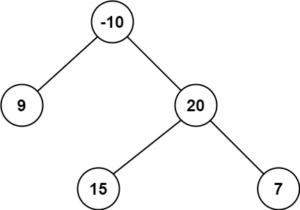
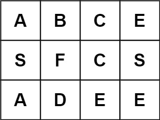
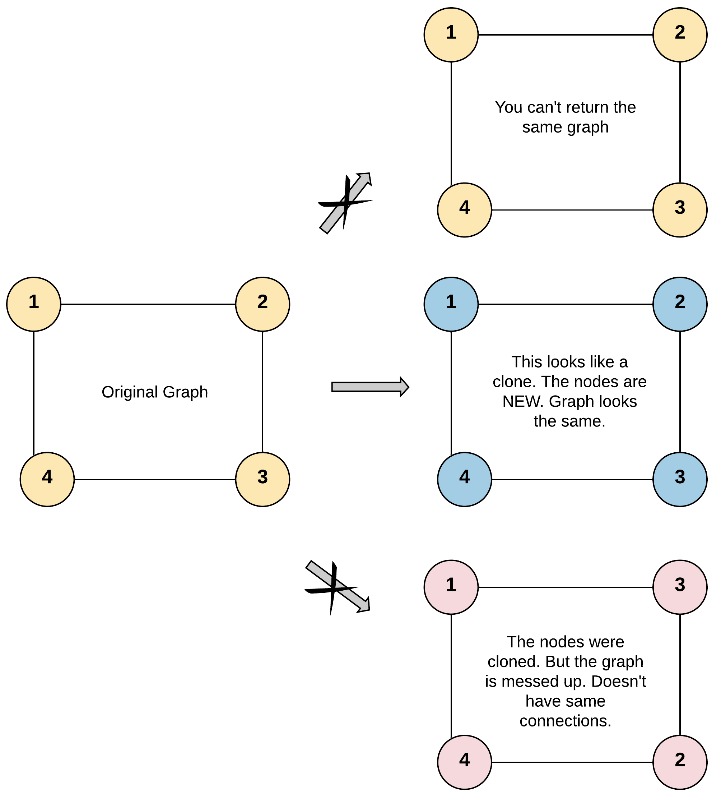
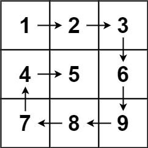
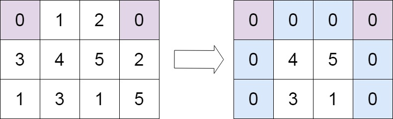
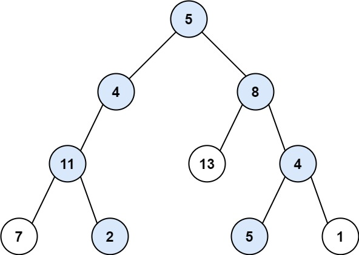

# Blind 75


<style>
/* Style to hide the native disclosure triangle in some browsers */
details summary::-webkit-details-marker {
    display: none;
}
</style>


## <h1 style="text-align: center;">1. Arrays & Hashing </h1>

<details id="section1">
<summary> <span style="color:green;font-size:16px;font-weight:bold">
217. Contains Duplicate 
</span></summary>

https://leetcode.com/problems/contains-duplicate/description/


    Given an integer array nums, return true if any value appears 
    at least twice in the array, and return false if every element is distinct.

    

    Example 1:

    Input: nums = [1,2,3,1]
    Output: true
    Example 2:

    Input: nums = [1,2,3,4]
    Output: false
    Example 3:

    Input: nums = [1,1,1,3,3,4,3,2,4,2]
    Output: true
    

    Constraints:

    1 <= nums.length <= 10^5
    -10^9 <= nums[i] <= 10^9


<span style="color:green;">Solution:</span>

Approach 1: Sorting


Intuition:
The sorting approach sorts the array in ascending order and then checks for 
adjacent elements that are the same. If any duplicates are found, it returns
 true. Sorting helps in bringing duplicates together, simplifying the check. 
 However, sorting has a time complexity of O(n log n).

Explanation:
Another approach is to sort the array and then check for adjacent elements that are the same. If any duplicates are found, return true, otherwise return false.
```java
class Solution {
    public boolean containsDuplicate(int[] nums) {
        Arrays.sort(nums);
        int n = nums.length;
        for (int i = 1; i < n; i++) {
            if (nums[i] == nums[i - 1])
                return true;
        }
        return false;
    }
}
```

    Time: O(nlog(n))
    Space: O(n)


Approach 2: HashSet
```java
class Solution {
    public boolean containsDuplicate(int[] nums) {
        HashSet<Integer> hm=new HashSet<>();
        for(int i:nums){
            if(hm.contains(i)){
                return true;
            }
            hm.add(i);
        }
        return false;
    }
}
```
    Time: O(n)
    Space: O(n)

</details>


<details id="Valid Anagram">
<summary> <span style="color:green;font-size:16px;font-weight:bold">242. Valid Anagram 
</span></summary>

https://leetcode.com/problems/valid-anagram/description/


Given two strings s and t, return true if t is an anagram of s, and false otherwise.

An Anagram is a word or phrase formed by rearranging the letters of a different word or phrase, typically using all the original letters exactly once.

 

Example 1:

Input: s = "anagram", t = "nagaram"
Output: true
Example 2:

Input: s = "rat", t = "car"
Output: false
 

Constraints:

1 <= s.length, t.length <= 5 * 104
s and t consist of lowercase English letters.
 

Follow up: What if the inputs contain Unicode characters? How would you adapt your solution to such a case?


<span style="color:green;">Solution:</span>

Approach 1: Sorting

```java
class Solution {
    public boolean isAnagram(String s, String t) {
        char[] sChars = s.toCharArray();
        char[] tChars = t.toCharArray();
        
        Arrays.sort(sChars);
        Arrays.sort(tChars);
        
        return Arrays.equals(sChars, tChars);
    }
}
```

    Time: O(nlog(n)) n-> length of greater string
    Space: O(n+m)

Approach 2: Hash Table
    
```java
    class Solution {
    public boolean isAnagram(String s, String t) {
        Map<Character, Integer> count = new HashMap<>();
        
        // Count the frequency of characters in string s
        for (char x : s.toCharArray()) {
            count.put(x, count.getOrDefault(x, 0) + 1);
        }
        
        // Decrement the frequency of characters in string t
        for (char x : t.toCharArray()) {
            count.put(x, count.getOrDefault(x, 0) - 1);
        }
        
        // Check if any character has non-zero frequency
        for (int val : count.values()) {
            if (val != 0) {
                return false;
            }
        }
        
        return true;
    }
}
```
    Time: O(n) 
    Space: O(n)
</details>

<details id="Two Sum">
<summary> 
<span style="color:green;font-size:16px;font-weight:bold">1. Two Sum 
</span></summary>

https://leetcode.com/problems/two-sum/description/

Given an array of integers nums and an integer target, return indices of the two numbers such that they add up to target.

You may assume that each input would have exactly one solution, and you may not use the same element twice.

You can return the answer in any order.

 

Example 1:

Input: nums = [2,7,11,15], target = 9
Output: [0,1]
Explanation: Because nums[0] + nums[1] == 9, we return [0, 1].
Example 2:

Input: nums = [3,2,4], target = 6
Output: [1,2]
Example 3:

Input: nums = [3,3], target = 6
Output: [0,1]
 

Constraints:

2 <= nums.length <= 104
-109 <= nums[i] <= 109
-109 <= target <= 109
Only one valid answer exists.
 

Follow-up: Can you come up with an algorithm that is less than O(n2) time complexity?

<span style="color:green;">Solution:</span>

Solution 1: (Brute Force)

```java
class Solution {
    public int[] twoSum(int[] nums, int target) {
        int n = nums.length;
        for (int i = 0; i < n - 1; i++) {
            for (int j = i + 1; j < n; j++) {
                if (nums[i] + nums[j] == target) {
                    return new int[]{i, j};
                }
            }
        }
        return new int[]{}; // No solution found
    }
}
```
    Time: O(n^2)
    Space: O(1)

Solution 2: (Two-pass Hash Table)

```java
class Solution {
    public int[] twoSum(int[] nums, int target) {
        Map<Integer, Integer> numMap = new HashMap<>();
        int n = nums.length;

        // Build the hash table
        for (int i = 0; i < n; i++) {
            numMap.put(nums[i], i);
        }

        // Find the complement
        for (int i = 0; i < n; i++) {
            int complement = target - nums[i];
            if (numMap.containsKey(complement) && numMap.get(complement) != i) {
                return new int[]{i, numMap.get(complement)};
            }
        }

        return new int[]{}; // No solution found
    }
}
```
    Time: O(n)
    Space: O(n)    

</details>


<details id="49. Group Anagrams">
<summary> 
<span style="color:yellow;font-size:16px;font-weight:bold">49. Group Anagrams 
</span></summary>

https://leetcode.com/problems/group-anagrams/description/

Given an array of strings strs, group the anagrams together. You can return the answer in any order.

An Anagram is a word or phrase formed by rearranging the letters of a different word or phrase, typically using all the original letters exactly once.

 

Example 1:

Input: strs = ["eat","tea","tan","ate","nat","bat"]
Output: [["bat"],["nat","tan"],["ate","eat","tea"]]
Example 2:

Input: strs = [""]
Output: [[""]]
Example 3:

Input: strs = ["a"]
Output: [["a"]]
 

Constraints:

1 <= strs.length <= 104
0 <= strs[i].length <= 100
strs[i] consists of lowercase English letters.


<span style="color:green;">Solution:</span>

```java

class Solution {
    public List<List<String>> groupAnagrams(String[] strs) {
        Map<String, List<String>> map = new HashMap<>();
        
        for (String word : strs) {
            char[] chars = word.toCharArray();
            Arrays.sort(chars);
            String sortedWord = new String(chars);
            
            map.putIfAbsent(sortedWord, new ArrayList<>());
            
            map.get(sortedWord).add(word);
        }
        
        return new ArrayList<>(map.values());
    }
}
```

    Time: O(n * k * log(k)), where:

    n is the number of strings in the input array strs.
    k is the maximum length of a string in the input array.
</details>


<details id="347. Top K Frequent Elements">
<summary> 
<span style="color:yellow;font-size:16px;font-weight:bold">347. Top K Frequent Elements 
</span></summary>

https://leetcode.com/problems/top-k-frequent-elements/description/

Given an integer array nums and an integer k, return the k most frequent elements. You may return the answer in any order.

 

Example 1:

Input: nums = [1,1,1,2,2,3], k = 2
Output: [1,2]
Example 2:

Input: nums = [1], k = 1
Output: [1]
 

Constraints:

1 <= nums.length <= 105
-104 <= nums[i] <= 104
k is in the range [1, the number of unique elements in the array].
It is guaranteed that the answer is unique.
 

Follow up: Your algorithm's time complexity must be better than O(n log n), where n is the array's size.

<span style="color:green;">Solution:</span>

Approach 1:HashMap and Priority Queue


```java
class Solution {
    public int[] topKFrequent(int[] nums, int k) {
        HashMap<Integer, Integer> map = new HashMap<>();
        for(int i:nums){
            map.put(i, map.getOrDefault(i, 0)+1);
        }

        int[] ans = new int[k];
        // Max Heap on the basis of HashMap
        PriorityQueue<Integer> queue = new PriorityQueue<>((a,b)->map.get(b)-map.get(a));

        for(int i:map.keySet()){
            //log(n) operation
            queue.add(i);
        }
        for(int i=0; i<k; i++){
            ans[i]=queue.poll();
        }
        return ans;
    }
}
```

    Time complexity: O( n*log(n) ) where n=Length of nums

    Space complexity: O(n)

Approach 2: Bucket Sort

```java
public List<Integer> topKFrequent(int[] nums, int k) {

	List<Integer>[] bucket = new List[nums.length + 1];
	Map<Integer, Integer> frequencyMap = new HashMap<Integer, Integer>();

	for (int n : nums) {
		frequencyMap.put(n, frequencyMap.getOrDefault(n, 0) + 1);
	}

	for (int key : frequencyMap.keySet()) {
		int frequency = frequencyMap.get(key);
		if (bucket[frequency] == null) {
			bucket[frequency] = new ArrayList<>();
		}
		bucket[frequency].add(key);
	}

	List<Integer> res = new ArrayList<>();

	for (int pos = bucket.length - 1; pos >= 0 && res.size() < k; pos--) {
		if (bucket[pos] != null) {
			res.addAll(bucket[pos]);
		}
	}
	return res;
}
```
    Time complexity: O(n)


</details>

<details id="238. Product of Array Except Self">
<summary> 
<span style="color:yellow;font-size:16px;font-weight:bold">238. Product of Array Except Self 
</span></summary>

https://leetcode.com/problems/product-of-array-except-self/description/


Given an integer array nums, return an array answer such that answer[i] is equal to the product of all the elements of nums except nums[i].

The product of any prefix or suffix of nums is guaranteed to fit in a 32-bit integer.

You must write an algorithm that runs in O(n) time and without using the division operation.

 

Example 1:

Input: nums = [1,2,3,4]
Output: [24,12,8,6]
Example 2:

Input: nums = [-1,1,0,-3,3]
Output: [0,0,9,0,0]
 

Constraints:

2 <= nums.length <= 105
-30 <= nums[i] <= 30
The product of any prefix or suffix of nums is guaranteed to fit in a 32-bit integer.
 

Follow up: Can you solve the problem in O(1) extra space complexity? (The output array does not count as extra space for space complexity analysis.)

<span style="color:green;">Solution:</span>

Approach 1: prefix ans suffix sum

```java
class Solution {
    public int[] productExceptSelf(int[] nums) {
        int n = nums.length;
        int pre[] = new int[n];
        int suff[] = new int[n];
        pre[0] = 1;
        suff[n - 1] = 1;
        
        for(int i = 1; i < n; i++) {
            pre[i] = pre[i - 1] * nums[i - 1];
        }
        for(int i = n - 2; i >= 0; i--) {
            suff[i] = suff[i + 1] * nums[i + 1];
        }
        
        int ans[] = new int[n];
        for(int i = 0; i < n; i++) {
            ans[i] = pre[i] * suff[i];
        }
        return ans;
    }
}
```

    Time: O(n)
    Space:O(n)

Approach 2:

```java
class Solution {
    public int[] productExceptSelf(int[] nums) {
        int n = nums.length;
        int ans[] = new int[n];
        Arrays.fill(ans, 1);
        int curr = 1;
        for(int i = 0; i < n; i++) {
            ans[i] *= curr;
            curr *= nums[i];
        }
        curr = 1;
        for(int i = n - 1; i >= 0; i--) {
            ans[i] *= curr;
            curr *= nums[i];
        }
        return ans;
    }
}
```
    Time: O(n)
    Space:O(1)
</details>

<details id="128. Longest Consecutive Sequence">
<summary> 
<span style="color:yellow;font-size:16px;font-weight:bold">128. Longest Consecutive Sequence 
</span></summary>

https://leetcode.com/problems/longest-consecutive-sequence/description/


Given an unsorted array of integers nums, return the length of the longest consecutive elements sequence.

You must write an algorithm that runs in O(n) time.

 

Example 1:

Input: nums = [100,4,200,1,3,2]
Output: 4
Explanation: The longest consecutive elements sequence is [1, 2, 3, 4]. Therefore its length is 4.
Example 2:

Input: nums = [0,3,7,2,5,8,4,6,0,1]
Output: 9
 

Constraints:

0 <= nums.length <= 105
-109 <= nums[i] <= 109

<span style="color:green;">Solution:</span>
Approach: check if the element is the starting number in the sequence. Staring no. predecessor will not be present in the set. check the whole sequence if it is the starting number.

```java
class Solution {
    public int longestConsecutive(int[] nums) {
       if (nums.length == 0) return 0;
       HashSet<Integer> hs = new HashSet<>();
       for(int num:nums) hs.add(num);
       int longest =1;
       for(int num: nums ){
           //check if the num is the start of a sequence by checking if left exists
           if(!hs.contains(num-1)){ // start of a sequence
                int count =1;
                while(hs.contains(num + 1)){ // check if hs contains next no.
                    num++;
                    count++;
                }
                longest = Math.max(longest, count);
                
           }
           if(longest > nums.length/2) break;

       }
       return longest;
    }
}

```

    Time: O(n)

</details>

## <h1 style="text-align: center;">2. Two Pointers </h1>


<details id="125. Valid Palindrome">
<summary> 
<span style="color:green;font-size:16px;font-weight:bold">125. Valid Palindrome 
</span></summary>

https://leetcode.com/problems/valid-palindrome/description/

A phrase is a palindrome if, after converting all uppercase letters into lowercase letters and removing all non-alphanumeric characters, it reads the same forward and backward. Alphanumeric characters include letters and numbers.

Given a string s, return true if it is a palindrome, or false otherwise.

 

Example 1:

Input: s = "A man, a plan, a canal: Panama"
Output: true
Explanation: "amanaplanacanalpanama" is a palindrome.

Example 2:

Input: s = "race a car"
Output: false
Explanation: "raceacar" is not a palindrome.

Example 3:

Input: s = " "
Output: true
Explanation: s is an empty string "" after removing non-alphanumeric characters.
Since an empty string reads the same forward and backward, it is a palindrome.
 

Constraints:

1 <= s.length <= 2 * 105
s consists only of printable ASCII characters.

<span style="color:green;">Solution:</span>

Approach: Simply iterate over the array using 2 pointers and compare the characters
if find any non letter continue the loop.

```java
public boolean isPalindrome(String s) {
        
    int i = 0;
    int j = s.length() - 1;
    while (i < j) {
        
        Character start = s.charAt(i);
        Character end = s.charAt(j);
        
        if (!Character.isLetterOrDigit(start)) {
            i++;
            continue;
        }
        
        if (!Character.isLetterOrDigit(end)) {
            j--;
            continue;
        }
        
        if (Character.toLowerCase(start) != Character.toLowerCase(end)) {
            return false;
        }
        
        i++;
        j--;    
    }
    
    return true;
}
```
    Time: O(n)

</details>

<details id="15. 3Sum">
<summary> 
<span style="color:yellow;font-size:16px;font-weight:bold">15. 3Sum 
</span></summary>

https://leetcode.com/problems/3sum/description/

Given an integer array nums, return all the triplets [nums[i], nums[j], nums[k]] such that i != j, i != k, and j != k, and nums[i] + nums[j] + nums[k] == 0.

Notice that the solution set must not contain duplicate triplets.

 

Example 1:

Input: nums = [-1,0,1,2,-1,-4]
Output: [[-1,-1,2],[-1,0,1]]
Explanation: 
nums[0] + nums[1] + nums[2] = (-1) + 0 + 1 = 0.
nums[1] + nums[2] + nums[4] = 0 + 1 + (-1) = 0.
nums[0] + nums[3] + nums[4] = (-1) + 2 + (-1) = 0.
The distinct triplets are [-1,0,1] and [-1,-1,2].
Notice that the order of the output and the order of the triplets does not matter.
Example 2:

Input: nums = [0,1,1]
Output: []
Explanation: The only possible triplet does not sum up to 0.
Example 3:

Input: nums = [0,0,0]
Output: [[0,0,0]]
Explanation: The only possible triplet sums up to 0.
 

Constraints:

3 <= nums.length <= 3000
-105 <= nums[i] <= 105

<span style="color:green;">Solution:</span>

Approach:
Iterate over the array and in each iteration pick ith element and try to find the 2 other
element that has sum equal to the negative of this number. We need to ignore the
duplicate elements in the outer loop as well as inner 2 pointer loop in order to get the unique triplets. 

```java
class Solution {
    public List<List<Integer>> threeSum(int[] nums) {
        Arrays.sort(nums);
        List<List<Integer>> sol = new ArrayList<List<Integer>>();

        for (int i = 0; i < nums.length - 2; i++) {
            //Only consider non-duplicate elements for i
            if (i == 0 || (i > 0 && nums[i] != nums[i - 1])) {
                int target = 0 - nums[i];
                int left = i + 1;
                int right = nums.length - 1;

                while (left < right) {
                    if (nums[left] + nums[right] == target) {
                        ArrayList<Integer> miniSol = new ArrayList<>(Arrays.asList(nums[i],nums[left],nums[right]));
                        sol.add(miniSol);
                        //Consider duplicate numbers only once
                        while (left < right && nums[left] == nums[left + 1]) {
                            left++;
                        }
                        while (left < right && nums[right] == nums[right - 1]) {
                            right--;
                        }
                        left++;
                        right--;
                    } else if (nums[left] + nums[right] > target) {
                        right--;
                    } else {
                        left++;
                    }
                }
            }
        }
        return sol;
    }
}
```

    Time: O(n^2)
</details>

<details id="11. Container With Most Water">
<summary> 
<span style="color:yellow;font-size:16px;font-weight:bold">11. Container With Most Water 
</span></summary>

https://leetcode.com/problems/container-with-most-water/description/


You are given an integer array height of length n. There are n vertical lines drawn such that the two endpoints of the ith line are (i, 0) and (i, height[i]).

Find two lines that together with the x-axis form a container, such that the container contains the most water.

Return the maximum amount of water a container can store.

Notice that you may not slant the container.

 

Example 1:


Input: height = [1,8,6,2,5,4,8,3,7]
Output: 49
Explanation: The above vertical lines are represented by array [1,8,6,2,5,4,8,3,7]. In this case, the max area of water (blue section) the container can contain is 49.

Example 2:

Input: height = [1,1]
Output: 1
 

Constraints:

n == height.length
2 <= n <= 105
0 <= height[i] <= 104

<span style="color:green;">Solution:</span>

Approach:

```java
class Solution {

    public int maxArea(int[] height) {
        int left = 0;
        int right = height.length - 1;
        int res = 0;
        while (left < right) {
            int containerLength = right - left;
            int area = containerLength * Math.min(height[left], height[right]);
            res = Math.max(res, area);
            // Get the next bar of the shortest bar of the two
            if (height[left] < height[right]) {
                left++;
            } else {
                right--;
            }
        }
        return res;
    }
}
```
    Time: O(n)


</details>

## <h1 style="text-align: center;">3. Sliding Window </h1>


<details id="121. Best Time to Buy and Sell Stock">
<summary> 
<span style="color:green;font-size:16px;font-weight:bold">121. Best Time to Buy and Sell Stock 
</span></summary>

https://leetcode.com/problems/best-time-to-buy-and-sell-stock/description/

ou are given an array prices where prices[i] is the price of a given stock on the ith day.

You want to maximize your profit by choosing a single day to buy one stock and choosing a different day in the future to sell that stock.

Return the maximum profit you can achieve from this transaction. If you cannot achieve any profit, return 0.

 

Example 1:

Input: prices = [7,1,5,3,6,4]
Output: 5
Explanation: Buy on day 2 (price = 1) and sell on day 5 (price = 6), profit = 6-1 = 5.
Note that buying on day 2 and selling on day 1 is not allowed because you must buy before you sell.
Example 2:

Input: prices = [7,6,4,3,1]
Output: 0
Explanation: In this case, no transactions are done and the max profit = 0.
 

Constraints:

1 <= prices.length <= 105
0 <= prices[i] <= 104

<span style="color:green;">Solution:</span>


Approach: Keep on checking the difference between the element starting from index 0 and
1.if the left index is bigger then right, make right new left . The reason why made right our new left is that, we have already checked the element sin between they were bigger then the left and the current right is less then left hence the current right is a promissing candidate for buying stock.

```java
class Solution {

    public int maxProfit(int[] prices) {
        int left = 0;
        int right = 1;
        int maxProfit = 0;
        while (right < prices.length) {
            if (prices[left] < prices[right]) {
                maxProfit = Math.max(maxProfit, prices[right] - prices[left]);
            } else {
                left = right;
            }
            right++;
        }
        return maxProfit;
    }
}

```

    Time: O(n)
</details>


<details id="3. Longest Substring Without Repeating Characters">
<summary> 
<span style="color:yellow;font-size:16px;font-weight:bold">3. Longest Substring Without Repeating Characters 
</span></summary>

https://leetcode.com/problems/longest-substring-without-repeating-characters/description/

Given a string s, find the length of the longest 
substring
 without repeating characters.

 

Example 1:

Input: s = "abcabcbb"
Output: 3
Explanation: The answer is "abc", with the length of 3.
Example 2:

Input: s = "bbbbb"
Output: 1
Explanation: The answer is "b", with the length of 1.
Example 3:

Input: s = "pwwkew"
Output: 3
Explanation: The answer is "wke", with the length of 3.
Notice that the answer must be a substring, "pwke" is a subsequence and not a substring.
 

Constraints:

0 <= s.length <= 5 * 10^4
s consists of English letters, digits, symbols and spaces.

<span style="color:green;">Solution:</span>

Approach: Use 2 pointers starting at index 0. in every iteration push the current character into a HashSet sequentially, if it is already present, this means that current length is the max length for non-repeating sequence.

```java
class Solution {
    public int lengthOfLongestSubstring(String s) {
        if(s.length()<2)return s.length();
        int ans=0;
        int currlen=0;
        int left=0;
        int right=0;
        HashSet<Character> hs=new HashSet<>();
        while(left<=right && right<s.length()){
            if(hs.contains(s.charAt(right))){
                ans=Math.max(ans,currlen);
                left+=1;
                right=left;
                hs=new HashSet<>();
                currlen=0;
            }else{
                hs.add(s.charAt(right));right++;currlen++;
            }
        }
        return Math.max(ans,currlen);
    }
}
```

    Time: O(n)

</details>


<details id="424. Longest Repeating Character Replacement">
<summary> 
<span style="color:yellow;font-size:16px;font-weight:bold">424. Longest Repeating Character Replacement 
</span></summary>

https://leetcode.com/problems/longest-repeating-character-replacement/description/

You are given a string s and an integer k. You can choose any character of the string and change it to any other uppercase English character. You can perform this operation at most k times.

Return the length of the longest substring containing the same letter you can get after performing the above operations.

 

Example 1:

Input: s = "ABAB", k = 2
Output: 4
Explanation: Replace the two 'A's with two 'B's or vice versa.
Example 2:

Input: s = "AABABBA", k = 1
Output: 4
Explanation: Replace the one 'A' in the middle with 'B' and form "AABBBBA".
The substring "BBBB" has the longest repeating letters, which is 4.
There may exists other ways to achieve this answer too.
 

Constraints:

1 <= s.length <= 105
s consists of only uppercase English letters.
0 <= k <= s.length

<span style="color:green;">Solution:</span>


Aproach: We use a 2 pointer approach. left pointer is "i" and right pointer is "j". We
want to keep track of the element whaich has the maximum frequency in a given window. for that make a character map and maintain the frequency. Whenever "right-left+1-max>k"
which means we cannot replace more characters in order to make the sequence repeating. we will increase the left pointer and reduce the frequency of the left char.

```java
class Solution {
    public int characterReplacement(String s, int k) {
        int[] arr = new int[26];
        int ans = 0;
        int max = 0;
        int i = 0;
        for (int j = 0; j < s.length(); j++) {
            arr[s.charAt(j) - 'A']++;
            max = Math.max(max, arr[s.charAt(j) - 'A']);
            if (j - i + 1 - max > k) {
                arr[s.charAt(i) - 'A']--;
                i++;
            }
            ans = Math.max(ans, j - i + 1);
        }
        return ans;
    }
}

```

    Time: O(n)
    Space: O(1)
</details>


<details id="76. Minimum Window Substring">
<summary> 
<span style="color:red;font-size:16px;font-weight:bold">76. Minimum Window Substring (Hard)
</span></summary>
Given two strings s and t of lengths m and n respectively, return the minimum window 
substring
 of s such that every character in t (including duplicates) is included in the window. If there is no such substring, return the empty string "".

The testcases will be generated such that the answer is unique.

 

Example 1:

Input: s = "ADOBECODEBANC", t = "ABC"
Output: "BANC"
Explanation: The minimum window substring "BANC" includes 'A', 'B', and 'C' from string t.

Example 2:

Input: s = "a", t = "a"
Output: "a"
Explanation: The entire string s is the minimum window.

Example 3:

Input: s = "a", t = "aa"
Output: ""
Explanation: Both 'a's from t must be included in the window.
Since the largest window of s only has one 'a', return empty string.
 

Constraints:

m == s.length
n == t.length
1 <= m, n <= 105
s and t consist of uppercase and lowercase English letters.
 

Follow up: Could you find an algorithm that runs in O(m + n) time?

<span style="color:green;">Solution:</span>

Approach:

```java
class Solution {
    public String minWindow(String s, String t) {
        
        HashMap<Character, Integer> map = new HashMap<>();
        for (char x : t.toCharArray()) {
            map.put(x, map.getOrDefault(x, 0) + 1);
        }

        // Taking count of number of character matched so far
        int matched = 0;
        // Starting index of the window
        int start = 0;
        // min length of answer found sofar (initially making it bigger then s length)
        int minLen = s.length() + 1;
        // starting index of substring 
        int subStr = 0;

        for (int endWindow = 0; endWindow < s.length(); endWindow++) {
            char right = s.charAt(endWindow);
            if (map.containsKey(right)) {
                map.put(right, map.get(right) - 1);
                // one character matched
                if (map.get(right) == 0) {
                    matched++;
                }
            }
            // While the window has all the character matched, try to shorten the window from start 
            while (matched == map.size()) {
                if (minLen > endWindow - start + 1) {
                    minLen = endWindow - start + 1;
                    subStr = start;
                }
                // Delete the character from begining
                char deleted = s.charAt(start);
                start++;
                if (map.containsKey(deleted)) {
                    // If the deleted character count is 0, then that character is unmatched
                    if (map.get(deleted) == 0) {
                        matched--;
                    }
                    map.put(deleted, map.get(deleted) + 1);
                }
            }
        }
        return minLen > s.length() ? "" : s.substring(subStr, subStr + minLen);
    }
}
```

    Time: O(n)
</details>


## <h1 style="text-align: center;">4. Stack </h1>

<details id="20. Valid Parentheses">
<summary> 
<span style="color:green;font-size:16px;font-weight:bold">20. Valid Parentheses 
</span></summary>

https://leetcode.com/problems/valid-parentheses/description/

Given a string s containing just the characters '(', ')', '{', '}', '[' and ']', determine if the input string is valid.

An input string is valid if:

Open brackets must be closed by the same type of brackets.
Open brackets must be closed in the correct order.
Every close bracket has a corresponding open bracket of the same type.
 

Example 1:

Input: s = "()"
Output: true
Example 2:

Input: s = "()[]{}"
Output: true
Example 3:

Input: s = "(]"
Output: false
 

Constraints:

1 <= s.length <= 104
s consists of parentheses only '()[]{}'.

<span style="color:green;">Solution:</span>


```java
class Solution {

    public boolean isValid(String s) {
        if (s.length() % 2 != 0) return false;
        Stack<Character> stack = new Stack<>();
        for (int i = 0; i < s.length(); i++) {
            if (
                stack.isEmpty() &&
                (s.charAt(i) == ')' || s.charAt(i) == '}' || s.charAt(i) == ']')
            ) return false; else {
                    if (
                        s.charAt(i) == ')' && stack.peek() == '('
                    ) stack.pop(); else if (
                        s.charAt(i) == '}' && stack.peek() == '{'
                    ) stack.pop(); else if (
                        s.charAt(i) == ']' && stack.peek() == '['
                    ) stack.pop(); else stack.add(s.charAt(i));
            }
        }
        return stack.isEmpty();
    }
}
```

    Time:O(n)

</details>


## <h1 style="text-align: center;">5. Binary Search </h1>

<details id="704. Binary Search">
<summary> 
<span style="color:green;font-size:16px;font-weight:bold">704. Binary Search 
</span></summary>
Given an array of integers nums which is sorted in ascending order, and an integer target, write a function to search target in nums. If target exists, then return its index. Otherwise, return -1.

You must write an algorithm with O(log n) runtime complexity.

 

Example 1:

Input: nums = [-1,0,3,5,9,12], target = 9
Output: 4
Explanation: 9 exists in nums and its index is 4

Example 2:

Input: nums = [-1,0,3,5,9,12], target = 2
Output: -1
Explanation: 2 does not exist in nums so return -1


Solution:

```java
class Solution {
    public int search(int[] nums, int target) {
        int left = 0; // initialize left pointer to 0
        int right = nums.length - 1; // initialize right pointer to the last index of the array
        
        while (left <= right) { // continue the loop till left pointer is less than or equal to right pointer
            int mid = left + (right - left) / 2; // calculate the middle index of the array
            
            if (nums[mid] == target) { // check if the middle element is equal to target
                return mid; // return the middle index
            } else if (nums[mid] < target) { // check if the middle element is less than target
                left = mid + 1; // move the left pointer to the right of middle element
            } else { // if the middle element is greater than target
                right = mid - 1; // move the right pointer to the left of middle element
            }
        }
        return -1; // target not found in the array
    }
}
```
</details>


<details id="153. Find Minimum in Rotated Sorted Array">
<summary> 
<span style="color:green;font-size:16px;font-weight:bold">153. Find Minimum in Rotated Sorted Array 
</span></summary>

Suppose an array of length n sorted in ascending order is rotated between 1 and n times. For example, the array nums = [0,1,2,4,5,6,7] might become:

[4,5,6,7,0,1,2] if it was rotated 4 times.
[0,1,2,4,5,6,7] if it was rotated 7 times.
Notice that rotating an array [a[0], a[1], a[2], ..., a[n-1]] 1 time results in the array [a[n-1], a[0], a[1], a[2], ..., a[n-2]].

Given the sorted rotated array nums of unique elements, return the minimum element of this array.

You must write an algorithm that runs in O(log n) time.

 

Example 1:

Input: nums = [3,4,5,1,2]
Output: 1
Explanation: The original array was [1,2,3,4,5] rotated 3 times.
Example 2:

Input: nums = [4,5,6,7,0,1,2]
Output: 0
Explanation: The original array was [0,1,2,4,5,6,7] and it was rotated 4 times.
Example 3:

Input: nums = [11,13,15,17]
Output: 11
Explanation: The original array was [11,13,15,17] and it was rotated 4 times. 
 

Constraints:

n == nums.length
1 <= n <= 5000
-5000 <= nums[i] <= 5000
All the integers of nums are unique.
nums is sorted and rotated between 1 and n times.

Solution:

Approach: If a array is sorted and rotated, then it has 2 sorted portions. First we want to determine where does the mid pointer lies, in which sorted portion. 
eg) 5,6,7:1,2,3,4  
if at anytime nums[mid] >= nums[l] this means that mid is in 1,2,3,4. now left is mid + 1.

```java
class Solution {
    public int findMin(int[] nums) {
        int l = 0;
        int r = nums.length - 1;
        while (l <= r) {
            if (nums[l] <= nums[r]) {
                return nums[l];
            }
            int mid = (l + r) / 2;
            if (nums[mid] >= nums[l]) {
                l = mid + 1;
            } else {
                r = mid;
            }
        }
        return 0;
    }
}

```
</details>

<details id="33. Search in Rotated Sorted Array">
<summary> 
<span style="color:yellow;font-size:16px;font-weight:bold">33. Search in Rotated Sorted Array 
</span></summary>
There is an integer array nums sorted in ascending order (with distinct values).

Prior to being passed to your function, nums is possibly rotated at an unknown pivot index k (1 <= k < nums.length) such that the resulting array is [nums[k], nums[k+1], ..., nums[n-1], nums[0], nums[1], ..., nums[k-1]] (0-indexed). For example, [0,1,2,4,5,6,7] might be rotated at pivot index 3 and become [4,5,6,7,0,1,2].

Given the array nums after the possible rotation and an integer target, return the index of target if it is in nums, or -1 if it is not in nums.

You must write an algorithm with O(log n) runtime complexity.

 

Example 1:

Input: nums = [4,5,6,7,0,1,2], target = 0
Output: 4
Example 2:

Input: nums = [4,5,6,7,0,1,2], target = 3
Output: -1
Example 3:

Input: nums = [1], target = 0
Output: -1
 

Constraints:

1 <= nums.length <= 5000
-104 <= nums[i] <= 104
All values of nums are unique.
nums is an ascending array that is possibly rotated.
-104 <= target <= 104

Approach:
They key here is to judge in which sorted portiondoes the mid lies.

1. if we know the mid lies in the left sorted portion (means mid>=left) then we can check the target. If the target is greater then mid, then we are sure that we will search on right since there is no elements (e>mid) present in left portion.
but if the target is less then mid, then ans could be present in left as well as right. Then we will check if left value is less than the target then we go left else we go in the right portion to search. 

2. similarly on the right sorted array

```java
class Solution {
    public int search(int[] nums, int target) {
        int l=0;
        int r=nums.length-1;

        while(l<=r){
            int mid = (l+r)/2;
            if(nums[mid]==target)return mid;
            //Left sorted portion
            if(nums[l]<= nums[mid]){
                //Always eliminate the possibility of having the elment in the other sorted portion first.
                if(target > nums[mid] || target < nums[l]){
                    l=mid+1;
                }else{
                    r=mid-1;
                }
            }
            //Right sorted portion
            else{
                //Always eliminate the possibility of having the elment in the other sorted portion first.
                if(target < nums[mid] || target > nums[r]){
                    r=mid-1;
                }else{
                    l=mid+1;
                }
            }
        }
        return -1;
    }
}

Time: O(log(n))
```

</details>


## <h1 style="text-align: center;">6. LinkedList </h1>
<details id="206. Reverse Linked List">
<summary> 
<span style="color:green;font-size:16px;font-weight:bold">206. Reverse Linked List 
</span></summary>
Given the head of a singly linked list, reverse the list, and return the reversed list.


Example 1:


Input: head = [1,2,3,4,5]
Output: [5,4,3,2,1]
Example 2:


Input: head = [1,2]
Output: [2,1]
Example 3:

Input: head = []
Output: []
 

Constraints:

The number of nodes in the list is the range [0, 5000].
-5000 <= Node.val <= 5000

```java
class Solution {

    public ListNode reverseList(ListNode head) {
        ListNode current = head;
        ListNode previous = null;
        ListNode nextCurrent = null;
    
        while (current != null) {
            nextCurrent = current.next;
            current.next = previous;
            previous = current;
            current = nextCurrent;
        }

        return previous;
    }
}
```
 
</details>


<details id="21. Merge Two Sorted Lists">
<summary> 
<span style="color:green;font-size:16px;font-weight:bold">21. Merge Two Sorted Lists 
</span></summary>
You are given the heads of two sorted linked lists list1 and list2.

Merge the two lists into one sorted list. The list should be made by splicing together the nodes of the first two lists.

Return the head of the merged linked list.

 

Example 1:


Input: list1 = [1,2,4], list2 = [1,3,4]
Output: [1,1,2,3,4,4]
Example 2:

Input: list1 = [], list2 = []
Output: []
Example 3:

Input: list1 = [], list2 = [0]
Output: [0]
 

Constraints:

The number of nodes in both lists is in the range [0, 50].
-100 <= Node.val <= 100
Both list1 and list2 are sorted in non-decreasing order.


```java
 public ListNode mergeTwoLists(ListNode list1, ListNode list2) {
        final ListNode root = new ListNode();
        ListNode prev = root;
        while (list1 != null && list2 != null) {
            if (list1.val < list2.val) {
                prev.next = list1;
                list1 = list1.next;
            } else {
                prev.next = list2;
                list2 = list2.next;
            }
            prev = prev.next;
        }
        prev.next = list1 != null ? list1 : list2;
        return root.next;
    }
```
</details>


<details id="143. Reorder List">
<summary> 
<span style="color:green;font-size:16px;font-weight:bold">143. Reorder List 
</span></summary>
You are given the head of a singly linked-list. The list can be represented as:

L0 → L1 → … → Ln - 1 → Ln
Reorder the list to be on the following form:

L0 → Ln → L1 → Ln - 1 → L2 → Ln - 2 → …
You may not modify the values in the list's nodes. Only nodes themselves may be changed.

 

Example 1:


Input: head = [1,2,3,4]
Output: [1,4,2,3]


Example 2:


Input: head = [1,2,3,4,5]
Output: [1,5,2,4,3]
 

Constraints:

The number of nodes in the list is in the range [1, 5 * 104].
1 <= Node.val <= 1000

```java 
  
        //Find middle of list using a slow and fast pointer approach
        ListNode slow = head;
        ListNode fast = head.next;
        while (fast != null && fast.next != null) {
            slow = slow.next;
            fast = fast.next.next;
        }

        //Reverse the second half of the list using a tmp variable
        ListNode second = slow.next;
        ListNode prev = slow.next = null;
        while (second != null) {
            ListNode tmp = second.next;
            second.next = prev;
            prev = second;
            second = tmp;
        }

        //Re-assign the pointers to match the pattern
        ListNode first = head;
        second = prev;
        while (second != null) {
            ListNode tmp1 = first.next;
            ListNode tmp2 = second.next;
            first.next = second;
            second.next = tmp1;
            first = tmp1;
            second = tmp2;
        }
```

</details>


<details id="19. Remove Nth Node From End of List">
<summary> 
<span style="color:yellow;font-size:16px;font-weight:bold">19. Remove Nth Node From End of List 
</span></summary>
Given the head of a linked list, remove the nth node from the end of the list and return its head.

 

Example 1:


Input: head = [1,2,3,4,5], n = 2
Output: [1,2,3,5]
Example 2:

Input: head = [1], n = 1
Output: []
Example 3:

Input: head = [1,2], n = 1
Output: [1]

```java
class Solution {
    public ListNode removeNthFromEnd(ListNode head, int n) {
        if (head == null || head.next == null) return null;
       
        ListNode temp = new ListNode(0);
        temp.next = head;
        ListNode first = temp, second = temp;

        while (n > 0) {
            second = second.next;
            n--;
        }

        while (second.next != null) {
            second = second.next;
            first = first.next;
        }

        first.next = first.next.next;
        return temp.next;
    }
}

```
</details>

<details id="141. Linked List Cycle">
<summary> 
<span style="color:yellow;font-size:16px;font-weight:bold">141. Linked List Cycle 
</span></summary>
Given head, the head of a linked list, determine if the linked list has a cycle in it.

There is a cycle in a linked list if there is some node in the list that can be reached again by continuously following the next pointer. Internally, pos is used to denote the index of the node that tail's next pointer is connected to. Note that pos is not passed as a parameter.

Return true if there is a cycle in the linked list. Otherwise, return false.

 

Example 1:


Input: head = [3,2,0,-4], pos = 1
Output: true
Explanation: There is a cycle in the linked list, where the tail connects to the 1st node (0-indexed).
Example 2:


Input: head = [1,2], pos = 0
Output: true
Explanation: There is a cycle in the linked list, where the tail connects to the 0th node.
Example 3:


Input: head = [1], pos = -1
Output: false
Explanation: There is no cycle in the linked list.
 

Constraints:

The number of the nodes in the list is in the range [0, 104].
-105 <= Node.val <= 105
pos is -1 or a valid index in the linked-list.
 

Follow up: Can you solve it using O(1) (i.e. constant) memory?


```java
public class Solution {
    public boolean hasCycle(ListNode head) {
        ListNode fast = head;
        ListNode slow = head;
        while (fast != null && fast.next != null) {
            fast = fast.next.next;
            slow = slow.next;
            if (fast == slow) return true;
        }
        return false;
        }
    }
}
```
</details>

<details id="3. Merge k Sorted Lists">
<summary> 
<span style="color:red;font-size:16px;font-weight:bold">3. Merge k Sorted Lists 
</span></summary>
You are given an array of k linked-lists lists, each linked-list is sorted in ascending order.

Merge all the linked-lists into one sorted linked-list and return it.

 

Example 1:

Input: lists = [[1,4,5],[1,3,4],[2,6]]
Output: [1,1,2,3,4,4,5,6]
Explanation: The linked-lists are:
[
  1->4->5,
  1->3->4,
  2->6
]
merging them into one sorted list:
1->1->2->3->4->4->5->6
Example 2:

Input: lists = []
Output: []
Example 3:

Input: lists = [[]]
Output: []
 

Constraints:

k == lists.length
0 <= k <= 104
0 <= lists[i].length <= 500
-104 <= lists[i][j] <= 104
lists[i] is sorted in ascending order.
The sum of lists[i].length will not exceed 104.

```java
class Solution {
    public ListNode mergeKLists(ListNode[] lists) {
        if (lists == null || lists.length == 0) {
            return null;
        }

        PriorityQueue<ListNode> queue = new PriorityQueue<>((a, b) -> a.val - b.val);
        for (ListNode node : lists) {
            if (node != null) {
                queue.offer(node);
            }
        }

        ListNode dummy = new ListNode(0);
        ListNode current = dummy;

        while (!queue.isEmpty()) {
            ListNode node = queue.poll();
            current.next = node;
            current = current.next;

            if (node.next != null) {
                queue.offer(node.next);
            }
        }

        return dummy.next;
    }
}
```
</details>

## <h1 style="text-align: center;">7. Trees </h1>
<details id="226. Invert Binary Tree">
<summary> 
<span style="color:green;font-size:16px;font-weight:bold">226. Invert Binary Tree 
</span></summary>
Given the root of a binary tree, invert the tree, and return its root.

 

Example 1:


Input: root = [4,2,7,1,3,6,9]
Output: [4,7,2,9,6,3,1]
Example 2:


Input: root = [2,1,3]
Output: [2,3,1]
Example 3:

Input: root = []
Output: []
 

Constraints:

The number of nodes in the tree is in the range [0, 100].
-100 <= Node.val <= 100


```java
class Solution {
    public TreeNode invertTree(TreeNode root) {
        if (root == null) return null;
        TreeNode node = new TreeNode(root.val);
        node.right = invertTree(root.left);
        node.left = invertTree(root.right);
        return node;
    }
}
```


</details>


<details id="104. Maximum Depth of Binary Tree">
<summary> 
<span style="color:green;font-size:16px;font-weight:bold">104. Maximum Depth of Binary Tree 
</span></summary>
Given the root of a binary tree, return its maximum depth.

A binary tree's maximum depth is the number of nodes along the longest path from the root node down to the farthest leaf node.

 

Example 1:


Input: root = [3,9,20,null,null,15,7]
Output: 3
Example 2:

Input: root = [1,null,2]
Output: 2
 

Constraints:

The number of nodes in the tree is in the range [0, 104].
-100 <= Node.val <= 100


```java
class Solution {
    public int maxDepth(TreeNode root) {
        if(root ==null)return 0;
        return 1 + Math.max(maxDepth(root.left),maxDepth(root.right));
    }
}
```
</details>

<details id="100. Same Tree">
<summary> 
<span style="color:yellow;font-size:16px;font-weight:bold">100. Same Tree 
</span></summary>
Given the roots of two binary trees p and q, write a function to check if they are the same or not.

Two binary trees are considered the same if they are structurally identical, and the nodes have the same value.

 

Example 1:


Input: p = [1,2,3], q = [1,2,3]
Output: true


Example 2:


Input: p = [1,2], q = [1,null,2]
Output: false


Example 3:


Input: p = [1,2,1], q = [1,1,2]
Output: false
 

Constraints:

The number of nodes in both trees is in the range [0, 100].
-104 <= Node.val <= 104

```java
class Solution {
   public boolean isSameTree(TreeNode p, TreeNode q) {
        return dfs(p, q);
    }

    private boolean dfs(TreeNode p, TreeNode q) {
        if (p == null && q == null) {
            return true;
        }

        if (p == null || q == null) {
            return false;
        }
        if (p.val != q.val) return false;
        return dfs(p.left, q.left) && dfs(p.right, q.right);
    }
}
```
</details>

<details id="235. Lowest Common Ancestor of a Binary Search Tree">
<summary> 
<span style="color:yellow;font-size:16px;font-weight:bold">235. Lowest Common Ancestor of a Binary Search Tree 
</span></summary>
Given a binary search tree (BST), find the lowest common ancestor (LCA) node of two given nodes in the BST.

According to the definition of LCA on Wikipedia: “The lowest common ancestor is defined between two nodes p and q as the lowest node in T that has both p and q as descendants (where we allow a node to be a descendant of itself).”

 

Example 1:


Input: root = [6,2,8,0,4,7,9,null,null,3,5], p = 2, q = 8
Output: 6
Explanation: The LCA of nodes 2 and 8 is 6.

Example 2:


Input: root = [6,2,8,0,4,7,9,null,null,3,5], p = 2, q = 4
Output: 2
Explanation: The LCA of nodes 2 and 4 is 2, since a node can be a descendant of itself according to the LCA definition.
Example 3:

Input: root = [2,1], p = 2, q = 1
Output: 2
 

Constraints:

The number of nodes in the tree is in the range [2, 105].
-109 <= Node.val <= 109
All Node.val are unique.
p != q
p and q will exist in the BST.

```java
class Solution {
    public TreeNode lowestCommonAncestor(TreeNode root, TreeNode p, TreeNode q) {
        if(root!=null && p.val > root.val && q.val > root.val){
            return lowestCommonAncestor(root.right, p,q);
        }
        if(root!=null && p.val < root.val && q.val < root.val){
            return lowestCommonAncestor(root.left, p,q);
        }
        return root;
    }
}
```
</details>

<details id="102. Binary Tree Level Order Traversal">
<summary> 
<span style="color:yellow;font-size:16px;font-weight:bold">102. Binary Tree Level Order Traversal 
</span></summary>
Given the root of a binary tree, return the level order traversal of its nodes' values. (i.e., from left to right, level by level).

 

Example 1:


Input: root = [3,9,20,null,null,15,7]
Output: [[3],[9,20],[15,7]]
Example 2:

Input: root = [1]
Output: [[1]]
Example 3:

Input: root = []
Output: []
 

Constraints:

The number of nodes in the tree is in the range [0, 2000].
-1000 <= Node.val <= 1000

```java
class Solution {
    public List<List<Integer>> levelOrder(TreeNode root) {
        List<List<Integer>> arr=new ArrayList<>();
        Queue<TreeNode> q=new LinkedList<>();
        q.add(root);
        while(!q.isEmpty()){
            List<Integer> sub =new ArrayList<>();
            int len=q.size();
            for(int i=0;i<len;i++){
                TreeNode temp=q.poll();
                if(temp!=null){
                    sub.add(temp.val);
                    q.add(temp.left);
                    q.add(temp.right);
                }
            }
           if(!sub.isEmpty())arr.add(sub);
        }
        return arr;
    }
}
```
</details>

<details id="98. Validate Binary Search Tree">
<summary> 
<span style="color:yellow;font-size:16px;font-weight:bold">98. Validate Binary Search Tree 
</span></summary>
Given the root of a binary tree, determine if it is a valid binary search tree (BST).

A valid BST is defined as follows:

The left 
subtree
 of a node contains only nodes with keys less than the node's key.
The right subtree of a node contains only nodes with keys greater than the node's key.
Both the left and right subtrees must also be binary search trees.
 

Example 1:


Input: root = [2,1,3]
Output: true

Example 2:


Input: root = [5,1,4,null,null,3,6]
Output: false
Explanation: The root node's value is 5 but its right child's value is 4.
 

Constraints:

The number of nodes in the tree is in the range [1, 104].
-231 <= Node.val <= 231 - 1

```java
class Solution {
    public boolean helper(TreeNode root, Integer min, Integer max) {
        if(root == null)return true;
        if(( min!=null && root.val<=min) || (max!=null &&root.val>=max) ){
            return false;
        }
        return helper(root.left,min, root.val) && helper(root.right, root.val, max);
    }
    public boolean isValidBST(TreeNode root) {
        return helper(root,null, null);
    }
}
```
</details>

<details id="230. Kth Smallest Element in a BST">
<summary> 
<span style="color:yellow;font-size:16px;font-weight:bold">230. Kth Smallest Element in a BST 
</span></summary>
Given the root of a binary search tree, and an integer k, return the kth smallest value (1-indexed) of all the values of the nodes in the tree.

 

Example 1:


Input: root = [3,1,4,null,2], k = 1
Output: 1

Example 2:


Input: root = [5,3,6,2,4,null,null,1], k = 3
Output: 3
 

Constraints:

The number of nodes in the tree is n.
1 <= k <= n <= 104
0 <= Node.val <= 104
 

Follow up: If the BST is modified often (i.e., we can do insert and delete operations) and you need to find the kth smallest frequently, how would you optimize?


```java
class Solution {
    public void helper(TreeNode root, List<Integer> arr) {
        if(root==null)return;
        helper(root.left,arr);
        arr.add(root.val);
        helper(root.right,arr);
    }
    public int kthSmallest(TreeNode root, int k) {
        List<Integer> arr=new ArrayList<>();
        helper(root,arr);
        return arr.get(k-1);
    }
}
```
</details>


<details id="105. Construct Binary Tree from Preorder and Inorder Traversal">
<summary> 
<span style="color:yellow;font-size:16px;font-weight:bold">105. Construct Binary Tree from Preorder and Inorder Traversal 
</span></summary>
Given two integer arrays preorder and inorder where preorder is the preorder traversal of a binary tree and inorder is the inorder traversal of the same tree, construct and return the binary tree.

 

Example 1:


Input: preorder = [3,9,20,15,7], inorder = [9,3,15,20,7]
Output: [3,9,20,null,null,15,7]
Example 2:

Input: preorder = [-1], inorder = [-1]
Output: [-1]
 

Constraints:

1 <= preorder.length <= 3000
inorder.length == preorder.length
-3000 <= preorder[i], inorder[i] <= 3000
preorder and inorder consist of unique values.
Each value of inorder also appears in preorder.
preorder is guaranteed to be the preorder traversal of the tree.
inorder is guaranteed to be the inorder traversal of the tree.

```java
class Solution {
    public TreeNode buildTree(int[] preorder, int[] inorder) {
        if(preorder.length==0 || inorder.length==0)return null;
        TreeNode head=new TreeNode(preorder[0]);
        int mid=-1;
        for(int i=0;i<inorder.length;i++){
            if(preorder[0]==inorder[i]){
                mid=i;
            }
        }
        // there are 1 to mid+1 number of elements we need in preorder.
        head.left=buildTree(
            Arrays.copyOfRange(preorder, 1,mid+1),
            Arrays.copyOfRange(inorder, 0,mid));
        head.right=buildTree(
            Arrays.copyOfRange(preorder, mid+1,preorder.length),
            Arrays.copyOfRange(inorder, mid+1,inorder.length));
        return head;
    }
}
```
</details>


<details id="124. Binary Tree Maximum Path Sum">
<summary> 
<span style="color:red;font-size:16px;font-weight:bold">124. Binary Tree Maximum Path Sum 
</span></summary>
A path in a binary tree is a sequence of nodes where each pair of adjacent nodes in the sequence has an edge connecting them. A node can only appear in the sequence at most once. Note that the path does not need to pass through the root.

The path sum of a path is the sum of the node's values in the path.

Given the root of a binary tree, return the maximum path sum of any non-empty path.

 

Example 1:


Input: root = [1,2,3]
Output: 6
Explanation: The optimal path is 2 -> 1 -> 3 with a path sum of 2 + 1 + 3 = 6.

Example 2:




Input: root = [-10,9,20,null,null,15,7]
Output: 42
Explanation: The optimal path is 15 -> 20 -> 7 with a path sum of 15 + 20 + 7 = 42.
 

Constraints:

The number of nodes in the tree is in the range [1, 3 * 104].
-1000 <= Node.val <= 1000


```java
class Solution {

    public int maxPathSum(TreeNode root) {
        int[] res = { Integer.MIN_VALUE };
        maxPathSum(root, res);
        return res[0];
    }

    public int maxPathSum(TreeNode root, int[] res) {
        // return the maximum sum without split
        if (root == null) return 0;
        // maximum sum from the left
        int left = Math.max(0, maxPathSum(root.left, res));
        // maximum sum from the right
        int right = Math.max(0, maxPathSum(root.right, res));
        // max sum so far with the split
        res[0] = Math.max(res[0], root.val + left + right);

        return root.val + Math.max(left, right);
    }
}
```

    Time: O(n)
    Space: log(n)
</details>


<details id="297. Serialize and Deserialize Binary Tree">
<summary> 
<span style="color:red;font-size:16px;font-weight:bold">297. Serialize and Deserialize Binary Tree 
</span></summary>

https://leetcode.com/problems/serialize-and-deserialize-binary-tree/description/

Serialization is the process of converting a data structure or object into a sequence of bits so that it can be stored in a file or memory buffer, or transmitted across a network connection link to be reconstructed later in the same or another computer environment.

Design an algorithm to serialize and deserialize a binary tree. There is no restriction on how your serialization/deserialization algorithm should work. You just need to ensure that a binary tree can be serialized to a string and this string can be deserialized to the original tree structure.

Clarification: The input/output format is the same as how LeetCode serializes a binary tree. You do not necessarily need to follow this format, so please be creative and come up with different approaches yourself.

 

Example 1:


Input: root = [1,2,3,null,null,4,5]
Output: [1,2,3,null,null,4,5]
Example 2:

Input: root = []
Output: []
 

Constraints:

The number of nodes in the tree is in the range [0, 104].
-1000 <= Node.val <= 1000


```java
public class Codec {
    private int i=0;
    // Encodes a tree to a single string.
    public String serialize(TreeNode root) {
        List<String> arr = new ArrayList<>();
        sHelper(root,arr);
        return String.join(",",arr);
    }
    // sHelper is converting a tree into an array of preorder string token, for null->N
    public void sHelper(TreeNode root, List<String> arr) {
        if(root==null){
            arr.add("N");
            return;
        }
        arr.add(Integer.toString(root.val));
        sHelper(root.left, arr);
        sHelper(root.right, arr);
    }
    // Decodes your encoded data to tree.
    public TreeNode deserialize(String data) {
        String[] splits=data.split(",");
        return dHelper(splits);
    }
    public TreeNode dHelper(String[] data) {
        String temp=data[i];
        if(temp.equals("N")){
            i++;
            return null;
        }
        TreeNode newNode=new TreeNode(Integer.parseInt(temp));
        i++;
        newNode.left=dHelper(data);
        newNode.right=dHelper(data);
        return newNode;
    }
}
```

    Time: O(n) for each function
</details>


## <h1 style="text-align: center;">8. Heap/Priority Queue </h1>
<details id="295. Find Median from Data Stream">
<summary> 
<span style="color:red;font-size:16px;font-weight:bold">295. Find Median from Data Stream 
</span></summary>

https://leetcode.com/problems/find-median-from-data-stream/


The median is the middle value in an ordered integer list. If the size of the list is even, there is no middle value, and the median is the mean of the two middle values.

For example, for arr = [2,3,4], the median is 3.
For example, for arr = [2,3], the median is (2 + 3) / 2 = 2.5.
Implement the MedianFinder class:

MedianFinder() initializes the MedianFinder object.
void addNum(int num) adds the integer num from the data stream to the data structure.
double findMedian() returns the median of all elements so far. Answers within 10-5 of the actual answer will be accepted.
 

Example 1:

Input
["MedianFinder", "addNum", "addNum", "findMedian", "addNum", "findMedian"]
[[], [1], [2], [], [3], []]
Output
[null, null, null, 1.5, null, 2.0]

Explanation
MedianFinder medianFinder = new MedianFinder();
medianFinder.addNum(1);    // arr = [1]
medianFinder.addNum(2);    // arr = [1, 2]
medianFinder.findMedian(); // return 1.5 (i.e., (1 + 2) / 2)
medianFinder.addNum(3);    // arr[1, 2, 3]
medianFinder.findMedian(); // return 2.0
 

Constraints:

-105 <= num <= 105
There will be at least one element in the data structure before calling findMedian.
At most 5 * 104 calls will be made to addNum and findMedian.
 

Follow up:

If all integer numbers from the stream are in the range [0, 100], how would you optimize your solution?
If 99% of all integer numbers from the stream are in the range [0, 100], how would you optimize your solution?


```java
class MedianFinder {
    // maxheap can have 1 more element then min heap
        PriorityQueue<Integer> maxheap=new PriorityQueue<Integer>((a,b)->b-a);
        PriorityQueue<Integer> minheap=new PriorityQueue<Integer>((a,b)->a-b);
    public MedianFinder() {

    }
    
    public void addNum(int num) {
        if(maxheap.isEmpty() || maxheap.peek()>=num){
            maxheap.offer(num);
        }else{
            minheap.offer(num);
        }
        // size adjustments| maxheap can have 1 more element then minheap
        if(maxheap.size()>1+minheap.size()){
            minheap.offer(maxheap.poll());
        }else if(maxheap.size()<minheap.size()){
            maxheap.offer(minheap.poll());
        }
    }
    
    public double findMedian() {
        if(maxheap.size()==minheap.size()){
            // even number of elements
            return maxheap.peek()/2.0 + minheap.peek()/2.0;
        }
        // odd number of elements
        return maxheap.peek();
    }
}

```
</details>

## <h1 style="text-align: center;">9. Backtracking </h1>

<details id="39. Combination Sum">
<summary> 
<span style="color:yellow;font-size:16px;font-weight:bold">39. Combination Sum 
</span></summary>
Given an array of distinct integers candidates and a target integer target, return a list of all unique combinations of candidates where the chosen numbers sum to target. You may return the combinations in any order.

The same number may be chosen from candidates an unlimited number of times. Two combinations are unique if the 
frequency
 of at least one of the chosen numbers is different.

The test cases are generated such that the number of unique combinations that sum up to target is less than 150 combinations for the given input.

 

Example 1:

Input: candidates = [2,3,6,7], target = 7
Output: [[2,2,3],[7]]
Explanation:
2 and 3 are candidates, and 2 + 2 + 3 = 7. Note that 2 can be used multiple times.
7 is a candidate, and 7 = 7.
These are the only two combinations.
Example 2:

Input: candidates = [2,3,5], target = 8
Output: [[2,2,2,2],[2,3,3],[3,5]]
Example 3:

Input: candidates = [2], target = 1
Output: []
 

Constraints:

1 <= candidates.length <= 30
2 <= candidates[i] <= 40
All elements of candidates are distinct.
1 <= target <= 40


https://www.youtube.com/watch?v=OyZFFqQtu98&t=1409s


Approach: Try to start with the first element. We have 2 paths, 1. include current element 
and try to include it again. 2. not include current element and try next element. By doing this kind of approch we will never get duplicate solution.

```java
class Solution {
    public List<List<Integer>> combinationSum(int[] candidates, int target) {
        List<List<Integer>> ans=new ArrayList<>();
        List<Integer> sub=new ArrayList<>();
        dfs(ans,sub,candidates,target,0,0);
        return ans;
    }

    public void dfs(List<List<Integer>> ans, List<Integer> sub, int[] candidates, int target, int currSum, int index){
        if(currSum==target){
            ans.add(sub);return;
        }
        if(currSum>target || index >=candidates.length){
            return;
        }
        // add current index element 
        sub.add(candidates[index]);
        // try to take same element again (by passing the same index)
        dfs(ans,new ArrayList<>(sub),candidates,target,currSum+candidates[index],index);
        // remove the added element 
        sub.remove(sub.size()-1);
        // choose nect index to include
        dfs(ans,new ArrayList<>(sub),candidates,target,currSum,index+1);
    }
}
```


</details>


<details id="79. Word Search">
<summary> 
<span style="color:yellow;font-size:16px;font-weight:bold">79. Word Search
</span></summary>
Given an m x n grid of characters board and a string word, return true if word exists in the grid.

The word can be constructed from letters of sequentially adjacent cells, where adjacent cells are horizontally or vertically neighboring. The same letter cell may not be used more than once.

 

Example 1:


Input: board = [["A","B","C","E"],["S","F","C","S"],["A","D","E","E"]], word = "ABCCED"
Output: true

Example 2:


Input: board = [["A","B","C","E"],["S","F","C","S"],["A","D","E","E"]], word = "SEE"
Output: true

Example 3:



Input: board = [["A","B","C","E"],["S","F","C","S"],["A","D","E","E"]], word = "ABCB"
Output: false
 

Constraints:

m == board.length
n = board[i].length
1 <= m, n <= 6
1 <= word.length <= 15
board and word consists of only lowercase and uppercase English letters.
 

Follow up: Could you use search pruning to make your solution faster with a larger board?


```java


//This is a typical backtracking problem similar to Number of Islands.
//In number of Isalnds, we sinked the islands. Here, we will do the same by adding changing the value of the char.
//I added 100 because it will exceed the ascii limit for characters and will change it to some ascii value which is not an alphabet.
class Solution {
   public boolean check(
        char[][] board,
        String word,
        int i,
        int j,
        int m,
        int n,
        int cur
    ) {
        if (cur >= word.length()) return true;
        if (
            i < 0 ||
            j < 0 ||
            i >= m ||
            j >= n ||
            board[i][j] != word.charAt(cur)
        ) return false;
        boolean exist = false;
        if (board[i][j] == word.charAt(cur)) {
            board[i][j] += 100;
            exist =
                check(board, word, i + 1, j, m, n, cur + 1) ||
                check(board, word, i, j + 1, m, n, cur + 1) ||
                check(board, word, i - 1, j, m, n, cur + 1) ||
                check(board, word, i, j - 1, m, n, cur + 1);
            board[i][j] -= 100;
        }
        return exist;
    }
    public boolean exist(char[][] board, String word) {
        int m = board.length;
        int n = board[0].length;
        for (int i = 0; i < m; i++) {
            for (int j = 0; j < n; j++) {
                if (check(board, word, i, j, m, n, 0)) {
                    return true;
                }
            }
        }
        return false;
    }
}
```
</details>


## <h1 style="text-align: center;">10. Graphs </h1>

<details id="200. Number of Islands">
<summary> 
<span style="color:yellow;font-size:16px;font-weight:bold">200. Number of Islands 
</span></summary>
Given an m x n 2D binary grid grid which represents a map of '1's (land) and '0's (water), return the number of islands.

An island is surrounded by water and is formed by connecting adjacent lands horizontally or vertically. You may assume all four edges of the grid are all surrounded by water.

 

Example 1:

Input: grid = [
  ["1","1","1","1","0"],
  ["1","1","0","1","0"],
  ["1","1","0","0","0"],
  ["0","0","0","0","0"]
]
Output: 1
Example 2:

Input: grid = [
  ["1","1","0","0","0"],
  ["1","1","0","0","0"],
  ["0","0","1","0","0"],
  ["0","0","0","1","1"]
]
Output: 3
 

Constraints:

m == grid.length
n == grid[i].length
1 <= m, n <= 300
grid[i][j] is '0' or '1'.

```java
class Solution {
    int ans=0;
    public void dfs(char[][] grid, int i, int j) {
        if(i>=grid.length || j>=grid[0].length || i<0 || j<0 || grid[i][j] == '0')return;
        grid[i][j]='0';
        dfs(grid,i+1,j);
        dfs(grid,i,j+1);
        dfs(grid,i-1,j);
        dfs(grid,i,j-1);
    }
    public int numIslands(char[][] grid) {
        for(int i=0;i<grid.length;i++){
            for(int j=0;j<grid[0].length;j++){
                if(grid[i][j]=='1'){
                    dfs(grid,i,j);
                    ans++;
                }
            }
        }
        return ans;
    }
}
```

</details>

<details id="133. Clone Graph">
<summary> 
<span style="color:yellow;font-size:16px;font-weight:bold">133. Clone Graph 
</span></summary>
Given a reference of a node in a connected undirected graph.

Return a deep copy (clone) of the graph.

Each node in the graph contains a value (int) and a list (List[Node]) of its neighbors.

class Node {
    public int val;
    public List<Node> neighbors;
}
 

Test case format:

For simplicity, each node's value is the same as the node's index (1-indexed). For example, the first node with val == 1, the second node with val == 2, and so on. The graph is represented in the test case using an adjacency list.

An adjacency list is a collection of unordered lists used to represent a finite graph. Each list describes the set of neighbors of a node in the graph.

The given node will always be the first node with val = 1. You must return the copy of the given node as a reference to the cloned graph.

 

Example 1:



Input: adjList = [[2,4],[1,3],[2,4],[1,3]]
Output: [[2,4],[1,3],[2,4],[1,3]]
Explanation: There are 4 nodes in the graph.
1st node (val = 1)'s neighbors are 2nd node (val = 2) and 4th node (val = 4).
2nd node (val = 2)'s neighbors are 1st node (val = 1) and 3rd node (val = 3).
3rd node (val = 3)'s neighbors are 2nd node (val = 2) and 4th node (val = 4).
4th node (val = 4)'s neighbors are 1st node (val = 1) and 3rd node (val = 3).

Example 2:


Input: adjList = [[]]
Output: [[]]
Explanation: Note that the input contains one empty list. The graph consists of only one node with val = 1 and it does not have any neighbors.
Example 3:

Input: adjList = []
Output: []
Explanation: This an empty graph, it does not have any nodes.
 

Constraints:

The number of nodes in the graph is in the range [0, 100].
1 <= Node.val <= 100
Node.val is unique for each node.
There are no repeated edges and no self-loops in the graph.
The Graph is connected and all nodes can be visited starting from the given node.


```java
class Solution {
    Map<Integer,Node> map=new HashMap<>();
    public Node cloneGraph(Node node) {
        if(node==null)return null;
        // If that new node is already present return that 
        if(map.containsKey(node.val))return map.get(node.val);
        Node newNode=new Node(node.val,new ArrayList<Node>());
        map.put(node.val,newNode);
        // Recursively make and add all the neighbours
        for(Node neighbour:node.neighbors){
            newNode.neighbors.add(cloneGraph(neighbour));
        }
        return newNode;
    }
}
```

    Time: O(n+v)
</details>


<details id="695. Max Area of Island">
<summary> 
<span style="color:yellow;font-size:16px;font-weight:bold">695. Max Area of Island 
</span></summary>
You are given an m x n binary matrix grid. An island is a group of 1's (representing land) connected 4-directionally (horizontal or vertical.) You may assume all four edges of the grid are surrounded by water.

The area of an island is the number of cells with a value 1 in the island.

Return the maximum area of an island in grid. If there is no island, return 0.

 

Example 1:


Input: grid = [[0,0,1,0,0,0,0,1,0,0,0,0,0],[0,0,0,0,0,0,0,1,1,1,0,0,0],[0,1,1,0,1,0,0,0,0,0,0,0,0],[0,1,0,0,1,1,0,0,1,0,1,0,0],[0,1,0,0,1,1,0,0,1,1,1,0,0],[0,0,0,0,0,0,0,0,0,0,1,0,0],[0,0,0,0,0,0,0,1,1,1,0,0,0],[0,0,0,0,0,0,0,1,1,0,0,0,0]]
Output: 6
Explanation: The answer is not 11, because the island must be connected 4-directionally.
Example 2:

Input: grid = [[0,0,0,0,0,0,0,0]]
Output: 0
 

Constraints:

m == grid.length
n == grid[i].length
1 <= m, n <= 50
grid[i][j] is either 0 or 1.

```java
class Solution {
    public int helper(int[][] grid, int i, int j) {
        if(i<0 || j<0 || i>=grid.length || j>=grid[0].length || grid[i][j]!=1)return 0;
        grid[i][j]=0;
        return 1+helper(grid,i+1,j) + helper(grid,i,j+1) + helper(grid,i-1,j) + helper(grid,i,j-1);
    }
    public int maxAreaOfIsland(int[][] grid) {
        int ans=0;
        for(int i=0;i<grid.length;i++){
            for(int j=0;j<grid[0].length;j++){
                if(grid[i][j]==1){
                    ans=Math.max(ans,helper(grid,i,j));
                }
            }
        }
        return ans;
    }
}
```
</details>


<details id="417. Pacific Atlantic Water Flow">
<summary> 
<span style="color:yellow;font-size:16px;font-weight:bold">417. Pacific Atlantic Water Flow 
</span></summary>
There is an m x n rectangular island that borders both the Pacific Ocean and Atlantic Ocean. The Pacific Ocean touches the island's left and top edges, and the Atlantic Ocean touches the island's right and bottom edges.

The island is partitioned into a grid of square cells. You are given an m x n integer matrix heights where heights[r][c] represents the height above sea level of the cell at coordinate (r, c).

The island receives a lot of rain, and the rain water can flow to neighboring cells directly north, south, east, and west if the neighboring cell's height is less than or equal to the current cell's height. Water can flow from any cell adjacent to an ocean into the ocean.

Return a 2D list of grid coordinates result where result[i] = [ri, ci] denotes that rain water can flow from cell (ri, ci) to both the Pacific and Atlantic oceans.

 

Example 1:


Input: heights = [[1,2,2,3,5],[3,2,3,4,4],[2,4,5,3,1],[6,7,1,4,5],[5,1,1,2,4]]
Output: [[0,4],[1,3],[1,4],[2,2],[3,0],[3,1],[4,0]]
Explanation: The following cells can flow to the Pacific and Atlantic oceans, as shown below:
[0,4]: [0,4] -> Pacific Ocean 
       [0,4] -> Atlantic Ocean
[1,3]: [1,3] -> [0,3] -> Pacific Ocean 
       [1,3] -> [1,4] -> Atlantic Ocean
[1,4]: [1,4] -> [1,3] -> [0,3] -> Pacific Ocean 
       [1,4] -> Atlantic Ocean
[2,2]: [2,2] -> [1,2] -> [0,2] -> Pacific Ocean 
       [2,2] -> [2,3] -> [2,4] -> Atlantic Ocean
[3,0]: [3,0] -> Pacific Ocean 
       [3,0] -> [4,0] -> Atlantic Ocean
[3,1]: [3,1] -> [3,0] -> Pacific Ocean 
       [3,1] -> [4,1] -> Atlantic Ocean
[4,0]: [4,0] -> Pacific Ocean 
       [4,0] -> Atlantic Ocean
Note that there are other possible paths for these cells to flow to the Pacific and Atlantic oceans.
Example 2:

Input: heights = [[1]]
Output: [[0,0]]
Explanation: The water can flow from the only cell to the Pacific and Atlantic oceans.
 

Constraints:

m == heights.length
n == heights[r].length
1 <= m, n <= 200
0 <= heights[r][c] <= 105

```java
class Solution {
    // Applying the logic of count the no. of iceland will not give us the output (AtackOverFlowError) since we do not have anyting to track the visited nodes.
    public List<List<Integer>> pacificAtlantic(int[][] heights) {
        List<List<Integer>> res = new ArrayList<>();
        // Lets work from outside->inside.
        int rows = heights.length, cols = heights[0].length;
        boolean[][] pacific = new boolean[rows][cols];
        boolean[][] atlantic = new boolean[rows][cols];

        // 1st and last row will reach to pac and alt ocean respectively. So, start from there and work inwards.
        for (int i = 0; i < cols; i++) {
            dfs(heights, 0, i, Integer.MIN_VALUE, pacific);
            dfs(heights, rows - 1, i, Integer.MIN_VALUE, atlantic);
        }
        // 1st and last column will reach to pac and alt ocean respectively. So, start from there and work inwards.
        for (int i = 0; i < rows; i++) {
            dfs(heights, i, 0, Integer.MIN_VALUE, pacific);
            dfs(heights, i, cols - 1, Integer.MIN_VALUE, atlantic);
        }
        // Push the indexs which are true for both pacific and atlantic 
        for (int i = 0; i < rows; i++) {
            for (int j = 0; j < cols; j++) {
                if (pacific[i][j] && atlantic[i][j]) {
                    res.add(List.of(i, j));
                }
            }
        }
        return res;
    }

    private void dfs(
        int[][] heights,
        int i,
        int j,
        int prev,
        boolean[][] ocean
    ) {
        if (i < 0 || i >= ocean.length || j < 0 || j >= ocean[0].length || heights[i][j] < prev || ocean[i][j]) return;
        ocean[i][j] = true;
        dfs(heights, i + 1, j, heights[i][j], ocean);
        dfs(heights, i, j + 1, heights[i][j], ocean);
        dfs(heights, i - 1, j, heights[i][j], ocean);
        dfs(heights, i, j - 1, heights[i][j], ocean);
    }
}

```
</details>


<details id="130. Surrounded Regions">
<summary> 
<span style="color:yellow;font-size:16px;font-weight:bold">130. Surrounded Regions 
</span></summary>
Given an m x n matrix board containing 'X' and 'O', capture all regions that are 4-directionally surrounded by 'X'.

A region is captured by flipping all 'O's into 'X's in that surrounded region.

 

Example 1:


Input: board = [["X","X","X","X"],["X","O","O","X"],["X","X","O","X"],["X","O","X","X"]]
Output: [["X","X","X","X"],["X","X","X","X"],["X","X","X","X"],["X","O","X","X"]]
Explanation: Notice that an 'O' should not be flipped if:
- It is on the border, or
- It is adjacent to an 'O' that should not be flipped.
The bottom 'O' is on the border, so it is not flipped.
The other three 'O' form a surrounded region, so they are flipped.
Example 2:

Input: board = [["X"]]
Output: [["X"]]
 

Constraints:

m == board.length
n == board[i].length
1 <= m, n <= 200
board[i][j] is 'X' or 'O'.

```java
class Solution {
    public void dfs(char[][] grid, int i, int j) {
        if(i>=grid.length || j>=grid[0].length || i<0 || j<0 || grid[i][j] != 'O')return;
        grid[i][j]='A';
        dfs(grid,i+1,j);
        dfs(grid,i,j+1);
        dfs(grid,i-1,j);
        dfs(grid,i,j-1);
    }
    public void solve(char[][] board) {
        // This means that all the 'O' at the 1st and last row/column and its connected '0' will remain intact. All other '0' should be converted to 'X'.
        for(int i=0;i<board.length;i++){
            for(int j=0;j<board[0].length;j++){
                if(i==0 || i==board.length-1 || j==0 || j==board[0].length-1 ){
                    // Find all the 'O' and convert all the connected 'O' to 'A'.
                    if(board[i][j]=='O'){
                        dfs(board,i,j);
                    }
                }
            }
        }
        for(int i=0;i<board.length;i++){
            for(int j=0;j<board[0].length;j++){
                // All remaining 'O' should be "captured", hence flip it to 'X'
                if(board[i][j]=='O'){
                    board[i][j]='X';
                }
            }
        }
        for(int i=0;i<board.length;i++){
            for(int j=0;j<board[0].length;j++){
                // All the 'A' should become 'O'
                if(board[i][j]=='A'){
                    board[i][j]='O';
                }
            }
        }
    }
}
```
</details>

<details id="994. Rotting Oranges">
<summary> 
<span style="color:yellow;font-size:16px;font-weight:bold">994. Rotting Oranges 
</span></summary>
You are given an m x n grid where each cell can have one of three values:

0 representing an empty cell,
1 representing a fresh orange, or
2 representing a rotten orange.
Every minute, any fresh orange that is 4-directionally adjacent to a rotten orange becomes rotten.

Return the minimum number of minutes that must elapse until no cell has a fresh orange. If this is impossible, return -1.

 

Example 1:


Input: grid = [[2,1,1],[1,1,0],[0,1,1]]
Output: 4
Example 2:

Input: grid = [[2,1,1],[0,1,1],[1,0,1]]
Output: -1
Explanation: The orange in the bottom left corner (row 2, column 0) is never rotten, because rotting only happens 4-directionally.
Example 3:

Input: grid = [[0,2]]
Output: 0
Explanation: Since there are already no fresh oranges at minute 0, the answer is just 0.
 

Constraints:

m == grid.length
n == grid[i].length
1 <= m, n <= 10
grid[i][j] is 0, 1, or 2.

```java
class Cell{
    int x;int y;
    Cell(int x,int y){
        this.x=x;this.y=y;
    }
}
class Solution {
    // Multi source BFS algorithm. (DFS will fail to  solve this)
    public int orangesRotting(int[][] grid) {
        int m = grid.length, n = grid[0].length;
        Queue<Cell> queue = new LinkedList<>();
        // we will keep fresh count, so that we can know when the algorithm ends
        int fresh = 0;

        for (int i = 0; i < m; i += 1) {
            for (int j = 0; j < n; j += 1) {
                if (grid[i][j] == 2) {
                    queue.offer(new Cell (i, j));
                } 
                else if (grid[i][j] == 1) fresh += 1;
            }
        }

        int count = 0;
        int[][] dirs = { { 1, 0 }, { -1, 0 }, { 0, 1 }, { 0, -1 } };
        while (!queue.isEmpty() && fresh != 0) {
            count += 1;
            int sz = queue.size();
            for (int i = 0; i < sz; i += 1) {
                Cell rotten = queue.poll();
                int r = rotten.x, c = rotten.y;
                for (int[] dir : dirs) {
                    int x = r + dir[0], y = c + dir[1];
                    if (0 <= x && x < m && 0 <= y && y < n && grid[x][y] == 1){
                        grid[x][y] = 2;
                        queue.offer(new Cell (x, y));
                        fresh -= 1;
                    }
                }
            }
        }
        return fresh == 0 ? count : -1;
    }
}
```

    Time: O(m+n)
    Space: O(m+n)
</details>

<details id="207. Course Schedule">
<summary> 
<span style="color:yellow;font-size:16px;font-weight:bold">207. Course Schedule 
</span></summary>
There are a total of numCourses courses you have to take, labeled from 0 to numCourses - 1. You are given an array prerequisites where prerequisites[i] = [ai, bi] indicates that you must take course bi first if you want to take course ai.

For example, the pair [0, 1], indicates that to take course 0 you have to first take course 1.
Return true if you can finish all courses. Otherwise, return false.

 

Example 1:

Input: numCourses = 2, prerequisites = [[1,0]]
Output: true
Explanation: There are a total of 2 courses to take. 
To take course 1 you should have finished course 0. So it is possible.
Example 2:

Input: numCourses = 2, prerequisites = [[1,0],[0,1]]
Output: false
Explanation: There are a total of 2 courses to take. 
To take course 1 you should have finished course 0, and to take course 0 you should also have finished course 1. So it is impossible.
 

Constraints:

1 <= numCourses <= 2000
0 <= prerequisites.length <= 5000
prerequisites[i].length == 2
0 <= ai, bi < numCourses
All the pairs prerequisites[i] are unique.

Sol:


https://www.youtube.com/watch?v=EUDwWbvtB_Q

```java

class Solution {
    public boolean canFinish(int numCourses, int[][] prerequisites) {
        // Topological sort: by Khan's Algorithm (BFS based)
        int[] indegree = new int[numCourses];
        List<Integer>[] adj = new ArrayList[numCourses];
        
        // Prepare a adjcency list
        for (int i = 0; i < numCourses; i++) {
            adj[i] = new ArrayList<>();
        }
        // Prepare a indegree array for each node
        for (int[] prereq : prerequisites) {
            // Keep in mind for [1,0]: 0 should be taken then 1 hence 0->1
            adj[prereq[1]].add(prereq[0]);
            indegree[prereq[0]]++;
        }
        // Add all the nodes to queue which ahs indegree 0
        Queue<Integer> queue = new LinkedList<>();
        for (int i = 0; i < numCourses; i++) {
            if (indegree[i] == 0) {
                queue.add(i);
            }
        }
        
        int visited = 0;
        while (!queue.isEmpty()) {
            int node = queue.poll();
            visited++;
            // Check all its neighbours and decrement their indegree
            for (int neighbor : adj[node]) {
                indegree[neighbor]--;
                if (indegree[neighbor] == 0) {
                    queue.add(neighbor);
                }
            }
        }
        
        return numCourses == visited;
    }
}
```

```java
// DFS based topological sort
import java.util.*;

class Solution {
    public int[] findOrder(int numCourses, int[][] prerequisites) {
        // Create an adjacency list for the graph representation
        List<List<Integer>> graph = new ArrayList<>();
        for (int i = 0; i < numCourses; i++) {
            graph.add(new ArrayList<>());
        }

        // Fill in the graph with the prerequisites information
        for (int[] prerequisite : prerequisites) {
            int course = prerequisite[0];
            int prereq = prerequisite[1];
            graph.get(prereq).add(course);
        }

        // Create arrays to track visited nodes and the current path
        boolean[] visited = new boolean[numCourses];
        boolean[] onPath = new boolean[numCourses];
        Stack<Integer> stack = new Stack<>();

        // Helper function to perform DFS
        boolean hasCycle = false;
        for (int i = 0; i < numCourses; i++) {
            if (!visited[i] && !dfs(graph, visited, onPath, stack, i)) {
                return new int[0];
            }
        }

        // Convert the stack to an array
        int[] result = new int[numCourses];
        for (int i = 0; i < numCourses; i++) {
            result[i] = stack.pop();
        }

        return result;
    }

    private boolean dfs(List<List<Integer>> graph, boolean[] visited, boolean[] onPath, Stack<Integer> stack, int course) {
        if (onPath[course]) {
            return false; // Cycle detected
        }
        if (visited[course]) {
            return true; // Already visited node
        }

        // Mark the node as visited and part of the current path
        visited[course] = true;
        onPath[course] = true;

        // Visit all the neighbors
        for (int neighbor : graph.get(course)) {
            if (!dfs(graph, visited, onPath, stack, neighbor)) {
                return false;
            }
        }

        // After visiting all neighbors, mark the node as not part of the current path
        onPath[course] = false;
        // Add the course to the stack
        stack.push(course);

        return true;
    }
}

```
</details>

<details id="323. Number of Connected Components in an Undirected Graph">
<summary> 
<span style="color:yellow;font-size:16px;font-weight:bold">323. Number of Connected Components in an Undirected Graph 
</span></summary>
Given n nodes labeled from 0 to n - 1 and a list of undirected edges (each edge is a pair of nodes), write a function to find the number of connected components in an undirected graph.

Example 1:

Input: n = 5 and edges = [[0, 1], [1, 2], [3, 4]]

     0          3
     |          |
     1 --- 2    4

Output: 2Given n nodes labeled from 0 to n - 1 and a list of undirected edges (each edge is a pair of nodes), write a function to find the number of connected components in an undirected graph.

Example 1:

Input: n = 5 and edges = [[0, 1], [1, 2], [3, 4]]

     0          3
     |          |
     1 --- 2    4

Output: 2
Example 2:

Input: n = 5 and edges = [[0, 1], [1, 2], [2, 3], [3, 4]]

     0           4
     |           |
     1 --- 2 --- 3

Output:  1
Note:
You can assume that no duplicate edges will appear in edges. Since all edges are undirected, [0, 1] is the same as [1, 0] and thus will not appear together in edges.
Example 2:

Input: n = 5 and edges = [[0, 1], [1, 2], [2, 3], [3, 4]]

     0           4
     |           |
     1 --- 2 --- 3

Output:  1
Note:
You can assume that no duplicate edges will appear in edges. Since all edges are undirected, [0, 1] is the same as [1, 0] and thus will not appear together in edges.


</details>

## <h1 style="text-align: center;">11. 1-D Dynamic Programming </h1>

<details id="70. Climbing Stairs">
<summary> 
<span style="color:green;font-size:16px;font-weight:bold">70. Climbing Stairs 
</span></summary>
You are climbing a staircase. It takes n steps to reach the top.

Each time you can either climb 1 or 2 steps. In how many distinct ways can you climb to the top?

 

Example 1:

Input: n = 2
Output: 2
Explanation: There are two ways to climb to the top.
1. 1 step + 1 step
2. 2 steps
Example 2:

Input: n = 3
Output: 3
Explanation: There are three ways to climb to the top.
1. 1 step + 1 step + 1 step
2. 1 step + 2 steps
3. 2 steps + 1 step
 

Constraints:

1 <= n <= 45


```java
// Bottom-up
class Solution {

    public int climbStairs(int n) {
        int[] dp = new int[n + 1];
        dp[0] = 1;
        dp[1] = 1;

        for (int i = 2; i < n + 1; i++) {
            dp[i] = dp[i - 1] + dp[i - 2];
        }
        return dp[n];
    }
}

```
```java
// Top down with memo[]
class Solution {

    public int climbStairs(int n) {
        int[] memo = new int[n + 1];
        Arrays.fill(memo, -1);
        // To reach n we can take 1 step from n-1 or 2 steps from n-2.
        return climbStairs(n - 1, memo) + climbStairs(n - 2, memo);
    }

    private int climbStairs(int n, int[] memo) {
        if (n < 0) return 0;
        if (n == 0 || n == 1) {
            memo[n] = 1;
            return memo[n];
        }
        if (memo[n] != -1) return memo[n];

        memo[n] = climbStairs(n - 1, memo) + climbStairs(n - 2, memo);
        return memo[n];
    }
}
```
</details>


<details id="198. House Robber">
<summary> 
<span style="color:yellow;font-size:16px;font-weight:bold">198. House Robber 
</span></summary>

https://leetcode.com/problems/house-robber/

You are a professional robber planning to rob houses along a street. Each house has a certain amount of money stashed, the only constraint stopping you from robbing each of them is that adjacent houses have security systems connected and it will automatically contact the police if two adjacent houses were broken into on the same night.

Given an integer array nums representing the amount of money of each house, return the maximum amount of money you can rob tonight without alerting the police.

 

Example 1:

Input: nums = [1,2,3,1]
Output: 4
Explanation: Rob house 1 (money = 1) and then rob house 3 (money = 3).
Total amount you can rob = 1 + 3 = 4.
Example 2:

Input: nums = [2,7,9,3,1]
Output: 12
Explanation: Rob house 1 (money = 2), rob house 3 (money = 9) and rob house 5 (money = 1).
Total amount you can rob = 2 + 9 + 1 = 12.
 

Constraints:

1 <= nums.length <= 100
0 <= nums[i] <= 400

```java
// Bottom-up 
class Solution {
    public int rob(int[] nums) {
        if(nums.length==1)return nums[0];
        if(nums.length==2)return Math.max(nums[0], nums[1]);

        int[] dp=new int[nums.length+1];
        dp[0]=0;
        dp[1]=nums[0];
        dp[2]=nums[1]>nums[0]?nums[1]:nums[0];
        for(int i=2;i<nums.length+1;i++){
            dp[i]=dp[i-2]+nums[i-1]>dp[i-1]?dp[i-2]+nums[i-1]:dp[i-1];
        }
        return dp[nums.length];
    }
}
```
</details>

<details id="213. House Robber II">
<summary> 
<span style="color:yellow;font-size:16px;font-weight:bold">213. House Robber II 
</span></summary>
You are a professional robber planning to rob houses along a street. Each house has a certain amount of money stashed. All houses at this place are arranged in a circle. That means the first house is the neighbor of the last one. Meanwhile, adjacent houses have a security system connected, and it will automatically contact the police if two adjacent houses were broken into on the same night.

Given an integer array nums representing the amount of money of each house, return the maximum amount of money you can rob tonight without alerting the police.

 

Example 1:

Input: nums = [2,3,2]
Output: 3
Explanation: You cannot rob house 1 (money = 2) and then rob house 3 (money = 2), because they are adjacent houses.
Example 2:

Input: nums = [1,2,3,1]
Output: 4
Explanation: Rob house 1 (money = 1) and then rob house 3 (money = 3).
Total amount you can rob = 1 + 3 = 4.
Example 3:

Input: nums = [1,2,3]
Output: 3
 

Constraints:

1 <= nums.length <= 100
0 <= nums[i] <= 1000


```java
class Solution {
    public int rob(int[] nums) {
        if(nums.length==1)return nums[0];
        if(nums.length==2)return Math.max(nums[0],nums[1]);

        int[] dp0=new int[nums.length];
        dp0[1]=nums[0];
        dp0[2]=Math.max(nums[0],nums[1]);
        for(int i=3;i<nums.length;i++){
            dp0[i]=Math.max(dp0[i-2]+nums[i-1],dp0[i-1]);
        }     
        int[] dp1=new int[nums.length+1];
        dp1[2]=nums[1];
        dp1[3]=Math.max(nums[1],nums[2]);
        for(int i=4;i<nums.length+1;i++){
            dp1[i]=Math.max(dp1[i-2]+nums[i-1],dp1[i-1]);
        }  
        return Math.max(dp0[nums.length-1],dp1[nums.length]);      
    }
}
```
</details>


<details id="5. Longest Palindromic Substring">
<summary> 
<span style="color:yellow;font-size:16px;font-weight:bold">5. Longest Palindromic Substring 
</span></summary>
Given a string s, return the longest 
palindromic
 
substring
 in s.

 

Example 1:

Input: s = "babad"
Output: "bab"
Explanation: "aba" is also a valid answer.
Example 2:

Input: s = "cbbd"
Output: "bb"
 

Constraints:

1 <= s.length <= 1000
s consist of only digits and English letters.

```java
class Solution {
    public String longestPalindrome(String s) {
        int longestPalLen=0;
        String longestPal="";
        for(int i=0;i<s.length();i++){
            //odd length palindrome
            int l=i; int r=i;
            while(l>=0 && r<s.length() && s.charAt(l)==s.charAt(r)){
                if(r-l+1>longestPalLen)
                { 
                    longestPalLen=r-l+1;
                    longestPal=s.substring(l,r+1);
                }
                l--;r++;
            }
            //even length palindrome
            l=i; r=i+1;
            while(l>=0 && r<s.length() && s.charAt(l)==s.charAt(r)){
                if(r-l+1>longestPalLen)
                {
                    longestPalLen=r-l+1;
                    longestPal=s.substring(l,r+1);
                }
                l--;r++;
            }
        }
        return longestPal;
    }
}
```
</details>


<details id="647. Palindromic Substrings">
<summary> 
<span style="color:yellow;font-size:16px;font-weight:bold">647. Palindromic Substrings 
</span></summary>
Given a string s, return the number of palindromic substrings in it.

A string is a palindrome when it reads the same backward as forward.

A substring is a contiguous sequence of characters within the string.

 

Example 1:

Input: s = "abc"
Output: 3
Explanation: Three palindromic strings: "a", "b", "c".
Example 2:

Input: s = "aaa"
Output: 6
Explanation: Six palindromic strings: "a", "a", "a", "aa", "aa", "aaa".
 

Constraints:

1 <= s.length <= 1000
s consists of lowercase English letters.

```java
class Solution {
    // Similar approach as used in "5. Longest Palindromic Substring"
    public int helper(String s, int l, int r){
        int count=0;
        while(l>=0 && r<s.length()){
            if(s.charAt(l)==s.charAt(r)){
                count++;l--;r++;
            }else break;
        }
        return count;
    }
    public int countSubstrings(String s) {
        int ans=0;
        for(int i=0;i<s.length();i++){
            // check for odd length palindrome
            ans+=helper(s,i,i);
            // check for even length palindrome
            ans+=helper(s,i,i+1);
        }
        return ans;
    }
}
```
</details>


<details id="91. Decode Ways">
<summary> 
<span style="color:yellow;font-size:16px;font-weight:bold">91. Decode Ways 
</span></summary>
A message containing letters from A-Z can be encoded into numbers using the following mapping:

'A' -> "1"
'B' -> "2"
...
'Z' -> "26"
To decode an encoded message, all the digits must be grouped then mapped back into letters using the reverse of the mapping above (there may be multiple ways). For example, "11106" can be mapped into:

"AAJF" with the grouping (1 1 10 6)
"KJF" with the grouping (11 10 6)
Note that the grouping (1 11 06) is invalid because "06" cannot be mapped into 'F' since "6" is different from "06".

Given a string s containing only digits, return the number of ways to decode it.

The test cases are generated so that the answer fits in a 32-bit integer.

 

Example 1:

Input: s = "12"
Output: 2
Explanation: "12" could be decoded as "AB" (1 2) or "L" (12).
Example 2:

Input: s = "226"
Output: 3
Explanation: "226" could be decoded as "BZ" (2 26), "VF" (22 6), or "BBF" (2 2 6).
Example 3:

Input: s = "06"
Output: 0
Explanation: "06" cannot be mapped to "F" because of the leading zero ("6" is different from "06").
 

Constraints:

1 <= s.length <= 100
s contains only digits and may contain leading zero(s).

```java
// Main Solution
// Bottom up dynamic prog
class Solution {

    public int numDecodings(String s) {
        int[] dp = new int[s.length() + 1];
        dp[0] = 1; // empty string
        dp[1] = s.charAt(0) == '0' ? 0 : 1;
        for (int i = 2; i < s.length() + 1; i++) {
            if (s.charAt(i - 1) != '0') {
                dp[i] += dp[i - 1];
            }
            if (
                s.charAt(i - 2) == '1' ||
                (s.charAt(i - 2) == '2' && s.charAt(i - 1) < '7')
            ) {
                dp[i] += dp[i - 2];
            }
        }
        return dp[s.length()];
    }
}
```

```java
//top down with memoization
class Solution {

    public int numDecodings(String s) {
        return numDecodings(s, 0, new Integer[s.length()]);
    }

    private int numDecodings(String s, int i, Integer[] dp) {
        if (i == s.length()) return 1;
        if (s.charAt(i) == '0') return 0;
        if (dp[i] != null) return dp[i];
        int count = 0;
        count += numDecodings(s, i + 1, dp);
        if (
            i < s.length() - 1 &&
            (s.charAt(i) == '1' || s.charAt(i) == '2' && s.charAt(i + 1) < '7')
        ) {
            count += numDecodings(s, i + 2, dp);
        }
        dp[i] = count;
        return dp[i];
    }
}
```
</details>


<details id="322. Coin Change">
<summary> 
<span style="color:yellow;font-size:16px;font-weight:bold">322. Coin Change 
</span></summary>
You are given an integer array coins representing coins of different denominations and an integer amount representing a total amount of money.

Return the fewest number of coins that you need to make up that amount. If that amount of money cannot be made up by any combination of the coins, return -1.

You may assume that you have an infinite number of each kind of coin.

 

Example 1:

Input: coins = [1,2,5], amount = 11
Output: 3
Explanation: 11 = 5 + 5 + 1
Example 2:

Input: coins = [2], amount = 3
Output: -1
Example 3:

Input: coins = [1], amount = 0
Output: 0
 

Constraints:

1 <= coins.length <= 12
1 <= coins[i] <= 231 - 1
0 <= amount <= 104

```java
// Top-Down dp
class Solution {
    public int coinChange(int[] coins, int amount) {
        if(coins.length==0 || amount==0)return 0;
        int[] dp= new int[amount+1];
        Arrays.fill(dp,amount+1);
        dp[0]=0;
        for(int i=1;i<=amount;i++){
            for(int coin:coins){
                if(i-coin>=0){
                    dp[i]=Math.min(dp[i],1+dp[i-coin]);
                }
            }
        }
        return dp[amount]==amount+1?-1:dp[amount];
    }
}
```
</details>


<details id="152. Maximum Product Subarray">
<summary> 
<span style="color:yellow;font-size:16px;font-weight:bold">152. Maximum Product Subarray 
</span></summary>
Given an integer array nums, find a 
subarray
 that has the largest product, and return the product.

The test cases are generated so that the answer will fit in a 32-bit integer.

 

Example 1:

Input: nums = [2,3,-2,4]
Output: 6
Explanation: [2,3] has the largest product 6.
Example 2:

Input: nums = [-2,0,-1]
Output: 0
Explanation: The result cannot be 2, because [-2,-1] is not a subarray.
 

Constraints:

1 <= nums.length <= 2 * 104
-10 <= nums[i] <= 10
The product of any prefix or suffix of nums is guaranteed to fit in a 32-bit integer.


```java
class Solution {
    public int maxProduct(int[] nums) {
        if(nums.length==1)return nums[0];
        int min = 1,max=1, ans=nums[0];
        for(int i:nums){
            // tmp-> so that we will not mistakely use updated max
            int tmp=max*i;
            max=Math.max(Math.max(tmp,min*i),i);
            min=Math.min(Math.min(tmp,min*i),i);
            ans=Math.max(ans,max);
        }
        return ans;
    }
}
```
</details>


<details id="139. Word Break">
<summary> 
<span style="color:yellow;font-size:16px;font-weight:bold">139. Word Break 
</span></summary>
Given a string s and a dictionary of strings wordDict, return true if s can be segmented into a space-separated sequence of one or more dictionary words.

Note that the same word in the dictionary may be reused multiple times in the segmentation.

 

Example 1:

Input: s = "leetcode", wordDict = ["leet","code"]
Output: true
Explanation: Return true because "leetcode" can be segmented as "leet code".
Example 2:

Input: s = "applepenapple", wordDict = ["apple","pen"]
Output: true
Explanation: Return true because "applepenapple" can be segmented as "apple pen apple".
Note that you are allowed to reuse a dictionary word.
Example 3:

Input: s = "catsandog", wordDict = ["cats","dog","sand","and","cat"]
Output: false
 

Constraints:

1 <= s.length <= 300
1 <= wordDict.length <= 1000
1 <= wordDict[i].length <= 20
s and wordDict[i] consist of only lowercase English letters.
All the strings of wordDict are unique.


```java
// Top down DP solution
class Solution {
    public boolean wordBreak(String s, List<String> wordDict) {
        boolean[] dp=new boolean[s.length()+1];
        dp[s.length()]=true;
        for(int i=s.length()-1;i>=0;i--){
            for(String word:wordDict){
                // s.startsWith(word,i)-> check for prefix word in the string s strating form index i
                if(word.length()+i<=s.length() && s.startsWith(word,i)){
                    dp[i]=dp[i+word.length()];
                }
                // Only 1 solution (true) is enough for every i
                if(dp[i])break;
            }
        }
        return dp[0];
    }
}
```
    Time:  O(s.length() * wordDict.size() * s.length())
</details>


<details id="300. Longest Increasing Subsequence">
<summary> 
<span style="color:yellow;font-size:16px;font-weight:bold">300. Longest Increasing Subsequence 
</span></summary>
Given an integer array nums, return the length of the longest strictly increasing 
subsequence
.

 

Example 1:

Input: nums = [10,9,2,5,3,7,101,18]
Output: 4
Explanation: The longest increasing subsequence is [2,3,7,101], therefore the length is 4.
Example 2:

Input: nums = [0,1,0,3,2,3]
Output: 4
Example 3:

Input: nums = [7,7,7,7,7,7,7]
Output: 1
 

Constraints:

1 <= nums.length <= 2500
-104 <= nums[i] <= 104
 

Follow up: Can you come up with an algorithm that runs in O(n log(n)) time complexity?

```java
class Solution {

    // Dynamic programming, O(n^2)
    public int lengthOfLIS(int[] nums) {
        if (nums.length == 1) return 1;

        int[] LIS = new int[nums.length];
        Arrays.fill(LIS, 1);
        int maximumSoFar = 1;

        for (int i = nums.length - 1; i >= 0; i--) {
            for (int j = i + 1; j < nums.length; j++) {
                if (nums[i] < nums[j]) {
                    LIS[i] = Math.max(1 + LIS[j], LIS[i]);
                }
            }
            maximumSoFar = Math.max(maximumSoFar, LIS[i]);
        }
        return maximumSoFar;
    }

    // Binary search, O(nlogn)
    public int lengthOfLIS(int[] nums) {
        List<Integer> lis = new ArrayList<>(nums.length);

        for (int n : nums) {
            int i = Collections.binarySearch(lis, n);
            if (i < 0) i = -i - 1;

            if (i == lis.size())
                lis.add(n);
            else
                lis.set(i, n);
        }
        return lis.size();
    }
}
```
</details>


## <h1 style="text-align: center;">12. 2-D Dynamic Programming </h1>


<details id="62. Unique Paths">
<summary> 
<span style="color:yellow;font-size:16px;font-weight:bold">62. Unique Paths 
</span></summary>
There is a robot on an m x n grid. The robot is initially located at the top-left corner (i.e., grid[0][0]). The robot tries to move to the bottom-right corner (i.e., grid[m - 1][n - 1]). The robot can only move either down or right at any point in time.

Given the two integers m and n, return the number of possible unique paths that the robot can take to reach the bottom-right corner.

The test cases are generated so that the answer will be less than or equal to 2 * 109.

 

Example 1:


Input: m = 3, n = 7
Output: 28
Example 2:

Input: m = 3, n = 2
Output: 3
Explanation: From the top-left corner, there are a total of 3 ways to reach the bottom-right corner:
1. Right -> Down -> Down
2. Down -> Down -> Right
3. Down -> Right -> Down
 

Constraints:

1 <= m, n <= 100


Intution: the last row and column has only 1 path to reach the goal cell. For last row we can only go right and for last column we can only go down the cell. Hence assign all these cells to 1;
Now the number of paths to the goal cell from the current cell is the sum of poaths from the right cell and below cell.


```java
class Solution {

    // Dynamic programming: TC = O(m*n), SC = O(m*n)
    public int uniquePaths(int m, int n) {
        int[][] dp = new int[m][n];

        // Fill out last row
        for (int j = 0; j < n; j++) {
            dp[m - 1][j] = 1;
        }

        // Fill out last column
        for (int i = 0; i < m; i++) {
            dp[i][n - 1] = 1;
        }

        for (int i = m - 2; i >= 0; i--) {
            for (int j = n - 2; j >= 0; j--) {
                dp[i][j] = dp[i][j + 1] + dp[i + 1][j];
            }
        }
        return dp[0][0];
    }

    // Dynamic programming: TC = O(m*n), SC = O(min(m,n))
    public int uniquePaths2(int m, int n) {
        if (m <= 0 || n <= 0) return 0;

        int[] dp = new int[n];
        for (int i = 0; i < n; i++)
            dp[i] = 1;

        for (int i = 1; i < m; i++)
            for (int j = 1; j < n; j++)
                dp[j] += dp[j - 1];

        return dp[n - 1];
    }

    // Combinatorics: TC = O(min(m,n)), SC = O(1)
    // result = C(m + n, n) = (m + n)! / (m! * n!)
    public int uniquePaths3(int m, int n) {
        if (m <= 0 || n <= 0) return 0;

        if (m < n) return uniquePaths3(n, m);

        m--;
        n--;
        long res = 1;
        for (int i = 1; i <= n; i++) {
            res *= (m + i);
            res /= i;
        }
        return (int)res;
    }
}
```
</details>


<details id="1143. Longest Common Subsequence">
<summary> 
<span style="color:yellow;font-size:16px;font-weight:bold">1143. Longest Common Subsequence 
</span></summary>
Given two strings text1 and text2, return the length of their longest common subsequence. If there is no common subsequence, return 0.

A subsequence of a string is a new string generated from the original string with some characters (can be none) deleted without changing the relative order of the remaining characters.

For example, "ace" is a subsequence of "abcde".
A common subsequence of two strings is a subsequence that is common to both strings.

 

Example 1:

Input: text1 = "abcde", text2 = "ace" 
Output: 3  
Explanation: The longest common subsequence is "ace" and its length is 3.
Example 2:

Input: text1 = "abc", text2 = "abc"
Output: 3
Explanation: The longest common subsequence is "abc" and its length is 3.
Example 3:

Input: text1 = "abc", text2 = "def"
Output: 0
Explanation: There is no such common subsequence, so the result is 0.
 

Constraints:

1 <= text1.length, text2.length <= 1000
text1 and text2 consist of only lowercase English characters.


Intution: Focus on the iterative solution which is a bottom up solution.
Here we have assigned the last row and column to 0. We are starting from 
dp[ text1.length()-1][ text2.length()-1] diagonally updward to the corner tile. at every comparision we are determining the common subsequence b/w 2 strings where 1st string is from i----text1.length()-1 ans second string is from j----text2.length()-1


```java
// Iterative version (Bottom-up 2d dp)
class Solution {
    
    public int longestCommonSubsequence(String text1, String text2) {
        int[][] dp = new int[text1.length() + 1][text2.length() + 1];    

        for (int i = text1.length() - 1; i >= 0; i--) {
            for (int j = text2.length() - 1; j >= 0; j--) {
                if (text1.charAt(i) == text2.charAt(j)) {
                    // Increase the maximum sub-string length
                    dp[i][j] = 1 + dp[i + 1][j + 1];
                } else {
                    // Copy the maximum sub-string length so far
                    dp[i][j] = Math.max(dp[i][j + 1], dp[i + 1][j]);
                }
            }
        }

        return dp[0][0];
    }
}

// Iterative version
class Solution {
    
    public int longestCommonSubsequence(String text1, String text2) {
        int[][] dp = new int[text1.length() + 1][text2.length() + 1];    

        for (int i = text1.length() - 1; i >= 0; i--) {
            for (int j = text2.length() - 1; j >= 0; j--) {
                if (text1.charAt(i) == text2.charAt(j)) {
                    dp[i][j] = 1 + dp[i + 1][j + 1];
                } else {
                    dp[i][j] = Math.max(dp[i][j + 1], dp[i + 1][j]);
                }
            }
        }

        return dp[0][0];
    }
}
```
</details>

## <h1 style="text-align: center;">13. Greedy </h1>


<details id="53. Maximum Subarray">
<summary> 
<span style="color:yellow;font-size:16px;font-weight:bold">53. Maximum Subarray 
</span></summary>
Given an integer array nums, find the 
subarray
 with the largest sum, and return its sum.

 

Example 1:

Input: nums = [-2,1,-3,4,-1,2,1,-5,4]
Output: 6
Explanation: The subarray [4,-1,2,1] has the largest sum 6.
Example 2:

Input: nums = [1]
Output: 1
Explanation: The subarray [1] has the largest sum 1.
Example 3:

Input: nums = [5,4,-1,7,8]
Output: 23
Explanation: The subarray [5,4,-1,7,8] has the largest sum 23.
 

Constraints:

1 <= nums.length <= 105
-104 <= nums[i] <= 104
 

Follow up: If you have figured out the O(n) solution, try coding another solution using the divide and conquer approach, which is more subtle.

```java
// Kaden's Algorithm
class Solution {
    public int maxSubArray(int[] nums) {
    if (nums.length == 1) return nums[0];
        int sum = 0;
        int max = Integer.MIN_VALUE;
        for (int n : nums) {
            sum += n;
            max = Math.max(max, sum);
            if (sum < 0) {
                // Lets drop the current subarray
                sum = 0;
            }
        }
        return max;
    }
}
```
</details>


<details id="55. Jump Game">
<summary> 
<span style="color:yellow;font-size:16px;font-weight:bold">55. Jump Game 
</span></summary>
You are given an integer array nums. You are initially positioned at the array's first index, and each element in the array represents your maximum jump length at that position.

Return true if you can reach the last index, or false otherwise.

 

Example 1:

Input: nums = [2,3,1,1,4]
Output: true
Explanation: Jump 1 step from index 0 to 1, then 3 steps to the last index.
Example 2:

Input: nums = [3,2,1,0,4]
Output: false
Explanation: You will always arrive at index 3 no matter what. Its maximum jump length is 0, which makes it impossible to reach the last index.
 

Constraints:

1 <= nums.length <= 104
0 <= nums[i] <= 105

```java
class Solution {
    public boolean canJump(int[] nums) {
        int goal = nums.length - 1;
        for (int i = nums.length - 2; i >= 0; i--) {
            if (nums[i] + i >= goal) {
                goal = i;
            }
        }
        return goal == 0;
    }
}
```
</details>

## <h1 style="text-align: center;">14. Intervals </h1>


<details id="57. Insert Interval">
<summary> 
<span style="color:yellow;font-size:16px;font-weight:bold">57. Insert Interval 
</span></summary>
You are given an array of non-overlapping intervals intervals where intervals[i] = [starti, endi] represent the start and the end of the ith interval and intervals is sorted in ascending order by starti. You are also given an interval newInterval = [start, end] that represents the start and end of another interval.

Insert newInterval into intervals such that intervals is still sorted in ascending order by starti and intervals still does not have any overlapping intervals (merge overlapping intervals if necessary).

Return intervals after the insertion.

 

Example 1:

Input: intervals = [[1,3],[6,9]], newInterval = [2,5]
Output: [[1,5],[6,9]]
Example 2:

Input: intervals = [[1,2],[3,5],[6,7],[8,10],[12,16]], newInterval = [4,8]
Output: [[1,2],[3,10],[12,16]]
Explanation: Because the new interval [4,8] overlaps with [3,5],[6,7],[8,10].
 

Constraints:

0 <= intervals.length <= 104
intervals[i].length == 2
0 <= starti <= endi <= 105
intervals is sorted by starti in ascending order.
newInterval.length == 2
0 <= start <= end <= 105

```java
class Solution {
    public int[][] insert(int[][] intervals, int[] newInterval) {
        List<int[]> res = new ArrayList<>();
        for (int[] bound : intervals) {
            if (newInterval == null || bound[1] < newInterval[0]){
                // newInterval Lies after the the current bound or the newInterval already settled
                res.add(bound); 
            }else if (bound[0] > newInterval[1]) {
                // newInterval lies before the current bound
                res.add(newInterval);
                res.add(bound);
                newInterval = null;
            } else {
                // the newInterval is orverlapping hence make an updated newInterval
                newInterval[0] = Math.min(bound[0], newInterval[0]);
                newInterval[1] = Math.max(bound[1], newInterval[1]);
            }
        }
        if (newInterval != null) res.add(newInterval);
        return res.toArray(new int[res.size()][]);
    }
}
```
</details>


<details id="56. Merge Intervals">
<summary> 
<span style="color:yellow;font-size:16px;font-weight:bold">56. Merge Intervals 
</span></summary>
Given an array of intervals where intervals[i] = [starti, endi], merge all overlapping intervals, and return an array of the non-overlapping intervals that cover all the intervals in the input.

 

Example 1:

Input: intervals = [[1,3],[2,6],[8,10],[15,18]]
Output: [[1,6],[8,10],[15,18]]
Explanation: Since intervals [1,3] and [2,6] overlap, merge them into [1,6].
Example 2:

Input: intervals = [[1,4],[4,5]]
Output: [[1,5]]
Explanation: Intervals [1,4] and [4,5] are considered overlapping.
 

Constraints:

1 <= intervals.length <= 104
intervals[i].length == 2
0 <= starti <= endi <= 104

```java
// My approach
class Solution {
    public int[][] merge(int[][] intervals) {
        List<int[]> ans=new ArrayList<>();
        Arrays.sort(intervals,(a,b)->a[0]-b[0]);
        int[] overlap=new int[]{intervals[0][0],intervals[0][1]};
        for(int i=1;i<intervals.length;i++){
            if(overlap[1]<intervals[i][0]){
                // 1st bound is not overlapping with 2nd
                ans.add(overlap);
                overlap=intervals[i];
            }else{
                // continue making the overlap bigger
                overlap[0]=Math.min(overlap[0],intervals[i][0]);
                overlap[1]=Math.max(overlap[1],intervals[i][1]);
            }
        }
        ans.add(overlap);
        return ans.toArray(new int[ans.size()][]);
    }
}
```

```java
// neetcode approach
class Solution {

    public int[][] merge(int[][] intervals) {
        ArrayList<int[]> ans = new ArrayList<>();
        Arrays.sort(intervals, (a, b) -> Integer.compare(a[0], b[0]));
        ans.add(intervals[0]);
        for (int i = 1; i < intervals.length; i++) {
            //comparing the values of prevEnd and curStart
            int curStart = intervals[i][0];
            if (curStart <= ans.get(ans.size() - 1)[1]) {
                //do the merging
                ans.get(ans.size() - 1)[1] =
                    Math.max(ans.get(ans.size() - 1)[1], intervals[i][1]);
            } else {
                ans.add(intervals[i]);
            }
        }
        int[][] res = new int[ans.size()][2];
        ans.toArray(res);
        return res;
    }
}

```
</details>


<details id="435. Non-overlapping Intervals">
<summary> 
<span style="color:yellow;font-size:16px;font-weight:bold">435. Non-overlapping Intervals 
</span></summary>
Given an array of intervals intervals where intervals[i] = [starti, endi], return the minimum number of intervals you need to remove to make the rest of the intervals non-overlapping.

 

Example 1:

Input: intervals = [[1,2],[2,3],[3,4],[1,3]]
Output: 1
Explanation: [1,3] can be removed and the rest of the intervals are non-overlapping.
Example 2:

Input: intervals = [[1,2],[1,2],[1,2]]
Output: 2
Explanation: You need to remove two [1,2] to make the rest of the intervals non-overlapping.
Example 3:

Input: intervals = [[1,2],[2,3]]
Output: 0
Explanation: You don't need to remove any of the intervals since they're already non-overlapping.
 

Constraints:

1 <= intervals.length <= 105
intervals[i].length == 2
-5 * 104 <= starti < endi <= 5 * 104

```java
class Solution {
    public int eraseOverlapIntervals(int[][] intervals) {
        Arrays.sort(intervals,(a,b)->Integer.compare(a[0],b[0]));
        int[] bound=intervals[0];
        int ans=0;
        for(int i=1;i<intervals.length;i++){
            if(bound[1]>intervals[i][0] || (bound[0]<=intervals[i][0] && bound[1]>=intervals[i][1] )){
                // If they are overlapping, greedly select the intervel with the end cordinate is less
                if(bound[1]>intervals[i][1]){
                    bound=intervals[i];
                }
                ans++;
            }else{
                // No overlapping
                bound=intervals[i];
            }
        }   
        return ans;
    }
}
```
</details>


<details id="48. Rotate Image">
<summary> 
<span style="color:yellow;font-size:16px;font-weight:bold">48. Rotate Image 
</span></summary>
You are given an n x n 2D matrix representing an image, rotate the image by 90 degrees (clockwise).

You have to rotate the image in-place, which means you have to modify the input 2D matrix directly. DO NOT allocate another 2D matrix and do the rotation.

 

Example 1:


Input: matrix = [[1,2,3],[4,5,6],[7,8,9]]
Output: [[7,4,1],[8,5,2],[9,6,3]]

Example 2:


Input: matrix = [[5,1,9,11],[2,4,8,10],[13,3,6,7],[15,14,12,16]]
Output: [[15,13,2,5],[14,3,4,1],[12,6,8,9],[16,7,10,11]]
 

Constraints:

n == matrix.length == matrix[i].length
1 <= n <= 20
-1000 <= matrix[i][j] <= 1000

```java
class Solution {
    public void rotate(int[][] matrix) {
        int n = matrix.length;
        for (int i = 0; i < n / 2; i++) {
            for (int j = i; j < n - i - 1; j++) {
                int temp = matrix[i][j];
                matrix[i][j] = matrix[n - j - 1][i];
                matrix[n - j - 1][i] = matrix[n - i - 1][n - j - 1];
                matrix[n - i - 1][n - j - 1] = matrix[j][n - i - 1];
                matrix[j][n - i - 1] = temp;
            }
        }
    }
}
```
Approach
Transpose Step:
The transpose method swaps the elements across the main diagonal of the matrix.
It iterates through the upper triangle of the matrix (matrix[i][j] and matrix[j][i]) and exchanges the values.
Reverse Rows Step:
The reverseRows method then reverses each row of the transposed matrix.
For each row (matrix[r]), it uses two pointers (left and right) to swap elements symmetrically across the center.
Combination in rotate Method:
The rotate method combines these two steps to achieve a 90-degree clockwise rotation.
It first transposes the matrix and then reverses the rows of the transposed matrix.
Complexity
Time complexity:O(n∗n)O(n*n)O(n∗n)
Space complexity:O(1)O(1)O(1)
```java
class Solution {
    private void transpose(int[][] matrix) {
        for(int i=0; i<matrix.length; i++) {
            for(int j=i; j<matrix[0].length; j++) {
                int temp = matrix[i][j];
                matrix[i][j] = matrix[j][i];
                matrix[j][i] = temp;
            }
        }
    }
    private void reverseRows(int[][] matrix) {
        for(int r=0; r<matrix.length; r++) {
            int left = 0;
            int right = matrix.length-1;

            while(left < right) {
                int temp = matrix[r][left];
                matrix[r][left] = matrix[r][right];
                matrix[r][right] = temp;

                left++;
                right--;
            }
        }

    }
    public void rotate(int[][] matrix) {
        transpose(matrix);
        reverseRows(matrix);
    }
}
```
</details>


<details id="54. Spiral Matrix">
<summary> 
<span style="color:yellow;font-size:16px;font-weight:bold">54. Spiral Matrix 
</span></summary>
Given an m x n matrix, return all elements of the matrix in spiral order.

 

Example 1:



Input: matrix = [[1,2,3],[4,5,6],[7,8,9]]
Output: [1,2,3,6,9,8,7,4,5]

Example 2:


Input: matrix = [[1,2,3,4],[5,6,7,8],[9,10,11,12]]
Output: [1,2,3,4,8,12,11,10,9,5,6,7]
 

Constraints:

m == matrix.length
n == matrix[i].length
1 <= m, n <= 10
-100 <= matrix[i][j] <= 100


```java
class Solution {

    public List<Integer> spiralOrder(int[][] matrix) {
        List<Integer> list = new ArrayList<>();
        int top = 0;
        int bottom = matrix.length - 1;
        int left = 0;
        int right = matrix[0].length - 1;

        while (top <= bottom && left <= right) {
            // top row
            for (int j = left; j <= right; j++) {
                list.add(matrix[top][j]);
            }
            top++;

            // last col
            for (int i = top; i <= bottom; i++) {
                list.add(matrix[i][right]);
            }
            right--;

            // bottom row reverse
            if (top <= bottom) {
                for (int j = right; j >= left; j--) {
                    list.add(matrix[bottom][j]);
                }
            }
            bottom--;
            
            // fitst row reverse
            if (left <= right) {
                for (int i = bottom; i >= top; i--) {
                    list.add(matrix[i][left]);
                }
            }
            left++;
        }
        return list;
    }
}

```

    Time: O(m+n)
    space: O(1)
</details>


<details id="73. Set Matrix Zeroes">
<summary> 
<span style="color:yellow;font-size:16px;font-weight:bold">73. Set Matrix Zeroes 
</span></summary>
Given an m x n integer matrix matrix, if an element is 0, set its entire row and column to 0's.

You must do it in place.

 

Example 1:


Input: matrix = [[1,1,1],[1,0,1],[1,1,1]]
Output: [[1,0,1],[0,0,0],[1,0,1]]

Example 2:



Input: matrix = [[0,1,2,0],[3,4,5,2],[1,3,1,5]]
Output: [[0,0,0,0],[0,4,5,0],[0,3,1,0]]
 

Constraints:

m == matrix.length
n == matrix[0].length
1 <= m, n <= 200
-231 <= matrix[i][j] <= 231 - 1
 

Follow up:

A straightforward solution using O(mn) space is probably a bad idea.
A simple improvement uses O(m + n) space, but still not the best solution.
Could you devise a constant space solution?

```java
class Solution {

    public void setZeroes(int[][] matrix) {
        int rows = matrix.length;
        int cols = matrix[0].length;
        boolean firstRow = false;

        // Make top row/col to 0 for whichever i,j cell =0 except the top left cell
        for (int i = 0; i < rows; i++) {
            for (int j = 0; j < cols; j++) {
                if (matrix[i][j] == 0) {
                    // top col cell to 0
                    matrix[0][j] = 0;
                    if (i == 0) {
                        firstRow = true;
                    } else {
                        matrix[i][0] = 0;
                    }
                }
            }
        }
        // Make 0 all the cells, except top row/col
        for (int i = 1; i < rows; i++) {
            for (int j = 1; j < cols; j++) {
                if (matrix[0][j] == 0 || matrix[i][0] == 0) {
                    matrix[i][j] = 0;
                }
            }
        }
        // handle first column 
        if (matrix[0][0] == 0) {
            for (int i = 0; i < rows; i++) {
                matrix[i][0] = 0;
            }
        }
        // top column is already handled in the top for loop
        // handle first row 
        if (firstRow) {
            for (int j = 0; j < cols; j++) {
                matrix[0][j] = 0;
            }
        }
    }
}

```
</details>


## <h1 style="text-align: center;">15. Bit Manipulation </h1>

<details id="191. Number of 1 Bits">
<summary> 
<span style="color:green;font-size:16px;font-weight:bold">191. Number of 1 Bits 
</span></summary>
Write a function that takes the binary representation of an unsigned integer and returns the number of '1' bits it has (also known as the Hamming weight).

Note:

Note that in some languages, such as Java, there is no unsigned integer type. In this case, the input will be given as a signed integer type. It should not affect your implementation, as the integer's internal binary representation is the same, whether it is signed or unsigned.
In Java, the compiler represents the signed integers using 2's complement notation. Therefore, in Example 3, the input represents the signed integer. -3.
 

Example 1:

Input: n = 00000000000000000000000000001011
Output: 3
Explanation: The input binary string 00000000000000000000000000001011 has a total of three '1' bits.
Example 2:

Input: n = 00000000000000000000000010000000
Output: 1
Explanation: The input binary string 00000000000000000000000010000000 has a total of one '1' bit.
Example 3:

Input: n = 11111111111111111111111111111101
Output: 31
Explanation: The input binary string 11111111111111111111111111111101 has a total of thirty one '1' bits.
 

Constraints:

The input must be a binary string of length 32.
 

Follow up: If this function is called many times, how would you optimize it?

    Bit Manipulation in JAVA:

    Bitwise OR (|): 

    This operator returns bit by bit OR of input values, i.e., if either of the bits is 1, it gives 1, else it shows 01. For example:

    int a = 5; // Binary: 0101
    int b = 7; // Binary: 0111
    System.out.println("a|b = " + (a | b)); // Output: 7 (Binary: 0111)


    Bitwise AND (&): 

    This operator returns bit by bit AND of input values, i.e., if both bits are 1, it gives 1, else it shows 01. For example:

    int a = 5; // Binary: 0101
    int b = 7; // Binary: 0111
    System.out.println("a&b = " + (a & b)); // Output: 5 (Binary: 0101)


    Bitwise XOR (^): 

    This operator returns bit by bit XOR of input values, i.e., if corresponding bits are different, it gives 1, else it shows 01. For example:

    int a = 5; // Binary: 0101
    int b = 7; // Binary: 0111
    System.out.println("a^b = " + (a ^ b)); // Output: 2 (Binary: 0010)


    Bitwise Complement (~): 

    This operator returns the one’s complement representation of the input value, i.e., with all bits inverted, which means it makes every 0 to 1, and every 1 to 01. For example:

    int a = 5; // Binary: 0101
    System.out.println("~a = " + ~a); // Output: -6 (Binary: 1010)

    Please note that the bitwise complement of any integer N
    is equal to −(N+1)  

    Signed Left Shift (<<): 

    This operator shifts all bits in the number to the left by the number of places specified. It fills 0 in the emptied least significant bit1. For example:
    Java

    int a = 5; // Binary: 0101
    System.out.println("a<<2 = " + (a << 2)); // Output: 20 (Binary: 10100)

    Signed Right Shift (>>): This operator shifts all bits in the number to the right by the number of places specified. It fills the emptied most significant bit with the sign bit1. For example:
    Java

    int a = 5; // Binary: 0101
    System.out.println("a>>2 = " + (a >> 2)); // Output: 1 (Binary: 0001)

    Unsigned Right Shift (>>>): This operator shifts all bits in the number to the right by the number of places specified. It fills the emptied most significant bit with 01. For example:
    Java

    int a = -5; // Binary: 11111111111111111111111111111011
    System.out.println("a>>>1 = " + (a >>> 1)); // Output: 2147483645 (Binary: 01111111111111111111111111111101)


```java
//standard way
public class Solution {

    // you need to treat n as an unsigned value
    public int hammingWeight(int n) {
        int count = 0;
        int mask = 1;
        for (int i = 0; i < 32; i++) {
            if ((n & mask) != 0) {
                count++;
            }
            n >>= 1;
        }
        return count;
    }
}

//smart way
public class Solution {

    // you need to treat n as an unsigned value
    public int hammingWeight(int n) {
        int count = 0;
        while (n != 0) {
            n = n & (n - 1);
            count++;
        }
        return count;
    }
}
```
</details>


<details id="338. Counting Bits">
<summary> 
<span style="color:green;font-size:16px;font-weight:bold">338. Counting Bits 
</span></summary>
Given an integer n, return an array ans of length n + 1 such that for each i (0 <= i <= n), ans[i] is the number of 1's in the binary representation of i.

 

Example 1:

Input: n = 2
Output: [0,1,1]
Explanation:
0 --> 0
1 --> 1
2 --> 10
Example 2:

Input: n = 5
Output: [0,1,1,2,1,2]
Explanation:
0 --> 0
1 --> 1
2 --> 10
3 --> 11
4 --> 100
5 --> 101
 

Constraints:

0 <= n <= 105
 

Follow up:

It is very easy to come up with a solution with a runtime of O(n log n). Can you do it in linear time O(n) and possibly in a single pass?
Can you do it without using any built-in function (i.e., like __builtin_popcount in C++)?


```java
class Solution {
    public int[] countBits(int n) {
        int res[] = new int[n + 1];
        for (int i = 1; i <= n; i++)
            res[i] = 1 + res[i & (i - 1)];
        return res;
    }
}

```
</details>


<details id="190. Reverse Bits">
<summary> 
<span style="color:green;font-size:16px;font-weight:bold">190. Reverse Bits 
</span></summary>
Reverse bits of a given 32 bits unsigned integer.

Note:

Note that in some languages, such as Java, there is no unsigned integer type. In this case, both input and output will be given as a signed integer type. They should not affect your implementation, as the integer's internal binary representation is the same, whether it is signed or unsigned.
In Java, the compiler represents the signed integers using 2's complement notation. Therefore, in Example 2 above, the input represents the signed integer -3 and the output represents the signed integer -1073741825.
 

Example 1:

Input: n = 00000010100101000001111010011100
Output:    964176192 (00111001011110000010100101000000)
Explanation: The input binary string 00000010100101000001111010011100 represents the unsigned integer 43261596, so return 964176192 which its binary representation is 00111001011110000010100101000000.
Example 2:

Input: n = 11111111111111111111111111111101
Output:   3221225471 (10111111111111111111111111111111)
Explanation: The input binary string 11111111111111111111111111111101 represents the unsigned integer 4294967293, so return 3221225471 which its binary representation is 10111111111111111111111111111111.
 

Constraints:

The input must be a binary string of length 32
 

Follow up: If this function is called many times, how would you optimize it?

```java
public class Solution {
    // (n & 1) will give the rightmost digit in n
    // ans | (n & 1) will set the rightmost bit in ans to rightmost bit in n
    // you need treat n as an unsigned value
    public int reverseBits(int n) {
        int ans = 0;

        for (int i = 0; i < 32; i++) {
            // Shift ans to left. make rightmost bit and shift left, repeat
            ans = ans << 1;
            ans = ans | (n & 1);
            n = n >> 1;
        }
        return ans;
    }
}

```
</details>


<details id="268. Missing Number">
<summary> 
<span style="color:green;font-size:16px;font-weight:bold">268. Missing Number 
</span></summary>
Given an array nums containing n distinct numbers in the range [0, n], return the only number in the range that is missing from the array.

 

Example 1:

Input: nums = [3,0,1]
Output: 2
Explanation: n = 3 since there are 3 numbers, so all numbers are in the range [0,3]. 2 is the missing number in the range since it does not appear in nums.
Example 2:

Input: nums = [0,1]
Output: 2
Explanation: n = 2 since there are 2 numbers, so all numbers are in the range [0,2]. 2 is the missing number in the range since it does not appear in nums.
Example 3:

Input: nums = [9,6,4,2,3,5,7,0,1]
Output: 8
Explanation: n = 9 since there are 9 numbers, so all numbers are in the range [0,9]. 8 is the missing number in the range since it does not appear in nums.
 

Constraints:

n == nums.length
1 <= n <= 104
0 <= nums[i] <= n
All the numbers of nums are unique.
 

Follow up: Could you implement a solution using only O(1) extra space complexity and O(n) runtime complexity?

```java
class Solution {
    // XORing a number with itself yeald a zero
    // so xor nums=[1,0,3] with [0,1,2,3]=> 2
    public int missingNumber(int[] nums) {
        int ans=0;
        for(int i=1;i<=nums.length;i++){
            ans^=nums[i-1];
            ans^=i;
        }
        return ans;
    }
}

```
</details>


<details id="371. Sum of Two Integers">
<summary> 
<span style="color:yellow;font-size:16px;font-weight:bold">371. Sum of Two Integers 
</span></summary>
Given two integers a and b, return the sum of the two integers without using the operators + and -.

 

Example 1:

Input: a = 1, b = 2
Output: 3
Example 2:

Input: a = 2, b = 3
Output: 5
 

Constraints:

-1000 <= a, b <= 1000


```java
class Solution {
    public int getSum(int a, int b) {
        while (b != 0) {
            int tmp = (a & b) << 1;
            a = (a ^ b);
            b = tmp;
        }
        return a;
    }
}
```
</details>


# Extra Problems

<details id="1584. Min Cost to Connect All Points">
<summary> 
<span style="color:yellow;font-size:16px;font-weight:bold">1584. Min Cost to Connect All Points 
</span>
</summary>
You are given an array points representing integer coordinates of some points on a 2D-plane, where points[i] = [xi, yi].

The cost of connecting two points [xi, yi] and [xj, yj] is the manhattan distance between them: |xi - xj| + |yi - yj|, where |val| denotes the absolute value of val.

Return the minimum cost to make all points connected. All points are connected if there is exactly one simple path between any two points.

 

Example 1:


Input: points = [[0,0],[2,2],[3,10],[5,2],[7,0]]
Output: 20
Explanation: 

We can connect the points as shown above to get the minimum cost of 20.
Notice that there is a unique path between every pair of points.

Example 2:


Input: points = [[3,12],[-2,5],[-4,1]]
Output: 18
 

Constraints:

1 <= points.length <= 1000
-106 <= xi, yi <= 106
All pairs (xi, yi) are distinct.

```java
// Time Complexity: O(N^2 log(N)) where N is the length of points. N^2 comes from the fact we need to find the distance between a currNode and every other node to pick the shortest distance. log(N) comes from Priority Queue
// Space Complexity: O(N^2)
class Solution {
    class Edge{
        int cost;
        int destinationNodeIndex;
        Edge(int c,int n){
            this.cost=c;this.destinationNodeIndex=n;
        }
    }
    public int minCostConnectPoints(int[][] points) {
        PriorityQueue<Edge> pq = new PriorityQueue<>((a, b) -> a.cost - b.cost);
        pq.offer(new Edge(0,0));
        int len = points.length;
        // Stores indexes of the Visited nodes 
        Set<Integer> visited = new HashSet<>();
        int cost = 0;

        // When visited.size() == points.len meaning that all the nodes has been connected.
        while (visited.size() < len) {
            Edge edge = pq.poll();
            int weight = edge.cost;
            int currNode = edge.destinationNodeIndex;

            if (visited.contains(currNode)) continue;

            visited.add(currNode);
            cost += weight;
            // Finding all the edges from current node
            for (int nextNode = 0; nextNode < len; nextNode++) {
                if (!visited.contains(nextNode)) {
                    int nextWeight =
                        Math.abs(points[nextNode][0] - points[currNode][0]) +
                        Math.abs(points[nextNode][1] - points[currNode][1]);
                    pq.offer(new Edge(nextWeight, nextNode));
                }
            }
        }
        return cost;
    }
}

```
</details>

<details id="72. Edit Distance">
<summary> 
<span style="color:yellow;font-size:16px;font-weight:bold">72. Edit Distance 
</span>
</summary>
Given two strings word1 and word2, return the minimum number of operations required to convert word1 to word2.

You have the following three operations permitted on a word:

Insert a character
Delete a character
Replace a character
 

Example 1:

Input: word1 = "horse", word2 = "ros"
Output: 3
Explanation: 
horse -> rorse (replace 'h' with 'r')
rorse -> rose (remove 'r')
rose -> ros (remove 'e')
Example 2:

Input: word1 = "intention", word2 = "execution"
Output: 5
Explanation: 
intention -> inention (remove 't')
inention -> enention (replace 'i' with 'e')
enention -> exention (replace 'n' with 'x')
exention -> exection (replace 'n' with 'c')
exection -> execution (insert 'u')
 

Constraints:

0 <= word1.length, word2.length <= 500
word1 and word2 consist of lowercase English letters.
```java

// Very similar to Longest common substring
class Solution {
    public int minDistance(String word1, String word2) {
        // Bottom-up 2d dynamic programming
        int[][] dp=new int[word1.length()+1][word2.length()+1];
        // Inserting values in dp array column
        for(int i=word1.length();i>=0;i--){
            dp[i][word2.length()]=word1.length()-i;
        }
        // Inserting values to dp array row
        for(int i=word2.length();i>=0;i--){
            dp[word1.length()][i]=word2.length()-i;
        }
        for(int i=word1.length()-1;i>=0;i--){
            for(int j=word2.length()-1;j>=0;j--){
                if(word1.charAt(i)==word2.charAt(j)){
                    dp[i][j]=dp[i+1][j+1];
                }else{
                    // we have 3 different options Insert Delete Replace
                    dp[i][j]=Math.min(Math.min(dp[i+1][j],dp[i][j+1]),dp[i+1][j+1])+1;
                }
            }
        }
        return dp[0][0];
    }
}
```
</details>


<details id="746. Min Cost Climbing Stairs">
<summary> 
<span style="color:yellow;font-size:16px;font-weight:bold">746. Min Cost Climbing Stairs 
</span>
</summary>
You are given an integer array cost where cost[i] is the cost of ith step on a staircase. Once you pay the cost, you can either climb one or two steps.

You can either start from the step with index 0, or the step with index 1.

Return the minimum cost to reach the top of the floor.

 

Example 1:

Input: cost = [10,15,20]
Output: 15
Explanation: You will start at index 1.
- Pay 15 and climb two steps to reach the top.
The total cost is 15.
Example 2:

Input: cost = [1,100,1,1,1,100,1,1,100,1]
Output: 6
Explanation: You will start at index 0.
- Pay 1 and climb two steps to reach index 2.
- Pay 1 and climb two steps to reach index 4.
- Pay 1 and climb two steps to reach index 6.
- Pay 1 and climb one step to reach index 7.
- Pay 1 and climb two steps to reach index 9.
- Pay 1 and climb one step to reach the top.
The total cost is 6.
 

Constraints:

2 <= cost.length <= 1000
0 <= cost[i] <= 999
```java
class Solution {
    public int minCostClimbingStairs(int[] cost) {
        // dp[i] tells min cost to reach tile i
        int[] dp=new int[cost.length+1];
        dp[0]=0;
        dp[1]=0;
        for(int i=2;i<dp.length;i++){
            dp[i]=Math.min(dp[i-1]+cost[i-1],dp[i-2]+cost[i-2]);
        }
        return dp[cost.length];
    }
}
```

</details>


<details id="778. Swim in Rising Water">
<summary> 
<span style="color:yellow;font-size:16px;font-weight:bold">778. Swim in Rising Water 
</span>
</summary>
You are given an n x n integer matrix grid where each value grid[i][j] represents the elevation at that point (i, j).

The rain starts to fall. At time t, the depth of the water everywhere is t. You can swim from a square to another 4-directionally adjacent square if and only if the elevation of both squares individually are at most t. You can swim infinite distances in zero time. Of course, you must stay within the boundaries of the grid during your swim.

Return the least time until you can reach the bottom right square (n - 1, n - 1) if you start at the top left square (0, 0).

 

Example 1:


Input: grid = [[0,2],[1,3]]
Output: 3
Explanation:
At time 0, you are in grid location (0, 0).
You cannot go anywhere else because 4-directionally adjacent neighbors have a higher elevation than t = 0.
You cannot reach point (1, 1) until time 3.
When the depth of water is 3, we can swim anywhere inside the grid.

Example 2:


Input: grid = [[0,1,2,3,4],[24,23,22,21,5],[12,13,14,15,16],[11,17,18,19,20],[10,9,8,7,6]]
Output: 16
Explanation: The final route is shown.
We need to wait until time 16 so that (0, 0) and (4, 4) are connected.
 

Constraints:

n == grid.length
n == grid[i].length
1 <= n <= 50
0 <= grid[i][j] < n2
Each value grid[i][j] is unique.


```java

// dijkstra's algorithm O(n^2logn) its a bfs triversal algorithm. Shortest path from destination to each node(slightly modified).
class Edge {
    int val;
    int x;
    int y;

    Edge(int val, int x, int y) {
        this.val = val;
        this.x = x;
        this.y = y;
    }
}

class Solution {
    private int[][] dirs = { { -1, 0 }, { 1, 0 }, { 0, -1 }, { 0, 1 } };

    public int swimInWater(int[][] grid) {
        boolean[][] visited = new boolean[grid.length][grid[0].length];
        PriorityQueue<Edge> queue = new PriorityQueue<>((a, b) -> Integer.compare(a.val, b.val));
        queue.add(new Edge(grid[0][0], 0, 0));
        visited[0][0] = true;

        while (!queue.isEmpty()) {
            Edge temp = queue.poll();
            // reached bottom right tile
            if (temp.x == grid.length - 1 && temp.y == grid[0].length - 1)return temp.val;

            for (int i = 0; i < 4; i++) {
                int x = temp.x + dirs[i][0];
                int y = temp.y + dirs[i][1];
                if (x < 0 || x >= grid.length || y < 0 || y >= grid.length || visited[x][y]) continue;
                // Math.max(temp.val, grid[x][y]) tells the current maximim element in the whole path, that inturn is the answer.
                queue.add(new Edge(Math.max(temp.val, grid[x][y]), x, y));
                visited[x][y] = true;
            }
        }
        return -1;
    }
}
```
</details>


<details id="931. Minimum Falling Path Sum">
<summary> 
<span style="color:yellow;font-size:16px;font-weight:bold">931. Minimum Falling Path Sum 
</span>
</summary>
Given an n x n array of integers matrix, return the minimum sum of any falling path through matrix.

A falling path starts at any element in the first row and chooses the element in the next row that is either directly below or diagonally left/right. Specifically, the next element from position (row, col) will be (row + 1, col - 1), (row + 1, col), or (row + 1, col + 1).

 

Example 1:


Input: matrix = [[2,1,3],[6,5,4],[7,8,9]]
Output: 13
Explanation: There are two falling paths with a minimum sum as shown.

Example 2:


Input: matrix = [[-19,57],[-40,-5]]
Output: -59
Explanation: The falling path with a minimum sum is shown.
 

Constraints:

n == matrix.length == matrix[i].length
1 <= n <= 100
-100 <= matrix[i][j] <= 100


```java
// brute force
class Solution {
    int minSum=Integer.MAX_VALUE;;
    public void dfs(int[][] matrix,int rowlen, int row, int col, int sum) {
        if(row<0 ||row>=rowlen||col<0||col>=rowlen)return;
        sum+=matrix[row][col];
        if(row==rowlen-1){
            minSum=Math.min(minSum,sum);return;
        }
        dfs(matrix,rowlen,row+1,col-1,sum);
        dfs(matrix,rowlen,row+1,col,sum);
        dfs(matrix,rowlen,row+1,col+1,sum);
    }
    public int minFallingPathSum(int[][] matrix) {
        int rowlen=matrix.length;

        for(int i=0;i<rowlen;i++){
            dfs(matrix,rowlen,0,i,0);
        }
        return minSum;
    }
}
```
```java
// memoization
class Solution {
    public int dfs(int[][] matrix,int rowlen, int row, int col, int[][] dp,int[][] visited) {
        if(row<0 ||row>=rowlen||col<0||col>=rowlen)return Integer.MAX_VALUE;
        if(visited[row][col]==1){
            return dp[row][col];
        }
        if(row==rowlen-1){
            dp[row][col]=matrix[row][col];
            visited[row][col]=1;
            return matrix[row][col];
        }
        int left=dfs(matrix,rowlen,row+1,col-1,dp,visited);
        int middle=dfs(matrix,rowlen,row+1,col,dp,visited);
        int right=dfs(matrix,rowlen,row+1,col+1,dp,visited);
        dp[row][col]=matrix[row][col]+Math.min(left,Math.min(middle,right));
        visited[row][col]=1;
        return dp[row][col];
    }
    public int minFallingPathSum(int[][] matrix) {
        int rowlen=matrix.length;
        int[][] dp=new int[rowlen][rowlen];
        int[][] visited=new int[rowlen][rowlen];
        
        for(int[] i:dp)Arrays.fill(i,Integer.MIN_VALUE);
        for(int i=0;i<rowlen;i++){
            dfs(matrix,rowlen,0,i,dp,visited);
        }
        int ans=dp[0][0];
        for(int i=0;i<rowlen;i++){
            if(visited[0][i]==1)ans=Math.min(ans,dp[0][i]);
        }
        return ans;
    }
}
```

</details>


<details id="1899. Merge Triplets to Form Target Triplet">
<summary> 
<span style="color:yellow;font-size:16px;font-weight:bold">1899. Merge Triplets to Form Target Triplet
</span>
</summary>
A triplet is an array of three integers. You are given a 2D integer array triplets, where triplets[i] = [ai, bi, ci] describes the ith triplet. You are also given an integer array target = [x, y, z] that describes the triplet you want to obtain.

To obtain target, you may apply the following operation on triplets any number of times (possibly zero):

Choose two indices (0-indexed) i and j (i != j) and update triplets[j] to become [max(ai, aj), max(bi, bj), max(ci, cj)].
For example, if triplets[i] = [2, 5, 3] and triplets[j] = [1, 7, 5], triplets[j] will be updated to [max(2, 1), max(5, 7), max(3, 5)] = [2, 7, 5].
Return true if it is possible to obtain the target triplet [x, y, z] as an element of triplets, or false otherwise.

 

Example 1:

Input: triplets = [[2,5,3],[1,8,4],[1,7,5]], target = [2,7,5]
Output: true
Explanation: Perform the following operations:
- Choose the first and last triplets [[2,5,3],[1,8,4],[1,7,5]]. Update the last triplet to be [max(2,1), max(5,7), max(3,5)] = [2,7,5]. triplets = [[2,5,3],[1,8,4],[2,7,5]]
The target triplet [2,7,5] is now an element of triplets.
Example 2:

Input: triplets = [[3,4,5],[4,5,6]], target = [3,2,5]
Output: false
Explanation: It is impossible to have [3,2,5] as an element because there is no 2 in any of the triplets.
Example 3:

Input: triplets = [[2,5,3],[2,3,4],[1,2,5],[5,2,3]], target = [5,5,5]
Output: true
Explanation: Perform the following operations:
- Choose the first and third triplets [[2,5,3],[2,3,4],[1,2,5],[5,2,3]]. Update the third triplet to be [max(2,1), max(5,2), max(3,5)] = [2,5,5]. triplets = [[2,5,3],[2,3,4],[2,5,5],[5,2,3]].
- Choose the third and fourth triplets [[2,5,3],[2,3,4],[2,5,5],[5,2,3]]. Update the fourth triplet to be [max(2,5), max(5,2), max(5,3)] = [5,5,5]. triplets = [[2,5,3],[2,3,4],[2,5,5],[5,5,5]].
The target triplet [5,5,5] is now an element of triplets.
 

Constraints:

1 <= triplets.length <= 105
triplets[i].length == target.length == 3
1 <= ai, bi, ci, x, y, z <= 1000

```java
//greedy
class Solution {
    public boolean mergeTriplets(int[][] triplets, int[] target) {
        boolean first=false;
        boolean second=false;
        boolean third=false;

        for(int[] i:triplets){
            if(first && second && third){
                return true;
            }
            if(i[0]<=target[0] && i[1]<=target[1] && i[2]<=target[2]){
                if(i[0]==target[0])first=true;
                if(i[1]==target[1])second=true;
                if(i[2]==target[2])third=true;
            }
        }
        return first && second && third;
    }
}
```
</details>


<details id="210. Course Schedule II">
<summary> 
<span style="color:yellow;font-size:16px;font-weight:bold">210. Course Schedule II 
</span>
</summary>
There are a total of numCourses courses you have to take, labeled from 0 to numCourses - 1. You are given an array prerequisites where prerequisites[i] = [ai, bi] indicates that you must take course bi first if you want to take course ai.

For example, the pair [0, 1], indicates that to take course 0 you have to first take course 1.
Return the ordering of courses you should take to finish all courses. If there are many valid answers, return any of them. If it is impossible to finish all courses, return an empty array.

 

Example 1:

Input: numCourses = 2, prerequisites = [[1,0]]
Output: [0,1]
Explanation: There are a total of 2 courses to take. To take course 1 you should have finished course 0. So the correct course order is [0,1].
Example 2:

Input: numCourses = 4, prerequisites = [[1,0],[2,0],[3,1],[3,2]]
Output: [0,2,1,3]
Explanation: There are a total of 4 courses to take. To take course 3 you should have finished both courses 1 and 2. Both courses 1 and 2 should be taken after you finished course 0.
So one correct course order is [0,1,2,3]. Another correct ordering is [0,2,1,3].
Example 3:

Input: numCourses = 1, prerequisites = []
Output: [0]
 

Constraints:

1 <= numCourses <= 2000
0 <= prerequisites.length <= numCourses * (numCourses - 1)
prerequisites[i].length == 2
0 <= ai, bi < numCourses
ai != bi
All the pairs [ai, bi] are distinct.

```java
class Solution {
    public int[] findOrder(int numCourses, int[][] prerequisites) {
        Map<Integer, List<Integer>> adjList = new HashMap<Integer, List<Integer>>();
        int[] indegree = new int[numCourses];
        int[] topologicalOrder = new int[numCourses];

        // creating the adjcency list(this node is the prerequisite for what alll nodes)
        for (int i = 0; i < prerequisites.length; i++) {
            int post = prerequisites[i][0];
            int pre = prerequisites[i][1];
            List<Integer> lst = adjList.getOrDefault(pre, new ArrayList<Integer>());
            lst.add(post);
            adjList.put(pre, lst);
            // How many cources has to be completed before taking this course
            indegree[post] += 1;
        }
        Queue<Integer> q = new LinkedList<Integer>();
        for (int i = 0; i < numCourses; i++) {
            // Add all the cources to the queue having no prerequisite
            if (indegree[i] == 0) {
                q.add(i);
            }
        }

        int i = 0;
        while (!q.isEmpty()) {
            int node = q.remove();
            topologicalOrder[i] = node;
            i++;
            if(adjList.containsKey(node)) {
                // now we have taken node. Now we cam take all the cources which has a prequisite as this node
                for (Integer neighbor : adjList.get(node)) {
                    indegree[neighbor]--;
                    if (indegree[neighbor] == 0) {
                        q.add(neighbor);
                    }
                }
            }
        }
        if (i == numCourses) {
            return topologicalOrder;
        }
        return new int[0];        
    }
}
```
</details>


<details id="621. Task Scheduler">
<summary> 
<span style="color:yellow;font-size:16px;font-weight:bold">621. Task Scheduler 
</span>
</summary>
Given a characters array tasks, representing the tasks a CPU needs to do, where each letter represents a different task. Tasks could be done in any order. Each task is done in one unit of time. For each unit of time, the CPU could complete either one task or just be idle.

However, there is a non-negative integer n that represents the cooldown period between two same tasks (the same letter in the array), that is that there must be at least n units of time between any two same tasks.

Return the least number of units of times that the CPU will take to finish all the given tasks.

 

Example 1:

Input: tasks = ["A","A","A","B","B","B"], n = 2
Output: 8
Explanation: 
A -> B -> idle -> A -> B -> idle -> A -> B
There is at least 2 units of time between any two same tasks.
Example 2:

Input: tasks = ["A","A","A","B","B","B"], n = 0
Output: 6
Explanation: On this case any permutation of size 6 would work since n = 0.
["A","A","A","B","B","B"]
["A","B","A","B","A","B"]
["B","B","B","A","A","A"]
...
And so on.
Example 3:

Input: tasks = ["A","A","A","A","A","A","B","C","D","E","F","G"], n = 2
Output: 16
Explanation: 
One possible solution is
A -> B -> C -> A -> D -> E -> A -> F -> G -> A -> idle -> idle -> A -> idle -> idle -> A
 

Constraints:

1 <= task.length <= 104
tasks[i] is upper-case English letter.
The integer n is in the range [0, 100].

```java
class Solution {

    public int leastInterval(char[] tasks, int n) {
        if (n == 0) return tasks.length;
        PriorityQueue<Integer> pq = new PriorityQueue<>((a, b) -> b - a);
        // Queue<Frequency count,time when become available>
        Queue<Pair<Integer, Integer>> q = new LinkedList<>();
        int[] arr = new int[26];
        // Create frequency count
        for (char c : tasks) arr[c - 'A']++;
        for (int val : arr) if (val > 0) pq.add(val);
        int time = 0;

        while ((!pq.isEmpty() || !q.isEmpty())) {
            time++;
            if (!pq.isEmpty()) {
                int val = pq.poll();
                val--;
                if (val > 0) q.add(new Pair(val, time + n));
            }

            if (!q.isEmpty() && q.peek().getValue() == time) pq.add(
                q.poll().getKey()
            );
        }
        return time;
    }
}

```
</details>


<details id="50. Pow(x, n)">
<summary> 
<span style="color:yellow;font-size:16px;font-weight:bold">0. Pow(x, n) 
</span>
</summary>
Implement pow(x, n), which calculates x raised to the power n (i.e., xn).

 

Example 1:

Input: x = 2.00000, n = 10
Output: 1024.00000
Example 2:

Input: x = 2.10000, n = 3
Output: 9.26100
Example 3:

Input: x = 2.00000, n = -2
Output: 0.25000
Explanation: 2-2 = 1/22 = 1/4 = 0.25
 

Constraints:

-100.0 < x < 100.0
-231 <= n <= 231-1
n is an integer.
Either x is not zero or n > 0.
-104 <= xn <= 104


Solution

```java
class Solution {
    public double myPow(double x, int n) {
        if(n==0){
            return 1;
        }
        if(n<0){
            //we need to handle the scanerio where smallest negative integer is even. when making it positive it will overflow.
            //instead of making a linear solution by calling (x,n-1). make logratmic by (x*x, n/2)
            if(n%2==0){
                n=n/2;
                n=-n;
                x=(1/x)*(1/x);
            }else{
                n=-n;
                x=1/x;
            }
        }
        if(n>0 && n%2!=0){
            return x * myPow(x*x,n/2);
        }
        return myPow(x*x,n/2);
    }
}
```

Time Complexity: O(log n)
</details>


<details id="416. Partition Equal Subset Sum">
<summary> 
<span style="color:yellow;font-size:16px;font-weight:bold">416. Partition Equal Subset Sum 
</span>
</summary>

Given an integer array nums, return true if you can partition the array into two subsets such that the sum of the elements in both subsets is equal or false otherwise.

 

Example 1:

Input: nums = [1,5,11,5]
Output: true
Explanation: The array can be partitioned as [1, 5, 5] and [11].
Example 2:

Input: nums = [1,2,3,5]
Output: false
Explanation: The array cannot be partitioned into equal sum subsets.
 

Constraints:

1 <= nums.length <= 200
1 <= nums[i] <= 100


Solution:

```java
class Solution {
    private boolean canPartitionHelper(int[] nums, int index, int target, Boolean[][] memo) {
        if (target == 0) {
            return true; // Subset with target sum found
        }
        if (index == nums.length || target < 0) {
            return false; // Index out of bounds or target sum not achievable
        }
        
        // Check if result is already memoized
        if (memo[index][target] != null) {
            return memo[index][target];
        }
        // Recursive calls
        // Include current number in the subset
        boolean include = canPartitionHelper(nums, index + 1, target - nums[index], memo);
        // Exclude current number from the subset
        boolean exclude = canPartitionHelper(nums, index + 1, target, memo);
        
        // Update memo and return result
        memo[index][target] = include || exclude;
        return memo[index][target];
    }
    public boolean canPartition(int[] nums) {
        int sum = Arrays.stream(nums).sum();
        // If the sum is odd, it cannot be divided into two equal subsets
        if (sum % 2 != 0) {
            return false;
        }
        int target = sum / 2;
        Boolean[][] memo = new Boolean[nums.length][target + 1];
        return canPartitionHelper(nums, 0, target, memo);
    }
}
```

Time complexity: O(nums * target)

    In the worst case, each call to the canPartitionHelper function may lead to two recursive calls: one including the current element and one excluding it. This results in a binary tree of recursive calls. However, due to memoization, each subproblem is solved only once. Therefore, the total number of unique subproblems is bounded by the number of unique combinations of index and target, which is at most O(n * target).

    For each subproblem, the time complexity of computing it is O(1) since it only involves constant time operations.

    Thus, the overall time complexity of the recursive solution with memoization is O(n * target).

</details>


<details id="567. Permutation in String">
<summary> 
<span style="color:yellow;font-size:16px;font-weight:bold">567. Permutation in String 
</span>
</summary>
Given two strings s1 and s2, return true if s2 contains a permutation of s1, or false otherwise.

In other words, return true if one of s1's permutations is the substring of s2.

 

Example 1:

Input: s1 = "ab", s2 = "eidbaooo"
Output: true
Explanation: s2 contains one permutation of s1 ("ba").
Example 2:

Input: s1 = "ab", s2 = "eidboaoo"
Output: false
 

Constraints:

1 <= s1.length, s2.length <= 104
s1 and s2 consist of lowercase English letters.

Soulution:

```java
class Solution {
    public boolean checkInclusion(String s1, String s2) {
        int n=s1.length();
        int m=s2.length();
        int[] map=new int[26];
        for(char c:s1.toCharArray()){
            map[c-'a']++;
        }
        int[] submap=new int[26];
        
        for(int i=0;i<m;i++){
            submap[s2.charAt(i)-'a']++;
            if(i>=n){
                submap[s2.charAt(i-n)-'a']--;
            }
            if(Arrays.equals(map,submap)){
                return true;
            }
        }
        return false;
    }
}
```

Time Complexity: O(s2  * 26)
</details>


<details id="131. Palindrome Partitioning">
<summary> 
<span style="color:yellow;font-size:16px;font-weight:bold">131. Palindrome Partitioning 
</span>
</summary>
Given a string s, partition s such that every 
substring
 of the partition is a 
palindrome
. Return all possible palindrome partitioning of s.

 

Example 1:

Input: s = "aab"
Output: [["a","a","b"],["aa","b"]]
Example 2:

Input: s = "a"
Output: [["a"]]
 

Constraints:

1 <= s.length <= 16
s contains only lowercase English letters.

Solution:

```java
class Solution {
    public List<List<String>> partition(String s) {
        List<List<String>> res= new ArrayList<>();
        List<String> path = new ArrayList<>();
        func(0, s, path, res);
        return res;
    }
    void dfs(int index, String s, List<String> path, List<List<String>> res){
        if(index == s.length()) {
            res.add(new ArrayList<>(path));
            return;
        }
        for(int i = index; i < s.length(); ++i) {
            if(isPalindrome(s, index, i)) {
            path.add(s.substring(index, i+1));
            dfs(i+1, s, path, res);
            path.remove(path.size()-1);
        }
    }
}
    boolean isPalindrome(String s, int start, int end) {
        while(start <= end) {
            if(s.charAt(start++) != s.charAt(end--))
            return false;
        }
        return true;
    }
}

```

Time Complexity: O(2^n)
</details>

<details id="155. Min Stack">
<summary> 
<span style="color:yellow;font-size:16px;font-weight:bold">155. Min Stack 
</span>
</summary>

https://leetcode.com/problems/min-stack/description/


Design a stack that supports push, pop, top, and retrieving the minimum element in constant time.

Implement the MinStack class:

MinStack() initializes the stack object.
void push(int val) pushes the element val onto the stack.
void pop() removes the element on the top of the stack.
int top() gets the top element of the stack.
int getMin() retrieves the minimum element in the stack.
You must implement a solution with O(1) time complexity for each function.

 

Example 1:

Input
["MinStack","push","push","push","getMin","pop","top","getMin"]
[[],[-2],[0],[-3],[],[],[],[]]

Output
[null,null,null,null,-3,null,0,-2]

Explanation
MinStack minStack = new MinStack();
minStack.push(-2);
minStack.push(0);
minStack.push(-3);
minStack.getMin(); // return -3
minStack.pop();
minStack.top();    // return 0
minStack.getMin(); // return -2
 

Constraints:

-231 <= val <= 231 - 1
Methods pop, top and getMin operations will always be called on non-empty stacks.
At most 3 * 104 calls will be made to push, pop, top, and getMin.

Solution:

There can be one more solution where we can use 2 stacks. a minStack will always have min value on top of it.
```java
class MinStack {
    class Element{
        int value;
        int minSoFar;
        public Element(int v, int m){
            this.value=v;
            this.minSoFar=m;
        }
    }
    Stack<Element> st;
    public MinStack() {
        st=new Stack<>();
    }
    
    public void push(int val) {
        // int min=
        if(st.isEmpty()){
            st.push(new Element(val,val));
        }else{
            int min=st.peek().minSoFar;
            st.push(new Element(val, min<val?min:val));
        }
       
    }
    
    public void pop() {
        if(!st.isEmpty()){
            st.pop();
        }
    }
    
    public int top() {
        if(!st.isEmpty())return st.peek().value;
        return -1;
    }
    
    public int getMin() {
        if(!st.isEmpty())return st.peek().minSoFar;
        return -1;
    }
}

```

Time Complexity: O(1) for all the operations

</details>

<details id="167. Two Sum II - Input Array Is Sorted">
<summary> 
<span style="color:yellow;font-size:16px;font-weight:bold">167. Two Sum II - Input Array Is Sorted 
</span>
</summary>

https://leetcode.com/problems/two-sum-ii-input-array-is-sorted/description/


Given a 1-indexed array of integers numbers that is already sorted in non-decreasing order, find two numbers such that they add up to a specific target number. Let these two numbers be numbers[index1] and numbers[index2] where 1 <= index1 < index2 <= numbers.length.

Return the indices of the two numbers, index1 and index2, added by one as an integer array [index1, index2] of length 2.

The tests are generated such that there is exactly one solution. You may not use the same element twice.

Your solution must use only constant extra space.

 

Example 1:

Input: numbers = [2,7,11,15], target = 9
Output: [1,2]
Explanation: The sum of 2 and 7 is 9. Therefore, index1 = 1, index2 = 2. We return [1, 2].
Example 2:

Input: numbers = [2,3,4], target = 6
Output: [1,3]
Explanation: The sum of 2 and 4 is 6. Therefore index1 = 1, index2 = 3. We return [1, 3].
Example 3:

Input: numbers = [-1,0], target = -1
Output: [1,2]
Explanation: The sum of -1 and 0 is -1. Therefore index1 = 1, index2 = 2. We return [1, 2].
 

Constraints:

2 <= numbers.length <= 3 * 104
-1000 <= numbers[i] <= 1000
numbers is sorted in non-decreasing order.
-1000 <= target <= 1000
The tests are generated such that there is exactly one solution.


SOLUTION:

```java
class Solution {
    public int[] twoSum(int[] numbers, int target) {
        int left=0;
        int right=numbers.length-1;
        int[] ans=new int[2];
        while(left<right){
            if(numbers[left]+numbers[right]==target){
                ans[0]=left+1;
                ans[1]=right+1;
                return ans;
            }
            if(numbers[left]+numbers[right]<target){
                left++;
            }else right--;
        }
        return ans;
    }
}
```

</details>

<details id="199. Binary Tree Right Side View">
<summary> 
<span style="color:yellow;font-size:16px;font-weight:bold">199. Binary Tree Right Side View 
</span>
</summary>

https://leetcode.com/problems/binary-tree-right-side-view/description/


Given the root of a binary tree, imagine yourself standing on the right side of it, return the values of the nodes you can see ordered from top to bottom.

 

Example 1:


Input: root = [1,2,3,null,5,null,4]
Output: [1,3,4]

Example 2:

Input: root = [1,null,3]
Output: [1,3]

Example 3:

Input: root = []
Output: []
 

Constraints:

The number of nodes in the tree is in the range [0, 100].
-100 <= Node.val <= 100

SOLUTION:

A normal BFS will work. Push the rightmost child first in the queue. While popping add the 1st element of the queue to the answer.


```java
class Solution {
    public List<Integer> rightSideView(TreeNode root) {
        if(root ==null) return new ArrayList<Integer>();
        List<Integer> ans=new ArrayList<>();
        Queue<TreeNode> queue=new LinkedList<>();
        queue.offer(root);
        while(!queue.isEmpty()){
            int levelSize=queue.size();
            for(int level=0;level<levelSize;level++){
                TreeNode temp=queue.poll();
                if(level==0){ans.add(temp.val);}
                if(temp.right!=null)queue.offer(temp.right);
                if(temp.left!=null)queue.offer(temp.left);
            } 
        }
        return ans;
    }
}
```

TIME COMPLEXITY:

$$O(n)$$

</details>

<details id="260. Single Number III">
<summary> 
<span style="color:yellow;font-size:16px;font-weight:bold">260. Single Number III 
</span>
</summary>


https://leetcode.com/problems/single-number-iii/description/


Once again, we need to use XOR to solve this problem. But this time, we need to do it in two passes:

In the first pass, we XOR all elements in the array, and get the XOR of the two numbers we need to find. Note that since the two numbers are distinct, so there must be a set bit (that is, the bit with value '1') in the XOR result. Find
out an arbitrary set bit (for example, the rightmost set bit).

In the second pass, we divide all numbers into two groups, one with the aforementioned bit set, another with the aforementinoed bit unset. Two different numbers we need to find must fall into thte two distrinct groups. XOR numbers in each group, we can find a number in either group.

Complexity:

Time: O (n)

Space: O (1)

A Corner Case:

When diff == numeric_limits<int>::min(), -diff is also numeric_limits<int>::min(). Therefore, the value of diff after executing diff &= -diff is still numeric_limits<int>::min(). The answer is still correct.


```java
class Solution {
    public int[] singleNumber(int[] nums) {
        // Lets do the xor of all the numbers to find out the xor of unique numbers
        int uniqueXOR=0;
        for(int n:nums){
            uniqueXOR^=n;
        }

        // Extract the right most differentiating bit in the uniqueXOR
        uniqueXOR= uniqueXOR & (-uniqueXOR);

        
        int group1=0;
        int group2=0;
        for(int n:nums){
            if((uniqueXOR & n)==0){
                group1=group1^n;
            }else{
                group2=group2^n;
            }
        }
        return new int[]{group1, group2};

    }
}
```

Time complexity: O(n)
</details>

<details id="853. Car Fleet">
<summary> 
<span style="color:yellow;font-size:16px;font-weight:bold">853. Car Fleet 
</span>
</summary>

There are n cars going to the same destination along a one-lane road. The destination is target miles away.

You are given two integer array position and speed, both of length n, where position[i] is the position of the ith car and speed[i] is the speed of the ith car (in miles per hour).

A car can never pass another car ahead of it, but it can catch up to it and drive bumper to bumper at the same speed. The faster car will slow down to match the slower car's speed. The distance between these two cars is ignored (i.e., they are assumed to have the same position).

A car fleet is some non-empty set of cars driving at the same position and same speed. Note that a single car is also a car fleet.

If a car catches up to a car fleet right at the destination point, it will still be considered as one car fleet.

Return the number of car fleets that will arrive at the destination.

 

Example 1:

Input: target = 12, position = [10,8,0,5,3], speed = [2,4,1,1,3]
Output: 3
Explanation:
The cars starting at 10 (speed 2) and 8 (speed 4) become a fleet, meeting each other at 12.
The car starting at 0 does not catch up to any other car, so it is a fleet by itself.
The cars starting at 5 (speed 1) and 3 (speed 3) become a fleet, meeting each other at 6. The fleet moves at speed 1 until it reaches target.
Note that no other cars meet these fleets before the destination, so the answer is 3.
Example 2:

Input: target = 10, position = [3], speed = [3]
Output: 1
Explanation: There is only one car, hence there is only one fleet.
Example 3:

Input: target = 100, position = [0,2,4], speed = [4,2,1]
Output: 1
Explanation:
The cars starting at 0 (speed 4) and 2 (speed 2) become a fleet, meeting each other at 4. The fleet moves at speed 2.
Then, the fleet (speed 2) and the car starting at 4 (speed 1) become one fleet, meeting each other at 6. The fleet moves at speed 1 until it reaches target.
 

Constraints:

n == position.length == speed.length
1 <= n <= 105
0 < target <= 106
0 <= position[i] < target
All the values of position are unique.
0 < speed[i] <= 106


```java
class Solution {
    public int carFleet(int target, int[] position, int[] speed) {
        Stack<Double> fleetTimes=new Stack<>();
        List<Pair<Integer,Integer>> pairs=new ArrayList<>();
        for(int i=0;i<position.length;i++){
            pairs.add(new Pair(position[i],speed[i]));
        }
        Collections.sort(pairs, (a,b)->b.getKey()-a.getKey());
        for(Pair<Integer, Integer> pair:pairs){
            double time=(double) (target-pair.getKey())/pair.getValue();
            if(!fleetTimes.isEmpty() && time<=fleetTimes.peek())continue;
            else{
                fleetTimes.push(time);
                // new fleet, add it to stack
            }
        }
        return fleetTimes.size();
    }
}
```

Time complexity: O(n)
Space Complexity: O(n)
</details>


<details id="134. Gas Station">
<summary> 
<span style="color:yellow;font-size:16px;font-weight:bold">134. Gas Station 
</span>
</summary>

https://leetcode.com/problems/gas-station/description/

There are n gas stations along a circular route, where the amount of gas at the ith station is gas[i].

You have a car with an unlimited gas tank and it costs cost[i] of gas to travel from the ith station to its next (i + 1)th station. You begin the journey with an empty tank at one of the gas stations.

Given two integer arrays gas and cost, return the starting gas station's index if you can travel around the circuit once in the clockwise direction, otherwise return -1. If there exists a solution, it is guaranteed to be unique

 

Example 1:

Input: gas = [1,2,3,4,5], cost = [3,4,5,1,2]
Output: 3
Explanation:
Start at station 3 (index 3) and fill up with 4 unit of gas. Your tank = 0 + 4 = 4
Travel to station 4. Your tank = 4 - 1 + 5 = 8
Travel to station 0. Your tank = 8 - 2 + 1 = 7
Travel to station 1. Your tank = 7 - 3 + 2 = 6
Travel to station 2. Your tank = 6 - 4 + 3 = 5
Travel to station 3. The cost is 5. Your gas is just enough to travel back to station 3.
Therefore, return 3 as the starting index.
Example 2:

Input: gas = [2,3,4], cost = [3,4,3]
Output: -1
Explanation:
You can't start at station 0 or 1, as there is not enough gas to travel to the next station.
Let's start at station 2 and fill up with 4 unit of gas. Your tank = 0 + 4 = 4
Travel to station 0. Your tank = 4 - 3 + 2 = 3
Travel to station 1. Your tank = 3 - 3 + 3 = 3
You cannot travel back to station 2, as it requires 4 unit of gas but you only have 3.
Therefore, you can't travel around the circuit once no matter where you start.
 

Constraints:

n == gas.length == cost.length
1 <= n <= 105
0 <= gas[i], cost[i] <= 104


SOLUTION:


```java
class Solution {
    public int canCompleteCircuit(int[] gas, int[] cost) {
        int len=cost.length;
        for(int i=0;i<len;i++){
            int start=i;
            int tank=gas[i];
            int dist=0;
            while(tank>=cost[start] && dist<len){
                tank-=cost[start];
                start=(start+1)%len;
                dist++;
                tank+=gas[start];
            }
            if(dist==len)return i;
        }
        return -1;
        }
}
```

```java

// O(n)
class Solution {
    public int canCompleteCircuit(int[] gas, int[] cost) {
        int sGas = 0, sCost = 0, res = 0, total = 0;
        for (int i = 0; i < gas.length; i++) {
            sGas += gas[i];
            sCost += cost[i];
        }
        if (sGas < sCost) return -1;
        for (int i = 0; i < gas.length; i++) {
            total += gas[i] - cost[i];
            if (total < 0) {
                total = 0;
                res = i + 1;
            }
        }
        return res;
    }
}
```


</details>


<details id="3186. Maximum Total Damage With Spell Casting">
<summary> 
<span style="color:yellow;font-size:16px;font-weight:bold">3186. Maximum Total Damage With Spell Casting 
</span>
</summary>

https://leetcode.com/problems/maximum-total-damage-with-spell-casting/description/


```java
class Solution {
    // Time complexity: O(n)
    // Space complexity: O(n)
    public long maximumTotalDamage(int[] power) {
        // Make a frequency map
        Map<Long,Integer> freq=new HashMap<>();
        for(long i:power){
            freq.put(i, freq.getOrDefault(i,0)+1);
        }
        // Make a Sorted list of keys
        List<Long> uniqueDamages=new ArrayList<>(freq.keySet());
        Collections.sort(uniqueDamages);

        int total=uniqueDamages.size();
        long[] dp=new long[total+1]; 
        
        for(int i=0;i<total;i++){
            int j=i-1;
            long currDamage=(uniqueDamages.get(i) * freq.get(uniqueDamages.get(i)));

            // Find an element in the sorted unique list of spells, such that it is at least 3 smaller than the current selected element.
            while(j>=0 && uniqueDamages.get(i)-uniqueDamages.get(j)<=2){
                j--;
            }
            // We have 2 options, one: lets find an element which is at least 3 smaller than the current element.
            // If that element is present, then the maximum damage till this element i.e dp[i+1] is damage of that element + damage till that newly found element i.e dp[j+1]
            // If no element is found that is at least 3 smaller then this element, we choose from to pick damage of current element or damage till previous element i.e dp[i] 
            if(j>=0){
                dp[i+1]=Math.max(currDamage+ dp[j+1], dp[i]);
            }else{
                dp[i+1]=Math.max(currDamage, dp[i]);
            }
        }
        return dp[total];
    }
}
```
</details>


<details id="66. Plus One">
<summary> 
<span style="color:yellow;font-size:16px;font-weight:bold">66. Plus One 
</span>
</summary>

https://leetcode.com/problems/plus-one/description/

You are given a large integer represented as an integer array digits, where each digits[i] is the ith digit of the integer. The digits are ordered from most significant to least significant in left-to-right order. The large integer does not contain any leading 0's.

Increment the large integer by one and return the resulting array of digits.

 

Example 1:

Input: digits = [1,2,3]
Output: [1,2,4]
Explanation: The array represents the integer 123.
Incrementing by one gives 123 + 1 = 124.
Thus, the result should be [1,2,4].
Example 2:

Input: digits = [4,3,2,1]
Output: [4,3,2,2]
Explanation: The array represents the integer 4321.
Incrementing by one gives 4321 + 1 = 4322.
Thus, the result should be [4,3,2,2].
Example 3:

Input: digits = [9]
Output: [1,0]
Explanation: The array represents the integer 9.
Incrementing by one gives 9 + 1 = 10.
Thus, the result should be [1,0].
 

Constraints:

1 <= digits.length <= 100
0 <= digits[i] <= 9
digits does not contain any leading 0's.


```java
class Solution {
    public int[] plusOne(int[] digits) {
        boolean lastcarry=false;

        for(int i=digits.length-1;i>=0;i--){
            if(i==digits.length-1){
                if(digits[i]==9){
                    lastcarry=true;
                    digits[i]=0;
                }else{
                    digits[i]++;
                    lastcarry=false;
                    break;
                }
            }
            else if(lastcarry){
                if(digits[i]==9 && lastcarry==true){
                    lastcarry=true;
                    digits[i]=0;
                }else{
                    lastcarry=false;
                    digits[i]++;
                    break;
                }
            }
        }
        if(lastcarry){
            int[] ans=new int[digits.length+1];
            ans[0]=1;
            for(int i=0;i<digits.length;i++){
                ans[i+1]=digits[i];
            }
            return ans;
        }
        return digits;
    }
}


```
</details>


<details id="42. Trapping Rain Water">
<summary> 
<span style="color:yellow;font-size:16px;font-weight:bold">42. Trapping Rain Water 
</span>
</summary>

https://leetcode.com/problems/trapping-rain-water/description/

Given n non-negative integers representing an elevation map where the width of each bar is 1, compute how much water it can trap after raining.

 

Example 1:


Input: height = [0,1,0,2,1,0,1,3,2,1,2,1]
Output: 6
Explanation: The above elevation map (black section) is represented by array [0,1,0,2,1,0,1,3,2,1,2,1]. In this case, 6 units of rain water (blue section) are being trapped.
Example 2:

Input: height = [4,2,0,3,2,5]
Output: 9
 

Constraints:

n == height.length
1 <= n <= 2 * 104
0 <= height[i] <= 105


```java
class Solution {
    public int trap(int[] height) {
        int len=height.length;
        int[] maxright=new int[len];
        int[] maxleft=new int[len];
        int ans=0;
        int max=0;
        for(int i=0;i<len-1;i++){
            maxleft[i]=max;
            max=Math.max(max,height[i]);
        }
        max=0;
        for(int i=len-1;i>=0;i--){
            maxright[i]=max;
            max=Math.max(max,height[i]);
        }
        for(int i=0;i<len;i++){
            ans = ans+Math.max(Math.min(maxright[i],maxleft[i])-height[i],0);
        }
        return ans;
    }
}
```

</details>


<details id="973. K Closest Points to Origin">
<summary> 
<span style="color:yellow;font-size:16px;font-weight:bold">973. K Closest Points to Origin 
</span>
</summary>

https://leetcode.com/problems/k-closest-points-to-origin/description/


Given an array of points where points[i] = [xi, yi] represents a point on the X-Y plane and an integer k, return the k closest points to the origin (0, 0).

The distance between two points on the X-Y plane is the Euclidean distance (i.e., √(x1 - x2)2 + (y1 - y2)2).

You may return the answer in any order. The answer is guaranteed to be unique (except for the order that it is in).

 

Example 1:


Input: points = [[1,3],[-2,2]], k = 1
Output: [[-2,2]]
Explanation:
The distance between (1, 3) and the origin is sqrt(10).
The distance between (-2, 2) and the origin is sqrt(8).
Since sqrt(8) < sqrt(10), (-2, 2) is closer to the origin.
We only want the closest k = 1 points from the origin, so the answer is just [[-2,2]].
Example 2:

Input: points = [[3,3],[5,-1],[-2,4]], k = 2
Output: [[3,3],[-2,4]]
Explanation: The answer [[-2,4],[3,3]] would also be accepted.
 

Constraints:

1 <= k <= points.length <= 104
-104 <= xi, yi <= 104


```java

class Point{
    int[] cordinates;
    double origindist;
    Point(int[] cordinates){
        this.cordinates=new int[]{cordinates[0],cordinates[1]};
        this.origindist= Math.sqrt(Math.pow(cordinates[0],2) + Math.pow(cordinates[1],2));
    }
}

class Solution {
    public int[][] kClosest(int[][] points, int k) {
        PriorityQueue<Point> queue=new PriorityQueue<>((a,b)->(Double.compare(a.origindist,b.origindist)));
        List<int[]> ans=new ArrayList<>();
        for(int[] point:points){
            queue.offer(new Point(point));
        }
        for(int i=0;i<k;i++){
            ans.add(queue.poll().cordinates);
        }
        return ans.toArray(new int[ans.size()][]);
    }
}

```
</details>


<details id="1046. Last Stone Weight">
<summary> 
<span style="color:yellow;font-size:16px;font-weight:bold">1046. Last Stone Weight 
</span>
</summary>

https://leetcode.com/problems/last-stone-weight/

You are given an array of integers stones where stones[i] is the weight of the ith stone.

We are playing a game with the stones. On each turn, we choose the heaviest two stones and smash them together. Suppose the heaviest two stones have weights x and y with x <= y. The result of this smash is:

If x == y, both stones are destroyed, and
If x != y, the stone of weight x is destroyed, and the stone of weight y has new weight y - x.
At the end of the game, there is at most one stone left.

Return the weight of the last remaining stone. If there are no stones left, return 0.

 

Example 1:

Input: stones = [2,7,4,1,8,1]
Output: 1
Explanation: 
We combine 7 and 8 to get 1 so the array converts to [2,4,1,1,1] then,
we combine 2 and 4 to get 2 so the array converts to [2,1,1,1] then,
we combine 2 and 1 to get 1 so the array converts to [1,1,1] then,
we combine 1 and 1 to get 0 so the array converts to [1] then that's the value of the last stone.
Example 2:

Input: stones = [1]
Output: 1
 

Constraints:

1 <= stones.length <= 30
1 <= stones[i] <= 1000


```java
class Solution {
    public int lastStoneWeight(int[] stones) {
        PriorityQueue<Integer> queue=new PriorityQueue<>(Collections.reverseOrder());
        for(int s:stones){
            queue.offer(s);
        }
        while(queue.size()>1){
            int first=queue.poll();
            int second=queue.poll();
            if(first!=second)queue.offer(Math.abs(first-second));
        }
        if(!queue.isEmpty())return queue.poll();
        return 0;
    }
}
```

</details>


<details id="202. Happy Number">
<summary> 
<span style="color:yellow;font-size:16px;font-weight:bold">202. Happy Number 
</span>
</summary>

https://leetcode.com/problems/happy-number/description/

Write an algorithm to determine if a number n is happy.

A happy number is a number defined by the following process:

Starting with any positive integer, replace the number by the sum of the squares of its digits.
Repeat the process until the number equals 1 (where it will stay), or it loops endlessly in a cycle which does not include 1.
Those numbers for which this process ends in 1 are happy.
Return true if n is a happy number, and false if not.

 

Example 1:

Input: n = 19
Output: true
Explanation:
12 + 92 = 82
82 + 22 = 68
62 + 82 = 100
12 + 02 + 02 = 1
Example 2:

Input: n = 2
Output: false
 

Constraints:

1 <= n <= 231 - 1


```java
class Solution {

    public boolean isHappy(int n) {
        Set<Integer> visit = new HashSet<Integer>();
        // compute square until getting duplicate value
        while (!visit.contains(n)) {
            visit.add(n);
            n = sumOfSquare(n);
            if (n == 1) return true;
        }
        return false;
    }

    public int sumOfSquare(int n) {
        int output = 0;
        while (n != 0) {
            int digit = n % 10;
            digit = digit * digit;
            output += digit;
            n = n / 10;
        }
        return output;
    }
}
```
</details>


<details id="560. Subarray Sum Equals K">
<summary> 
<span style="color:yellow;font-size:16px;font-weight:bold">560. Subarray Sum Equals K 
</span>
</summary>

https://leetcode.com/problems/subarray-sum-equals-k/description/


Given an array of integers nums and an integer k, return the total number of subarrays whose sum equals to k.

A subarray is a contiguous non-empty sequence of elements within an array.

 

Example 1:

Input: nums = [1,1,1], k = 2
Output: 2


Example 2:

Input: nums = [1,2,3], k = 3
Output: 2
 

Constraints:

1 <= nums.length <= 2 * 104
-1000 <= nums[i] <= 1000
-107 <= k <= 107


```java
// Good old O(n^2) solution 
class Solution {
    public int subarraySum(int[] nums, int k) {
        int csum=0;
        int ans=0;
        for(int i=0;i<nums.length;i++){
            csum=nums[i];if(csum==k)ans++;
            for(int j=i+1;j<nums.length;j++){
                csum+=nums[j];
                if(csum==k)ans++;
            }
        }
        return ans;
    }
}

// Prefix Sum Solution O(n)
// Simoultaneously make current sum and check if we have a prefix sum that we can chop off to make the sum equal to target. A prefix sum always starts from index 0. 
class Solution {
    public int subarraySum(int[] nums, int k) {
        HashMap<Integer,Integer> hmap=new HashMap<>();
        hmap.put(0,1);
        int ans=0;
        int csum=0;
        for(int i:nums){
            csum+=i;
            if(hmap.containsKey(csum-k)){
                ans+=hmap.get(csum-k);
            }
            hmap.put(csum,hmap.getOrDefault(csum,0)+1);
        }
        return ans;
    }
}
```
</details>


<details id="45. Jump Game II">
<summary> 
<span style="color:yellow;font-size:16px;font-weight:bold">45. Jump Game II 
</span>
</summary>

https://leetcode.com/problems/jump-game-ii/description/

You are given a 0-indexed array of integers nums of length n. You are initially positioned at nums[0].

Each element nums[i] represents the maximum length of a forward jump from index i. In other words, if you are at nums[i], you can jump to any nums[i + j] where:

0 <= j <= nums[i] and
i + j < n
Return the minimum number of jumps to reach nums[n - 1]. The test cases are generated such that you can reach nums[n - 1].

 

Example 1:

Input: nums = [2,3,1,1,4]
Output: 2
Explanation: The minimum number of jumps to reach the last index is 2. Jump 1 step from index 0 to 1, then 3 steps to the last index.
Example 2:

Input: nums = [2,3,0,1,4]
Output: 2
 

Constraints:

1 <= nums.length <= 104
0 <= nums[i] <= 1000
It's guaranteed that you can reach nums[n - 1].


```java
// O(n^2)
class Solution {
    public int jump(int[] nums) {
        int[] dp=new int[nums.length+1];
        Arrays.fill(dp,Integer.MAX_VALUE);
        dp[0]=0;dp[1]=0;
        for(int i=0;i<nums.length;i++){
            int num=nums[i];
            int x=i+1;
            while(num!=0 && x<dp.length-1){
                dp[x+1]=Math.min(dp[x+1],1+dp[i+1]);
                num--;
                x++;
            }
        }
        return dp[nums.length];
    }
}
```
</details>


<details id="763. Partition Labels">
<summary> 
<span style="color:yellow;font-size:16px;font-weight:bold">763. Partition Labels 
</span>
</summary>

https://leetcode.com/problems/partition-labels/description/

You are given a string s. We want to partition the string into as many parts as possible so that each letter appears in at most one part.

Note that the partition is done so that after concatenating all the parts in order, the resultant string should be s.

Return a list of integers representing the size of these parts.

 

Example 1:

Input: s = "ababcbacadefegdehijhklij"
Output: [9,7,8]
Explanation:
The partition is "ababcbaca", "defegde", "hijhklij".
This is a partition so that each letter appears in at most one part.
A partition like "ababcbacadefegde", "hijhklij" is incorrect, because it splits s into less parts.
Example 2:

Input: s = "eccbbbbdec"
Output: [10]
 

Constraints:

1 <= s.length <= 500
s consists of lowercase English letters.


```java
// Time Complexity: O(n^2) based on char count (another way to track the last index of each element)
class Solution {
    public List<Integer> partitionLabels(String s) {
        HashMap<Character,Integer> map=new HashMap<>();
        List<Integer> ans=new ArrayList<>();
        for(char c:s.toCharArray()){
            map.put(c,map.getOrDefault(c,0)+1);
        }
        HashMap<Character,Integer> cmap=new HashMap<>();
        int left=0;
        int right=0;
        while(left<s.length() && right<s.length()){
            char curr=s.charAt(right);
            cmap.put(curr,cmap.getOrDefault(curr,0)+1);
            for(int i=left;i<=right;i++){
                if(cmap.get(s.charAt(i))!=map.get(s.charAt(i)))break;
                if(i==right){
                    ans.add(right-left+1);
                    cmap.clear();
                    left=right+1;
                }
            }
            right++;
        }
        return ans;
    }
}
```
</details>


<details id="329. Longest Increasing Path in a Matrix">
<summary> 
<span style="color:red;font-size:16px;font-weight:bold">329. Longest Increasing Path in a Matrix 
</span>
</summary>

Given an m x n integers matrix, return the length of the longest increasing path in matrix.

From each cell, you can either move in four directions: left, right, up, or down. You may not move diagonally or move outside the boundary (i.e., wrap-around is not allowed).

 

Example 1:


Input: matrix = [[9,9,4],[6,6,8],[2,1,1]]
Output: 4
Explanation: The longest increasing path is [1, 2, 6, 9].

Example 2:


Input: matrix = [[3,4,5],[3,2,6],[2,2,1]]
Output: 4
Explanation: The longest increasing path is [3, 4, 5, 6]. Moving diagonally is not allowed.
Example 3:

Input: matrix = [[1]]
Output: 1
 

Constraints:

m == matrix.length
n == matrix[i].length
1 <= m, n <= 200
0 <= matrix[i][j] <= 231 - 1

```java

// Time complexity: O(r*c)
class Solution {
    public int longestIncreasingPath(int[][] matrix) {
        int r=matrix.length;
        int c=matrix[0].length;
        int[][] dp=new int[r][c];
        int ans=0;
        for(int i=0;i<r;i++){
            for(int j=0;j<c;j++){
                ans=Math.max(ans,dfs(matrix, -1, i,j,dp));
            }
        }
        return ans;
    }
    public int dfs(int[][] matrix, int lastnum, int r, int c, int[][] dp){
        if(r>=matrix.length || c>=matrix[0].length || r<0 || c<0 || matrix[r][c]<=lastnum)return 0;
        if(dp[r][c]!=0)return dp[r][c];
        int down=dfs(matrix, matrix[r][c], r+1,c,dp);
        int up=dfs(matrix, matrix[r][c], r-1,c,dp);
        int right=dfs(matrix, matrix[r][c], r,c+1,dp);
        int left=dfs(matrix, matrix[r][c], r,c-1,dp);
        dp[r][c]=1+Math.max(Math.max(down,up),Math.max(left,right));
        return dp[r][c];
    }
}
```
</details>


<details id="303. Range Sum Query - Immutable">
<summary> 
<span style="color:yellow;font-size:16px;font-weight:bold">303. Range Sum Query - Immutable 
</span>
</summary>

Given an integer array nums, handle multiple queries of the following type:

Calculate the sum of the elements of nums between indices left and right inclusive where left <= right.
Implement the NumArray class:

NumArray(int[] nums) Initializes the object with the integer array nums.
int sumRange(int left, int right) Returns the sum of the elements of nums between indices left and right inclusive (i.e. nums[left] + nums[left + 1] + ... + nums[right]).
 

Example 1:

Input
["NumArray", "sumRange", "sumRange", "sumRange"]
[[[-2, 0, 3, -5, 2, -1]], [0, 2], [2, 5], [0, 5]]
Output
[null, 1, -1, -3]

Explanation
NumArray numArray = new NumArray([-2, 0, 3, -5, 2, -1]);
numArray.sumRange(0, 2); // return (-2) + 0 + 3 = 1
numArray.sumRange(2, 5); // return 3 + (-5) + 2 + (-1) = -1
numArray.sumRange(0, 5); // return (-2) + 0 + 3 + (-5) + 2 + (-1) = -3
 

Constraints:

1 <= nums.length <= 104
-105 <= nums[i] <= 105
0 <= left <= right < nums.length
At most 104 calls will be made to sumRange.

```java
// Prefix sum
class NumArray {
    private int[] arr;
    public NumArray(int[] nums) {
        arr=new int[nums.length];
        int sum=0;
        for(int i=0;i<nums.length;i++){
            sum+=nums[i];
            arr[i]=sum;
        }
    }
    
    public int sumRange(int left, int right) {
        if(left==0 || right==0)return arr[right];
        return arr[right]-arr[left-1];
    }
}

```
</details>


<details id="525. Contiguous Array">
<summary> 
<span style="color:yellow;font-size:16px;font-weight:bold">525. Contiguous Array 
</span>
</summary>

Given a binary array nums, return the maximum length of a contiguous subarray with an equal number of 0 and 1.

 

Example 1:

Input: nums = [0,1]
Output: 2
Explanation: [0, 1] is the longest contiguous subarray with an equal number of 0 and 1.
Example 2:

Input: nums = [0,1,0]
Output: 2
Explanation: [0, 1] (or [1, 0]) is a longest contiguous subarray with equal number of 0 and 1.
 

Constraints:

1 <= nums.length <= 105
nums[i] is either 0 or 1.


```java
class Solution {
    public int findMaxLength(int[] nums) {
        // (Count, Index) Prefix sum
        Map<Integer,Integer> hm=new HashMap<>();
        int ans=0;
        int sum=0;
        for(int i=0;i<nums.length;i++){
            sum = sum + (nums[i] == 1 ? 1 : -1);
            if(sum == 0)
    			ans = Math.max(ans, i+1);  
            if(hm.containsKey(sum)){
                ans=Math.max(ans,i-hm.get(sum));
            }else{
                hm.put(sum,i);
            }
        }
        return ans;
    }
}
```
</details>


<details id="496. Next Greater Element I">
<summary> 
<span style="color:yellow;font-size:16px;font-weight:bold">496. Next Greater Element I 
</span>
</summary>

The next greater element of some element x in an array is the first greater element that is to the right of x in the same array.

You are given two distinct 0-indexed integer arrays nums1 and nums2, where nums1 is a subset of nums2.

For each 0 <= i < nums1.length, find the index j such that nums1[i] == nums2[j] and determine the next greater element of nums2[j] in nums2. If there is no next greater element, then the answer for this query is -1.

Return an array ans of length nums1.length such that ans[i] is the next greater element as described above.

 

Example 1:

Input: nums1 = [4,1,2], nums2 = [1,3,4,2]
Output: [-1,3,-1]
Explanation: The next greater element for each value of nums1 is as follows:
- 4 is underlined in nums2 = [1,3,4,2]. There is no next greater element, so the answer is -1.
- 1 is underlined in nums2 = [1,3,4,2]. The next greater element is 3.
- 2 is underlined in nums2 = [1,3,4,2]. There is no next greater element, so the answer is -1.
Example 2:

Input: nums1 = [2,4], nums2 = [1,2,3,4]
Output: [3,-1]
Explanation: The next greater element for each value of nums1 is as follows:
- 2 is underlined in nums2 = [1,2,3,4]. The next greater element is 3.
- 4 is underlined in nums2 = [1,2,3,4]. There is no next greater element, so the answer is -1.
 

Constraints:

1 <= nums1.length <= nums2.length <= 1000
0 <= nums1[i], nums2[i] <= 104
All integers in nums1 and nums2 are unique.
All the integers of nums1 also appear in nums2.
 

Follow up: Could you find an O(nums1.length + nums2.length) solution?


```java
class Solution {
    public int[] nextGreaterElement(int[] nums1, int[] nums2) {
        Map<Integer,Integer> map=new HashMap<>();
        Stack<Integer> st=new Stack<>();
        int[] ans=new int[nums1.length];
        for(int i:nums2){
            while(!st.isEmpty() && i>st.peek()){
                map.put(st.pop(),i);
            }
            st.push(i);
        }
        for(int i=0;i<nums1.length;i++){
            ans[i]=map.containsKey(nums1[i])?map.get(nums1[i]):-1;
        }
        return ans;
    }
}
```
</details>


<details id="739. Daily Temperatures">
<summary> 
<span style="color:yellow;font-size:16px;font-weight:bold">739. Daily Temperatures 
</span>
</summary>

Given an array of integers temperatures represents the daily temperatures, return an array answer such that answer[i] is the number of days you have to wait after the ith day to get a warmer temperature. If there is no future day for which this is possible, keep answer[i] == 0 instead.

 

Example 1:

Input: temperatures = [73,74,75,71,69,72,76,73]
Output: [1,1,4,2,1,1,0,0]
Example 2:

Input: temperatures = [30,40,50,60]
Output: [1,1,1,0]
Example 3:

Input: temperatures = [30,60,90]
Output: [1,1,0]
 

Constraints:

1 <= temperatures.length <= 105
30 <= temperatures[i] <= 100


```java
class Solution {
    public int[] dailyTemperatures(int[] temperatures) {
        Stack<Pair<Integer,Integer>> mono=new Stack<>();
        int[] ans=new int[temperatures.length];

        for(int i=0;i<temperatures.length;i++){
            while(!mono.isEmpty() && temperatures[i]>mono.peek().getValue()){
                Pair<Integer,Integer> pair=mono.pop();
                ans[pair.getKey()]=i-pair.getKey();
            }
            mono.push(new Pair(i,temperatures[i]));
        }
        return ans;
    }
}
```
</details>


<details id="DIJKSTRA ALGORITHM">
<summary> 
<span style="color:blue;font-size:16px;font-weight:bold">DIJKSTRA ALGORITHM 
</span>
</summary>

https://www.geeksforgeeks.org/problems/implementing-dijkstra-set-1-adjacency-matrix/1?utm_source=youtube&utm_medium=collab_striver_ytdescription&utm_campaign=implementing-dijkstra-set-1-adjacency-matrix

Single source shortest Path algorithm

Time Complexity: O(E * logV), Where E is the number of edges and V is the number of vertices.
The while loop runs at most V times because each vertex is processed only once.
For each vertex, we perform relaxation on its neighbors. In the worst case, each edge is considered once.
Therefore, the overall time complexity is O(E*logV), where V is the number of vertices, and the logV factor comes from the priority queue operations.
Auxiliary Space: O(V),
The dist array of size V is used to store the minimum distances from the source vertex to all other vertices. So, the space complexity for dist is O(V)
The pq priority queue is used to keep track of vertices to visit next. In the worst case, it can contain all V vertices. So, the space complexity for the priority queue is O(V).
Overall, the space complexity of the algorithm is O(V).

```java
//{ Driver Code Starts
import java.util.*;
import java.io.*;
import java.lang.*;

class DriverClass
{
    public static void main(String args[]) throws IOException {

        BufferedReader read =
            new BufferedReader(new InputStreamReader(System.in));
        int t = Integer.parseInt(read.readLine());
        while (t-- > 0) {
            String str[] = read.readLine().trim().split(" ");
            int V = Integer.parseInt(str[0]);
            int E = Integer.parseInt(str[1]);
    
            ArrayList<ArrayList<ArrayList<Integer>>> adj = new ArrayList<ArrayList<ArrayList<Integer>>>();
            for(int i=0;i<V;i++)
            {
                adj.add(new ArrayList<ArrayList<Integer>>());
            }
            
            int i=0;
            while (i++<E) {
                String S[] = read.readLine().trim().split(" ");
                int u = Integer.parseInt(S[0]);
                int v = Integer.parseInt(S[1]);
                int w = Integer.parseInt(S[2]);
                ArrayList<Integer> t1 = new ArrayList<Integer>();
                ArrayList<Integer> t2 = new ArrayList<Integer>();
                t1.add(v);
                t1.add(w);
                t2.add(u);
                t2.add(w);
                adj.get(u).add(t1);
                adj.get(v).add(t2);
            }
            
            int S = Integer.parseInt(read.readLine());
            
            Solution ob = new Solution();
            
            int[] ptr = ob.dijkstra(V, adj, S);
            
            for(i=0; i<V; i++)
                System.out.print(ptr[i] + " ");
            System.out.println();
        }
    }
}
// } Driver Code Ends


//User function Template for Java

class Co{
    int dist;
    int node;
    Co(int dist, int node){
        this.dist=dist;
        this.node=node;
    }
}
class Solution
{
    //Function to find the shortest distance of all the vertices
    //from the source vertex S.
    static int[] dijkstra(int V, ArrayList<ArrayList<ArrayList<Integer>>> adj, int S)
    {
        // Min Heap
        PriorityQueue<Co> pq=new PriorityQueue<>((a,b)->a.dist-b.dist);
        
        int[] dist=new int[V];
        Arrays.fill(dist,Integer.MAX_VALUE);
        dist[S]=0;
        pq.offer(new Co(0,S));
        
        while(!pq.isEmpty()){
            int dis = pq.peek().dist; 
            int node = pq.peek().node; 
            pq.poll();
            for(int i = 0;i<adj.get(node).size();i++) {
                int edgeWeight = adj.get(node).get(i).get(1); 
                int adjNode = adj.get(node).get(i).get(0); 
                if(dis + edgeWeight < dist[adjNode]) {
                    dist[adjNode] = dis + edgeWeight; 
                    pq.offer(new Co(dist[adjNode], adjNode)); 
                }
            }
        }
        
        return dist;
    }
}


```
</details>


<details id="1334. Find the City With the Smallest Number of Neighbors at a Threshold Distance">
<summary> 
<span style="color:yellow;font-size:16px;font-weight:bold">1334. Find the City With the Smallest Number of Neighbors at a Threshold Distance 
</span>
</summary>


https://leetcode.com/problems/find-the-city-with-the-smallest-number-of-neighbors-at-a-threshold-distance/description/

There are n cities numbered from 0 to n-1. Given the array edges where edges[i] = [fromi, toi, weighti] represents a bidirectional and weighted edge between cities fromi and toi, and given the integer distanceThreshold.

Return the city with the smallest number of cities that are reachable through some path and whose distance is at most distanceThreshold, If there are multiple such cities, return the city with the greatest number.

Notice that the distance of a path connecting cities i and j is equal to the sum of the edges' weights along that path.

 

Example 1:


Input: n = 4, edges = [[0,1,3],[1,2,1],[1,3,4],[2,3,1]], distanceThreshold = 4
Output: 3
Explanation: The figure above describes the graph. 
The neighboring cities at a distanceThreshold = 4 for each city are:
City 0 -> [City 1, City 2] 
City 1 -> [City 0, City 2, City 3] 
City 2 -> [City 0, City 1, City 3] 
City 3 -> [City 1, City 2] 
Cities 0 and 3 have 2 neighboring cities at a distanceThreshold = 4, but we have to return city 3 since it has the greatest number.

Example 2:


Input: n = 5, edges = [[0,1,2],[0,4,8],[1,2,3],[1,4,2],[2,3,1],[3,4,1]], distanceThreshold = 2
Output: 0
Explanation: The figure above describes the graph. 
The neighboring cities at a distanceThreshold = 2 for each city are:
City 0 -> [City 1] 
City 1 -> [City 0, City 4] 
City 2 -> [City 3, City 4] 
City 3 -> [City 2, City 4]
City 4 -> [City 1, City 2, City 3] 
The city 0 has 1 neighboring city at a distanceThreshold = 2.
 

Constraints:

2 <= n <= 100
1 <= edges.length <= n * (n - 1) / 2
edges[i].length == 3
0 <= fromi < toi < n
1 <= weighti, distanceThreshold <= 10^4
All pairs (fromi, toi) are distinct.


```java
class Solution {
    public int findTheCity(int n, int[][] edges, int distanceThreshold) {
        int[][] matrix=new int[n][n];
        for(int[]i:matrix)Arrays.fill(i,Integer.MAX_VALUE);
        int ans_node=Integer.MAX_VALUE;
        int ans_num_neigh=Integer.MAX_VALUE;
        // Make a 2D matrix and update all the edge distance
        // Since it is a undirectedgraph, add weights both ways
        for(int i=0;i<edges.length;i++){
            matrix[edges[i][0]][edges[i][1]]=edges[i][2];
            matrix[edges[i][1]][edges[i][0]]=edges[i][2];
        }
        // i->i weight is 0
        for(int i=0;i<n;i++){
            matrix[i][i]=0;
        }
        // i-> via node i 
        for(int i=0;i<n;i++){
            for(int j=0;j<n;j++){
                for(int k=0;k<n;k++){
                    if(matrix[j][i]==Integer.MAX_VALUE || matrix[i][k]==Integer.MAX_VALUE){continue;}
                    matrix[j][k]=Math.min(matrix[j][k],matrix[j][i]+matrix[i][k]);
                }
            }
        }

        for(int j=0;j<n;j++){
            int cnt=0;
            for(int k=0;k<n;k++){
                if(matrix[j][k]<=distanceThreshold)cnt++;
            }
            if(cnt<ans_num_neigh){
                ans_num_neigh=cnt;
                ans_node=j;
            }
            if(cnt==ans_num_neigh){
                if(j>ans_node){
                    ans_node=j;
                }
            }
        }
        
        return ans_node;
    }
}

```
</details>


<details id="Detect a cycle using BFS & DFS in a connected component">
<summary> 
<span style="color:blue;font-size:16px;font-weight:bold">Detect a cycle using BFS in a connected component 
</span>
</summary>

### UNDIRECTED GRAPH
```java

// BFS
//{ Driver Code Starts
import java.util.*;
import java.lang.*;
import java.io.*;
class GFG {
    public static void main(String[] args) throws IOException {
        BufferedReader br =
            new BufferedReader(new InputStreamReader(System.in));
        int T = Integer.parseInt(br.readLine().trim());
        while (T-- > 0) {
            String[] s = br.readLine().trim().split(" ");
            int V = Integer.parseInt(s[0]);
            int E = Integer.parseInt(s[1]);
            ArrayList<ArrayList<Integer>> adj = new ArrayList<>();
            for (int i = 0; i < V; i++) adj.add(i, new ArrayList<Integer>());
            for (int i = 0; i < E; i++) {
                String[] S = br.readLine().trim().split(" ");
                int u = Integer.parseInt(S[0]);
                int v = Integer.parseInt(S[1]);
                adj.get(u).add(v);
                adj.get(v).add(u);
            }
            Solution obj = new Solution();
            boolean ans = obj.isCycle(V, adj);
            if (ans)
                System.out.println("1");
            else
                System.out.println("0");
        }
    }
}
// } Driver Code Ends

class Co{
    int node;
    int parent;
    Co(int n, int p){
        this.node=n;
        this.parent=p;
    }
}
class Solution {
    // Function to detect cycle in an undirected graph.
    public boolean isCycle(int V, ArrayList<ArrayList<Integer>> adj) {
        boolean[] visited=new boolean[V];
        
        for(int i=0;i<V;i++){
            if(!visited[i] && isCycleUtility(adj,visited,i)){
                return true;
            }
        }
        return false;
    }
    public boolean isCycleUtility(ArrayList<ArrayList<Integer>> adj, boolean[] visited, int node){
        visited[node]=true;
        Queue<Co> queue=new LinkedList<>();
        queue.add(new Co(node, -1));
        
        while(!queue.isEmpty()){
            Co pair=queue.poll();
            
            for(int i:adj.get(pair.node)){
                if(i==pair.parent)continue;
                // Sequene of this statement is very important. 
                if(visited[i])return true;
                if(!visited[i]){
                    visited[i]=true;
                    queue.add(new Co(i,pair.node));
                }
            }
        }
        return false;
    }
}
// DFS

class Solution {
    // Function to detect cycle in an undirected graph.
    private boolean isCycleUtil(ArrayList<ArrayList<Integer>> graph, int start, boolean[] visited, int parent) {
        visited[start] = true;
        
        for (int neighbor : graph.get(start)) {
            if (neighbor == parent) {
                continue;
            }
            if (visited[neighbor]) {
                return true;
            }
            if (isCycleUtil(graph, neighbor, visited, start)) {
                return true;
            }
        }
        return false;
    }
    
    public boolean isCycle(int V, ArrayList<ArrayList<Integer>> adj) {
        boolean[] visited = new boolean[V];
        
        for (int i = 0; i < V; i++) {
            if (!visited[i] && isCycleUtil(adj, i, visited, -1)) {
                return true;
            }
        }
        return false;
    }
}
```


### DIRECTED GRAPH

Here we need to keep track of which BFS/DFS we are in. basically for every new BFS/DFS we need to pass a reStack[] array having details od nodes in being visited in the current BFS/DFS


```java
// Using DFS
class Solution {
    // Function to detect cycle in a directed graph.
    public boolean isCycle(int V, ArrayList<ArrayList<Integer>> adj) {
        boolean[] visited = new boolean[V];
        boolean[] recStack = new boolean[V];
        
        for (int i = 0; i < V; i++) {
            if (isCycleUtil(adj, i, visited, recStack)) {
                return true;
            }
        }
        return false;
    }

    private boolean isCycleUtil(ArrayList<ArrayList<Integer>> adj, int node, boolean[] visited, boolean[] recStack) {
        if (recStack[node]) {
            return true;
        }
        
        if (visited[node]) {
            return false;
        }

        visited[node] = true;
        recStack[node] = true;

        for (int neighbor : adj.get(node)) {
            if (isCycleUtil(adj, neighbor, visited, recStack)) {
                return true;
            }
        }

        recStack[node] = false;
        return false;
    }
}


// Using BFS


// Normal approach
class Solution {
    // Function to detect cycle in a directed graph using BFS.
    public boolean isCycle(int V, ArrayList<ArrayList<Integer>> adj) {
        boolean[] visited = new boolean[V];
        boolean[] recStack = new boolean[V];
        
        for (int i = 0; i < V; i++) {
            if (!visited[i] && isCycleUtil(adj, visited, recStack, i)) {
                return true;
            }
        }
        return false;
    }

    private boolean isCycleUtil(ArrayList<ArrayList<Integer>> adj, boolean[] visited, boolean[] recStack, int node) {
        Queue<Integer> queue = new LinkedList<>();
        queue.add(node);
        visited[node] = true;
        recStack[node] = true;
        
        while (!queue.isEmpty()) {
            int current = queue.poll();
            
            for (int neighbor : adj.get(current)) {
                if (!visited[neighbor]) {
                    visited[neighbor] = true;
                    recStack[neighbor] = true;
                    queue.add(neighbor);
                } else if (recStack[neighbor]) {
                    return true;
                }
            }
            recStack[current] = false;
        }
        return false;
    }
}


// Function to detect cycle in a directed graph using BFS (Kahn's Algorithm).
class Solution {
    public boolean isCycle(int V, ArrayList<ArrayList<Integer>> adj) {
        int[] inDegree = new int[V];
        
        // Calculate in-degrees of all vertices
        for (int i = 0; i < V; i++) {
            for (int neighbor : adj.get(i)) {
                inDegree[neighbor]++;
            }
        }

        Queue<Integer> queue = new LinkedList<>();
        
        // Add all vertices with in-degree 0 to the queue
        for (int i = 0; i < V; i++) {
            if (inDegree[i] == 0) {
                queue.add(i);
            }
        }

        int count = 0; // Counter for number of vertices included in the topological sort

        while (!queue.isEmpty()) {
            int node = queue.poll();
            count++;
            
            // Decrease in-degree of all adjacent vertices
            for (int neighbor : adj.get(node)) {
                inDegree[neighbor]--;
                // If in-degree becomes 0, add it to the queue
                if (inDegree[neighbor] == 0) {
                    queue.add(neighbor);
                }
            }
        }

        // If count of visited nodes is not equal to number of vertices, there is a cycle
        return count != V;
    }
}
```
</details>


<details id="113. Path Sum II">
<summary> 
<span style="color:yellow;font-size:16px;font-weight:bold">113. Path Sum II 
</span>
</summary>

Given the root of a binary tree and an integer targetSum, return all root-to-leaf paths where the sum of the node values in the path equals targetSum. Each path should be returned as a list of the node values, not node references.

A root-to-leaf path is a path starting from the root and ending at any leaf node. A leaf is a node with no children.

 

Example 1:



Input: root = [5,4,8,11,null,13,4,7,2,null,null,5,1], targetSum = 22
Output: [[5,4,11,2],[5,8,4,5]]
Explanation: There are two paths whose sum equals targetSum:
5 + 4 + 11 + 2 = 22
5 + 8 + 4 + 5 = 22
Example 2:


Input: root = [1,2,3], targetSum = 5
Output: []

Example 3:


Input: root = [1,2], targetSum = 0
Output: []
 

Constraints:

The number of nodes in the tree is in the range [0, 5000].
-1000 <= Node.val <= 1000
-1000 <= targetSum <= 1000


```java
/**
 * Definition for a binary tree node.
 * public class TreeNode {
 *     int val;
 *     TreeNode left;
 *     TreeNode right;
 *     TreeNode() {}
 *     TreeNode(int val) { this.val = val; }
 *     TreeNode(int val, TreeNode left, TreeNode right) {
 *         this.val = val;
 *         this.left = left;
 *         this.right = right;
 *     }
 * }
 */
class Solution {
    public List<List<Integer>> pathSum(TreeNode root, int targetSum) {
        List<List<Integer>> ans=new ArrayList<>();
        if(root==null)return ans;
        dfs(root, targetSum, ans, new ArrayList<Integer>());
        return ans;
    }
    public void dfs(TreeNode root, int target, List<List<Integer>> ans, List<Integer> sub){
        if(root.left==null && root.right==null && target==root.val){
            sub.add(root.val);
            ans.add(new ArrayList<>(sub));
            sub.remove(sub.size()-1);
            return;
        }
        sub.add(root.val);
        if(root.left!=null)dfs(root.left, target-root.val, ans, sub);
        if(root.right!=null)dfs(root.right, target-root.val, ans, sub);
        sub.remove(sub.size()-1);
    }
}
```
</details>


<details id="Topological Sort in DAG(Directed Acyclic Graph)">
<summary> 
<span style="color:blue;font-size:16px;font-weight:bold">Topological Sort in DAG(Directed Acyclic Graph) 
</span>
</summary>
Topological sort is onlu possible for a Directed, Acyclic graph. Just use general code for cycle detection using BFS/DFS add a small logic for stack to store the order. Code is extended version of the cycle detection. Because if there is a cycle in the graph then it is not acyclic hence no topological order is present. 
</details>


<details id="785. Is Graph Bipartite?using DFS">
<summary> 
<span style="color:blue;font-size:16px;font-weight:bold">785. Is Graph Bipartite? 
</span>
</summary>

https://leetcode.com/problems/is-graph-bipartite/description/

There is an undirected graph with n nodes, where each node is numbered between 0 and n - 1. You are given a 2D array graph, where graph[u] is an array of nodes that node u is adjacent to. More formally, for each v in graph[u], there is an undirected edge between node u and node v. The graph has the following properties:

There are no self-edges (graph[u] does not contain u).
There are no parallel edges (graph[u] does not contain duplicate values).
If v is in graph[u], then u is in graph[v] (the graph is undirected).
The graph may not be connected, meaning there may be two nodes u and v such that there is no path between them.
A graph is bipartite if the nodes can be partitioned into two independent sets A and B such that every edge in the graph connects a node in set A and a node in set B.

Return true if and only if it is bipartite.

 

Example 1:


Input: graph = [[1,2,3],[0,2],[0,1,3],[0,2]]
Output: false
Explanation: There is no way to partition the nodes into two independent sets such that every edge connects a node in one and a node in the other.

Example 2:


Input: graph = [[1,3],[0,2],[1,3],[0,2]]
Output: true
Explanation: We can partition the nodes into two sets: {0, 2} and {1, 3}.
 

Constraints:

graph.length == n
1 <= n <= 100
0 <= graph[u].length < n
0 <= graph[u][i] <= n - 1
graph[u] does not contain u.
All the values of graph[u] are unique.
If graph[u] contains v, then graph[v] contains u.


```java
// Solution using DFS
class Solution {
    public boolean isBipartite(int[][] graph) {
        int[] colors=new int[graph.length];
        Arrays.fill(colors, -1);

        for(int i=0;i<graph.length;i++){
            if(colors[i]==-1 && !dfs(graph,colors,i,0)){
                return false;
            }
        }    
        return true;
    }
    public boolean dfs(int[][] graph, int[] colors, int node, int color){
        colors[node]=color;
        for(int i=0;i<graph[node].length;i++){
            if(colors[graph[node][i]]==color)return false;
            if(colors[graph[node][i]]==-1 && !dfs(graph,colors,graph[node][i],1-color))return false;
        }
        return true;
    }

}


// Solution using BFS
class Co{
    int node;
    int color;
    Co(int n,int c){
        this.node=n;
        this.color=c;
    }
}
class Solution {
    public boolean isBipartite(int[][] graph) {
        int[] colors=new int[graph.length];
        Arrays.fill(colors, -1);

        for(int i=0;i<graph.length;i++){
            if(colors[i]==-1 && !bfs(graph,colors,i)){
                return false;
            }
        }    
        return true;
    }
    public boolean bfs(int[][] graph, int[] colors, int node){
        Queue<Co> queue=new LinkedList<>();
        int color=0;
        queue.add(new Co(node, color));
        while(!queue.isEmpty()){
            int c_node=queue.peek().node;
            int c_color=queue.peek().color;
            queue.poll();
            colors[c_node]=c_color;
            color=1-c_color;
            for(int i=0;i<graph[c_node].length;i++){
                if(colors[graph[c_node][i]]==c_color)return false;
                if(colors[graph[c_node][i]]==-1){
                    queue.add(new Co(graph[c_node][i], color));
                }
            }
        }
        return true;
    }
}
```
</details>


<details id="Detect cycle in a graph">
<summary> 
<span style="color:yellow;font-size:16px;font-weight:bold">Detect cycle in a graph 
</span>
</summary>

## Undirected Graph
We can acomplish this in 3 ways, DFS, BFS and DSU(Disjoint Set Union)


```java
//{ Driver Code Starts
import java.util.*;
import java.lang.*;
import java.io.*;
class GFG
{
    public static void main(String[] args) throws IOException
    {
        BufferedReader br = new BufferedReader(new InputStreamReader(System.in));
        int T = Integer.parseInt(br.readLine().trim());
        while(T-->0)
        {
            String[] s = br.readLine().trim().split(" ");
            int V = Integer.parseInt(s[0]);
            int E = Integer.parseInt(s[1]);
            ArrayList<ArrayList<Integer>>adj = new ArrayList<>();
            for(int i = 0; i < V; i++)
                adj.add(i, new ArrayList<Integer>());
            for(int i = 0; i < E; i++){
                String[] S = br.readLine().trim().split(" ");
                int u = Integer.parseInt(S[0]);
                int v = Integer.parseInt(S[1]);
                adj.get(u).add(v);
                adj.get(v).add(u);
            }
            Solution obj = new Solution();
            int ans = obj.detectCycle(V, adj);
            System.out.println(ans);
        }
    }
}
// } Driver Code Ends


class Solution
{
    //Function to detect cycle using DSU in an undirected graph.
    public int detectCycle(int V, ArrayList<ArrayList<Integer>> adj)
    {
        int[] parent=new int[V];
        int[] rank=new int[V];
        for(int i=0;i<V;i++)parent[i]=i;
        
        // Iterate through each edge of the graph.
        for (int u = 0; u < V; u++) {
            for (int v : adj.get(u)) {
                if (u < v) { // To avoid considering the same edge twice.
                    if (find(u,parent) == find(v,parent))
                        return 1;
                    else
                        union(u, v, parent, rank);
                }
            }
        }
        return 0;
        
    }
// Function to find the parent of a node x with path compression.
    private int find(int x, int[] parent) {
        if (parent[x] == x)
            return x;
        return parent[x] = find(parent[x], parent);
    }

    // Function to perform the union of two sets x and y.
    private void union(int x, int y, int[] parent, int[] rank) {
        int xRoot = find(x, parent);
        int yRoot = find(y, parent);

        if (xRoot != yRoot) {
            if (rank[xRoot] > rank[yRoot]) {
                parent[yRoot] = xRoot;
            } else if (rank[xRoot] < rank[yRoot]) {
                parent[xRoot] = yRoot;
            } else {
                parent[xRoot] = yRoot;
                rank[yRoot]++;
            }
        }
    }

}
```

</details>


<details id="Bipartite Graph">
<summary> 
<span style="color:blue;font-size:16px;font-weight:bold">Bipartite Graph 
</span>
</summary>
Given an adjacency list of a graph adj of V no. of vertices having 0 based index. Check whether the graph is bipartite or not.


```java
//{ Driver Code Starts
import java.util.*;
import java.lang.*;
import java.io.*;
class GFG
{
    public static void main(String[] args) throws IOException
    {
        BufferedReader br = new BufferedReader(new InputStreamReader(System.in));
        int T = Integer.parseInt(br.readLine().trim());
        while(T-->0)
        {
            String[] S = br.readLine().trim().split(" ");
            int V = Integer.parseInt(S[0]);
            int E = Integer.parseInt(S[1]);
            ArrayList<ArrayList<Integer>> adj = new ArrayList<>();
            for(int i = 0; i < V; i++){
                adj.add(new ArrayList<Integer>());
            }
            for(int i = 0; i < E; i++){
                String[] s = br.readLine().trim().split(" ");
                int u = Integer.parseInt(s[0]);
                int v = Integer.parseInt(s[1]);
                adj.get(u).add(v);
                adj.get(v).add(u);
            }
            Solution obj = new Solution();
            boolean ans = obj.isBipartite(V, adj);
            if(ans)
                System.out.println("1");
            else System.out.println("0");
       }
    }
}
// } Driver Code Ends


class Solution
{
    public boolean isBipartite(int V, ArrayList<ArrayList<Integer>>adj)
    {
        int[] colors=new int[V];
        Arrays.fill(colors,-1);
        
        for(int i=0;i<V;i++){
            if(colors[i]==-1 && !dfs(adj,0,colors,i)){
                return false;
            }
        }
        return true;
    }
    public boolean dfs(ArrayList<ArrayList<Integer>>adj, int color, int[] colors, int node){
        colors[node]=color;
        
        for(int i:adj.get(node)){
            if(colors[i]==color)return false;
            
            if(colors[i]==-1 && !dfs(adj,1-color,colors,i)){
                return false;
            }
        }
        return true;
    }
}
```
</details>


<details id="743. Network Delay Time (DIJKSTRA IMPLEMENTATION)">
<summary> 
<span style="color:blue;font-size:16px;font-weight:bold">743. Network Delay Time (DIJKSTRA IMPLEMENTATION) 
</span>
</summary>

https://leetcode.com/problems/network-delay-time/description/

## Learn this implementation

### Maintain a minimum distance array and update it on the go. Use min heap to put (weight, destination node). 
https://www.youtube.com/watch?v=hptQEIpvaxM&list=PLpIkg8OmuX-LZB9jYzbbZchk277H5CbdY&index=28


You are given a network of n nodes, labeled from 1 to n. You are also given times, a list of travel times as directed edges times[i] = (ui, vi, wi), where ui is the source node, vi is the target node, and wi is the time it takes for a signal to travel from source to target.

We will send a signal from a given node k. Return the minimum time it takes for all the n nodes to receive the signal. If it is impossible for all the n nodes to receive the signal, return -1.

 

Example 1:


Input: times = [[2,1,1],[2,3,1],[3,4,1]], n = 4, k = 2
Output: 2
Example 2:

Input: times = [[1,2,1]], n = 2, k = 1
Output: 1
Example 3:

Input: times = [[1,2,1]], n = 2, k = 2
Output: -1
 

Constraints:

1 <= k <= n <= 100
1 <= times.length <= 6000
times[i].length == 3
1 <= ui, vi <= n
ui != vi
0 <= wi <= 100
All the pairs (ui, vi) are unique. (i.e., no multiple edges.)

### Time Complexity


```java
class Co{
    int weight;
    int node;
    Co(int w,int n){
        this.weight=w;
        this.node=n;
    }
}
class Solution {
    public int networkDelayTime(int[][] times, int n, int k) {
        int[] mintimes=new int[n+1];
        Arrays.fill(mintimes,Integer.MAX_VALUE);
        List<List<Co>> adj=new ArrayList<>();
        for(int i=0;i<n+1;i++){
            adj.add(new ArrayList<Co>());
        }
        for(int i=0;i<times.length;i++){
            adj.get(times[i][0]).add(new Co(times[i][2], times[i][1]));
        }
        PriorityQueue<Co> queue=new PriorityQueue<>((a,b)->a.weight-b.weight);
        queue.add(new Co(0,k));
        mintimes[k] = 0;
        while (!queue.isEmpty()) {
            Co current = queue.poll();
            int node = current.node;
            int weight = current.weight;
            if (weight > mintimes[node]) {
                continue;
            }
            for (Co neighbor : adj.get(node)) {
                int newWeight = weight + neighbor.weight;
                if (newWeight < mintimes[neighbor.node]) {
                    mintimes[neighbor.node] = newWeight;
                    queue.add(new Co(newWeight, neighbor.node));
                }
            }
        }
        int maxTime = Integer.MIN_VALUE;
        for (int i = 1; i <= n; i++) {
            if (mintimes[i] == Integer.MAX_VALUE) {
                return -1; // If any node is unreachable, return -1.
            }
            maxTime = Math.max(maxTime, mintimes[i]);
        }
        return maxTime;
    }
}
```


</details>


<!-- <details id="1584. Min Cost to Connect All Points">
<summary> 
<span style="color:yellow;font-size:16px;font-weight:bold">1584. Min Cost to Connect All Points 
</span>
</summary>
</details> -->


<!-- <details id="1584. Min Cost to Connect All Points">
<summary> 
<span style="color:yellow;font-size:16px;font-weight:bold">1584. Min Cost to Connect All Points 
</span>
</summary>
</details> -->


<!-- <details id="1584. Min Cost to Connect All Points">
<summary> 
<span style="color:yellow;font-size:16px;font-weight:bold">1584. Min Cost to Connect All Points 
</span>
</summary>
</details> -->


<!-- <details id="1584. Min Cost to Connect All Points">
<summary> 
<span style="color:yellow;font-size:16px;font-weight:bold">1584. Min Cost to Connect All Points 
</span>
</summary>
</details> -->


<!-- <details id="1584. Min Cost to Connect All Points">
<summary> 
<span style="color:yellow;font-size:16px;font-weight:bold">1584. Min Cost to Connect All Points 
</span>
</summary>
</details> -->


<!-- <details id="1584. Min Cost to Connect All Points">
<summary> 
<span style="color:yellow;font-size:16px;font-weight:bold">1584. Min Cost to Connect All Points 
</span>
</summary>
</details> -->


<!-- <details id="1584. Min Cost to Connect All Points">
<summary> 
<span style="color:yellow;font-size:16px;font-weight:bold">1584. Min Cost to Connect All Points 
</span>
</summary>
</details> -->

